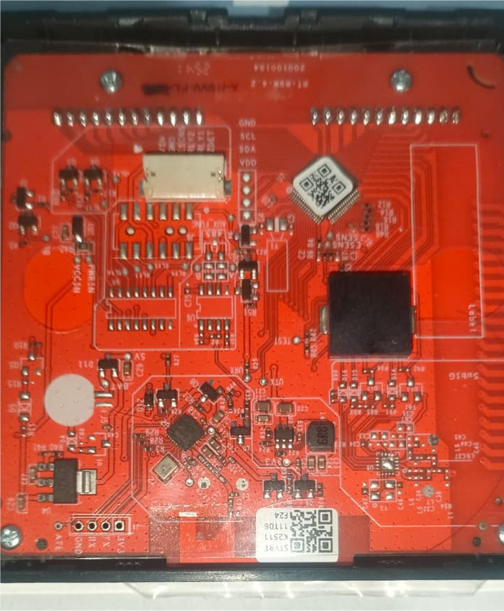

Maker: The two brands indicated and any possible similar clone with product ID dq6nlukkifyawj9n and version 1.15.0

Available on Aliexpress with many namings, but there is absolutely no guarantee.

## Installation

_NOTE_: Before flashing always make a backup of the original firmware.

These units generally ship with a firmware which is no longer exploitable by tuya-fwcutter.
Some disassembly is required for serial flashing; however, no soldering is needed as the board features through-holes
that accept Dupont pins directly.

To begin, open the unit following the mounting instructions provided with the device. Once opened, you will find the
PCB with labeled headers for the Beken BK7231N SoC.
serial connection:



All necessary pins are clearly labeled:

- GND, RX, TX, 3V3.

_NOTE_: Connection is usually straight (TX to TX, RX to RX) depending on the board. If you cannot read or write the
firmware, try swapping the RX/TX lines.

Do not attempt to flash the device while it is connected to mains power!

When ltchiptool says `Getting bus... (now, please do reboot by CEN or by power off/on)` disconnect and reconnect the GND
line, and it should proceed.

## Tuya Datapoints

| Datapoints | Function                         |
| ---------- | -------------------------------- |
| 1          | Turns on or off Thermostat       |
| 2          | Working Mode (enum)              |
| 10         | Frost Protection (switch)        |
| 16         | Target Temperature (number)      |
| 19         | Max Temperature SET (sensor)     |
| 24         | Current Temperature (sensor)     |
| 26         | Min Temperature SET (sensor)     |
| 30         | Weekly Program (custom)          |
| 31         | Weekly Type Selection (enum)     |
| 40         | Child Lock (switch)              |
| 45         | Fault Detect (bitmap/binary)     |
| 102        | Temperature STEP (sensor)        |
| 106        | Backlight Settings (custom)      |
| 109        | Temperature Calibration (number) |
| 110        | Active State (binary sensor)     |
| 111        | Version Number (string)          |
| 112        | Hysteresis (readonly sensor)     |
| 115        | Sensor Minimum (readonly sensor) |

_NOTE_: custom datapoints and device must be handled with a special starting script and a repository already present.
(also for weather services and backlight/weekly programming to work).
SOME datapoints, like: hysteresis, min and max temperature are programmable with the screen, but this may vary
depending on the producer of the unit.

## Configuration

- Per-device configuration:

```yaml
substitutions:
  name: house-thermostat
  friendly_name: House Thermostat

bk72xx:
  board: generic-bk7231n-qfn32-tuya

esphome:
  name: $name
  friendly_name: $friendly_name
  name_add_mac_suffix: false
  on_boot: 
    priority: -200
    then:
      - delay: 500ms
      - script.execute: tuya_kick_first #necessary for the device to start correctly

external_components:
  - source: github://SaschaKP/tuya_thermostat
    components: [tuyanew]
    refresh: 0s

preferences:
  flash_write_interval: 
    seconds: 60

# Enable logging
logger:
  level: INFO
  baud_rate: 0 #115200
#  hardware_uart: UART1

globals:
  - id: second_sent
    type: bool
    initial_value: 'false'
    restore_value: false

interval:
  - interval: 20min
    then:
      - if:
          condition:
            api.connected:
          then:
            - script.execute: push_weather

# Enable Home Assistant API
api:
  encryption:
    key: !secret api
  reboot_timeout: 30min
  on_client_connected: 
    then:
      - if:
          condition:
            - lambda: return id(second_sent) == false;
          then:
            - lambda: |-
                id(second_sent) = true;
            - script.execute: tuya_kick_second
      - delay: 1s
      - script.execute: push_weather

ota:
  - platform: esphome
    password: !secret ota

wifi:
  ssid: !secret wifi_ssid
  password: !secret wifi_password
  reboot_timeout: 20min

mdns:

#restart button
button:
  - platform: restart
    name: "Restart"
    id: button_restart

uart:
  - id: mcu_uart
    tx_pin: 1
    rx_pin: 0
    baud_rate: 38400
    parity: NONE
    data_bits: 8
    stop_bits: 1
    rx_buffer_size: 2048
#    debug:
#      sequence:
#        - lambda: UARTDebug::log_hex(direction, bytes, ':');

time:
  - platform: homeassistant
    id: ha_time

tuyanew:
  id: tuya_id
  uart_id: mcu_uart
  # The MCU uses this for displaying the time in the display as well as for
  # scheduled programmes one may have configured in their thermostat.
  time_id: ha_time
  on_weather_request:
    then:
      script.execute: push_weather

  on_datapoint_update:
    - sensor_datapoint: 106 # BackLight (6A)
      then:
        - lambda: |-
            if (x.len >= 8) {
              uint16_t end = (x.value_raw[0] << 8) + x.value_raw[1]; // 2 byte = total minutes
              uint16_t start = (x.value_raw[2] << 8) + x.value_raw[3]; // 2 byte = total minutes
              
              TimeEntityRestoreState current_time;
              current_time.second = 0; //set this to a valid zero

              current_time.hour = (uint8_t)(end / 60);
              current_time.minute = (uint8_t)(end % 60);
              current_time.apply(id(bl_end_time));

              current_time.hour = (uint8_t)(start / 60);
              current_time.minute = (uint8_t)(start % 60);
              current_time.apply(id(bl_start_time));

              id(bl_level_input).publish_state(x.value_raw[6]);

              id(bl_auto_off_input).publish_state((x.value_raw[7] == 0x00) ? "OFF" : "ON");

              ESP_LOGD("tuya_bl", "backlight setting - End %02i:%02i - Start %02i:%02i - Stanby BL %i - AutoOFF %i", (uint8_t)(end / 60), end % 60, (uint8_t)(start / 60), start % 60, x.value_raw[6], x.value_raw[7]);
            }

    - sensor_datapoint: 30 # Weekly Program (1E)
      then:
        - lambda: |-
            if (x.len >= 32) {
              datetime::TimeEntity* times[] = {id(p1_time), id(p2_time), id(p3_time), id(p4_time), id(p5_time), id(p6_time), id(p7_time), id(p8_time)};
              number::Number* temps[] = {id(p1_temp), id(p2_temp), id(p3_temp), id(p4_temp), id(p5_temp), id(p6_temp), id(p7_temp), id(p8_temp)};
              for (int i = 0; i < 32; i+=4) {
                TimeEntityRestoreState current_time;
                current_time.hour = x.value_raw[i];
                current_time.minute = x.value_raw[i+1];
                current_time.second = 0;
                current_time.apply(times[i / 4]);

                temps[i / 4]->publish_state(((x.value_raw[i+2] << 8) + x.value_raw[i+3]) / 10.0f);

                #if ESPHOME_LOG_LEVEL >= ESPHOME_LOG_LEVEL_DEBUG
                ESP_LOGD("tuya_week_prg", "P%i: %02i:%02i - %.1f °C", (i / 4) + 1, x.value_raw[i], x.value_raw[i+1], ((x.value_raw[i+2] << 8) + x.value_raw[i+3]) / 10.0f);
                #endif
              }
            }

text_sensor:
  - platform: homeassistant
    id: ha_weather_state # Extracts weather from the forecast
    entity_id: weather.forecast_casa # use your forecast entity ID in home assistant
    internal: true
    on_value:
      then:
        - script.execute: push_weather

sensor:
  - platform: homeassistant
    id: ha_weather_temp
    entity_id: weather.forecast_casa # use your forecast entity ID in home assistant
    attribute: temperature # Extracts the current temperature from the weather
    internal: true

  - platform: homeassistant
    id: ha_weather_humidity
    entity_id: weather.forecast_casa # use your forecast entity ID in home assistant
    attribute: humidity # Extracts humidity from the forecast
    internal: true
    on_value: 
      then:
        - script.execute: push_weather

  - platform: tuyanew
    id: isteresi_temp
    name: Hysteresis
    entity_category: diagnostic
    unit_of_measurement: "°C"
    sensor_datapoint: 112
    accuracy_decimals: 1
    icon: mdi:thermometer-check
    filters:
      - lambda: return x * 0.1f;

binary_sensor:
  - platform: tuyanew
    name: "Fault"
    device_class: problem
    sensor_datapoint: 45

climate:
  - platform: tuyanew
    name: "Thermostat"
    switch_datapoint: 1
    target_temperature_datapoint: 16
    current_temperature_datapoint: 24
    temperature_multiplier: 0.1
    active_state:
      datapoint: 110
    visual:
      min_temperature: 5 °C
      max_temperature: 50 °C
      temperature_step:
        target_temperature: 0.5 °C
        current_temperature: 0.1 °C

switch:
  - platform: tuyanew
    name: "Child Lock"
    switch_datapoint: 40
    icon: mdi:lock

  - platform: tuyanew
    name: "Frost Protection"
    switch_datapoint: 10
    icon: mdi:snowflake-melt

number:
  - platform: tuyanew
    name: "Temperature Calibration"
    number_datapoint: 109
    min_value: -9.9
    max_value: 9.9
    step: 0.1
    entity_category: config
    unit_of_measurement: "°C"
    icon: mdi:thermometer-lines
    multiply: 10

  - platform: template
    name: "BackLight MIN"
    id: bl_level_input
    min_value: 0
    max_value: 100
    step: 1
    unit_of_measurement: "%"
    mode: BOX
    optimistic: true
    entity_category: config
    icon: mdi:brightness-percent
    set_action:
      then:
        - lambda: |-
            id(push_backlight_dynamic)->execute(id(bl_start_time).hour * 60 + id(bl_start_time).minute, id(bl_end_time).hour * 60 + id(bl_end_time).minute, x, (id(bl_auto_off_input).current_option() == "ON") ? 0x01 : 0x00);

  - { platform: template, icon: mdi:home-thermometer, name: "P1 Temp", id: p1_temp, mode: BOX, entity_category: config, unit_of_measurement: °C, min_value: 5, max_value: 50, step: 0.5, optimistic: true, set_action: {then: {script.execute: push_full_schedule}} }
  - { platform: template, icon: mdi:home-thermometer, name: "P2 Temp", id: p2_temp, mode: BOX, entity_category: config, unit_of_measurement: °C, min_value: 5, max_value: 50, step: 0.5, optimistic: true, set_action: {then: {script.execute: push_full_schedule}} }
  - { platform: template, icon: mdi:home-thermometer, name: "P3 Temp", id: p3_temp, mode: BOX, entity_category: config, unit_of_measurement: °C, min_value: 5, max_value: 50, step: 0.5, optimistic: true, set_action: {then: {script.execute: push_full_schedule}} }
  - { platform: template, icon: mdi:home-thermometer, name: "P4 Temp", id: p4_temp, mode: BOX, entity_category: config, unit_of_measurement: °C, min_value: 5, max_value: 50, step: 0.5, optimistic: true, set_action: {then: {script.execute: push_full_schedule}} }
  - { platform: template, icon: mdi:home-thermometer, name: "P5 Temp", id: p5_temp, mode: BOX, entity_category: config, unit_of_measurement: °C, min_value: 5, max_value: 50, step: 0.5, optimistic: true, set_action: {then: {script.execute: push_full_schedule}} }
  - { platform: template, icon: mdi:home-thermometer, name: "P6 Temp", id: p6_temp, mode: BOX, entity_category: config, unit_of_measurement: °C, min_value: 5, max_value: 50, step: 0.5, optimistic: true, set_action: {then: {script.execute: push_full_schedule}} }
  - { platform: template, icon: mdi:home-thermometer, name: "P7 WE Temp", id: p7_temp, mode: BOX, entity_category: config, unit_of_measurement: °C, min_value: 5, max_value: 50, step: 0.5, optimistic: true, set_action: {then: {script.execute: push_full_schedule}} }
  - { platform: template, icon: mdi:home-thermometer, name: "P8 WE Temp", id: p8_temp, mode: BOX, entity_category: config, unit_of_measurement: °C, min_value: 5, max_value: 50, step: 0.5, optimistic: true, set_action: {then: {script.execute: push_full_schedule}} }

select:
  - platform: tuyanew
    name: "Work Mode"
    enum_datapoint: 2
    options:
      0: "Schedule"
      1: "Manual"
  - platform: template
    name: "BackLight Auto Off"
    id: bl_auto_off_input
    options: ["OFF", "ON"]
    optimistic: true
    entity_category: config
    set_action:
      then:
        - lambda: |-
            id(push_backlight_dynamic)->execute(id(bl_start_time).hour * 60 + id(bl_start_time).minute, id(bl_end_time).hour * 60 + id(bl_end_time).minute, (uint8_t)id(bl_level_input).state, (x == "ON") ? 0x01 : 0x00);

  - platform: tuyanew
    name: "Weekly Type"
    id: weekly_type_select
    enum_datapoint: 31
    entity_category: config
    options:
      0: "5+2"
      1: "6+1"
      2: "7"
    icon: mdi:calendar-edit

datetime:
  - platform: template
    name: "BackLight OFF"
    id: bl_end_time
    type: time
    optimistic: true
    entity_category: config
    set_action:
      then:
        - lambda: |-
            id(push_backlight_dynamic)->execute(id(bl_start_time).hour * 60 + id(bl_start_time).minute, x.hour * 60 + x.minute, (uint8_t)id(bl_level_input).state, (id(bl_auto_off_input).current_option() == "ON") ? 0x01 : 0x00);

  - platform: template
    name: "BackLight ON"
    id: bl_start_time
    type: time
    optimistic: true
    entity_category: config
    set_action:
      then:
        - lambda: |-
            id(push_backlight_dynamic)->execute(x.hour * 60 + x.minute, id(bl_end_time).hour * 60 + id(bl_end_time).minute, (uint8_t)id(bl_level_input).state, (id(bl_auto_off_input).current_option() == "ON") ? 0x01 : 0x00);

  - { platform: template, name: "P1 Wakeup", id: p1_time, entity_category: config, type: time, optimistic: true, set_action: {then: {script.execute: push_full_schedule}} }
  - { platform: template, name: "P2 Outside", id: p2_time, entity_category: config, type: time, optimistic: true, set_action: {then: {script.execute: push_full_schedule}} }
  - { platform: template, name: "P3 Pause", id: p3_time, entity_category: config, type: time, optimistic: true, set_action: {then: {script.execute: push_full_schedule}} }
  - { platform: template, name: "P4 Inside", id: p4_time, entity_category: config, type: time, optimistic: true, set_action: {then: {script.execute: push_full_schedule}} }
  - { platform: template, name: "P5 Evening", id: p5_time, entity_category: config, type: time, optimistic: true, set_action: {then: {script.execute: push_full_schedule}} }
  - { platform: template, name: "P6 Night", id: p6_time, entity_category: config, type: time, optimistic: true, set_action: {then: {script.execute: push_full_schedule}} }
  - { platform: template, name: "P7 WE Day", id: p7_time, entity_category: config, type: time, optimistic: true, set_action: {then: {script.execute: push_full_schedule}} }
  - { platform: template, name: "P8 WE Night", id: p8_time, entity_category: config, type: time, optimistic: true, set_action: {then: {script.execute: push_full_schedule}} }

script:
  - id: tuya_kick_first
    then:
      - delay: 150ms
      # 1. Query product info
      - uart.write:
          id: mcu_uart
          data: [0x55,0xAA,0x00,0x01,0x00,0x00,0x00]
      - delay: 150ms
      # Heartbeat (state 0)
      - uart.write:
          id: mcu_uart
          data: [0x55,0xAA,0x00,0x03,0x00,0x01,0x00,0x03]
      - delay: 150ms
      - uart.write:
          id: mcu_uart
          data: [0x55,0xAA,0x00,0x03,0x00,0x01,0x00,0x03]
      - delay: 150ms
      # Heartbeat (state 2)
      - uart.write:
          id: mcu_uart
          data: [0x55,0xAA,0x00,0x03,0x00,0x01,0x02,0x05]

  - id: tuya_kick_second
    then:
      # Heartbeat (state 3)
      - uart.write:
          id: mcu_uart
          data: [0x55,0xAA,0x00,0x03,0x00,0x01,0x03,0x06]
      - delay: 150ms
      # Query all DP status
      - uart.write:
          id: mcu_uart
          data: [0x55,0xAA,0x00,0x08,0x00,0x00,0x07]

  - id: push_weather
    then:
      - lambda: |-
          bool data_valid = true;
          
          // Validity check of numeric and textual data
          if (std::isnan(id(ha_weather_temp).state) || 
              std::isnan(id(ha_weather_humidity).state) ||
              id(ha_weather_state).state == "unavailable") {
            data_valid = false;
          }

          if (!data_valid) {
            // No data available, skip
            return;
          }

          uint8_t icon_code = 2; // Default on CLOUD
          std::string state = id(ha_weather_state).state;

          // 0: NO ICON (Clear Night)
          if (state == "clear-night" || state == "unknown") {
            icon_code = 0; // NO ICON IF AT NIGHT (CLEAR) OR UNKNOWN
          }
          else if (state == "sunny") {
            icon_code = 1; // SUN
          }
          else if (state == "partlycloudy" || state == "windy" || state == "windy-variant") {
            icon_code = 6; // SUN AND CLOUD
          }
          else if (state == "cloudy" || state == "fog" || state == "haze" || state == "dust" || state == "exceptional") {
            icon_code = 2; // CLOUD
          }
          else if (state == "rainy" || state == "pouring" || state == "lightning" || state == "lightning-rainy") {
            icon_code = 3; // RAIN
          }
          else if (state == "snowy-rainy" || state == "hail") {
            icon_code = 5; // SNOW AND RAIN
          }
          else if (state == "snowy") {
            icon_code = 4; // SNOW
          }

          int16_t temp = (int)id(ha_weather_temp).state;
          uint8_t hum = (int)id(ha_weather_humidity).state;

          id(tuya_id).send_weather_data(icon_code, temp, hum);

  - id: push_backlight_dynamic
    parameters:
      start_mins: uint16_t
      end_mins: uint16_t
      lux: uint8_t
      aoff: uint8_t
    mode: restart
    then:
      - delay: 500ms #avoid multiple sending if user changes a value within a delay of time
      - lambda: |-
          std::vector<uint8_t> data;
          data.reserve(8);
          data.push_back((uint8_t)(end_mins >> 8));
          data.push_back((uint8_t)(end_mins & 0xFF));
          data.push_back((uint8_t)(start_mins >> 8));
          data.push_back((uint8_t)(start_mins & 0xFF));
          data.push_back(0x00); //Reserved
          data.push_back(0x00); //Reserved
          data.push_back(lux);
          data.push_back(aoff);

          id(tuya_id).set_raw_datapoint_value(106, data);
          ESP_LOGD("backlight", "Sync MCU: End %02d:%02d, Start %02d:%02d, Lux %d, AutoOff %d", 
                    id(bl_end_time).hour, id(bl_end_time).minute,
                    id(bl_start_time).hour, id(bl_start_time).minute, 
                    lux, aoff);
          
  - id: push_full_schedule
    mode: restart
    then:
      - delay: 500ms #avoid multiple sending if user changes a value within a delay of time
      - lambda: |-
          datetime::TimeEntity* times[] = {id(p1_time), id(p2_time), id(p3_time), id(p4_time), id(p5_time), id(p6_time), id(p7_time), id(p8_time)};
          number::Number* temps[] = {id(p1_temp), id(p2_temp), id(p3_temp), id(p4_temp), id(p5_temp), id(p6_temp), id(p7_temp), id(p8_temp)};
          // Total Buffer: 55 AA 00 06 (Header/Ver/Cmd) + 00 24 (Len) + 1E 00 00 20 (DP Header) + 32 byte data + Checksum
          std::vector<uint8_t> data;
          data.reserve(32);

          for (uint8_t i = 0; i < 8; ++i) {
            data.push_back((uint8_t)times[i]->hour);
            data.push_back((uint8_t)times[i]->minute);
            float s = temps[i]->state;
            uint16_t temp = std::isnan(s) ? 200 : (uint16_t)(s * 10);
            data.push_back((uint8_t)(temp >> 8));
            data.push_back((uint8_t)(temp & 0xFF));
          }
          id(tuya_id).set_raw_datapoint_value(30, data);
          ESP_LOGD("tuya_schedule", "Complete programming sent (32 byte payload)");
```

_NOTE_: this particular configuration mimics tuya protocol exactly as seen on logs on version 1.15.0 (DP 111)
