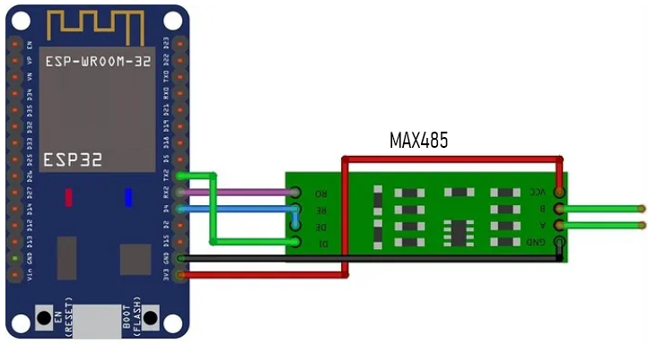

## Setup & requirements

- ESP32 Board
- MAX485 transceiver



---

## Basic configuration

**Latest version can be found here [Github](https://github.com/Slicit/HomeAssistant/blob/main/esphome/devices/earu_ea777.yaml)**

```yaml
esphome:
  name: ${name}
  friendly_name: Energy Meter EA777 (ModBus RTU)
  min_version: 2025.5.0
  name_add_mac_suffix: false

# ESP32 Board
esp32:
  board: esp32dev
  framework:
    type: esp-idf

# Home Assistant API
api:

# Over-The-Air updates
ota:
- platform: esphome

# Wi-Fi settings with secrets
wifi:
  ssid: !secret wifi_ssid
  password: !secret wifi_password

  # Optional manual IP
  # manual_ip:
  #   static_ip: 192.168.0.100
  #   gateway: 192.168.0.1
  #   subnet: 255.255.255.0

# UART Bus for the MAX485 transceiver
uart:
  id: uart_modbus_server
  baud_rate: 9600  # Adjust Baudrate
  tx_pin: 19       # Adjust TX PIN
  rx_pin: 18       # Adjust RX PIN
  stop_bits: 1     # Adjust Stop bits
  parity: EVEN     # Adjust Parity

modbus:
  uart_id: uart_modbus_server
  id: modbus_server
  flow_control_pin: 4
  send_wait_time: 1000ms

modbus_controller:
  - id: earu_ea777
    address: 0x1              # Adjust device address
    modbus_id: modbus_server
    setup_priority: -10
    update_interval: 10s

sensor:
  # Voltage section, Phase A, B, C as per the EA777 markings, Can also be named L1, L2, L3
  # In Volts, precision 0.1V
  - platform: modbus_controller
    modbus_controller_id: earu_ea777
    id: phase_a_voltage
    name: "Phase A voltage"
    address: 0x00
    register_type: read
    accuracy_decimals: 1
    value_type: U_WORD
    unit_of_measurement: "V"
    filters: 
      - multiply: 0.1

  - platform: modbus_controller
    modbus_controller_id: earu_ea777
    id: phase_b_voltage
    name: "Phase B voltage"
    address: 0x01
    register_type: read
    accuracy_decimals: 1
    value_type: U_WORD
    unit_of_measurement: "V"
    filters: 
      - multiply: 0.1

  - platform: modbus_controller
    modbus_controller_id: earu_ea777
    id: phase_c_voltage
    name: "Phase C voltage"
    address: 0x02
    register_type: read
    accuracy_decimals: 1
    value_type: U_WORD
    unit_of_measurement: "V"
    filters: 
      - multiply: 0.1

  # Current section in Amperes, precision 0.1A
  - platform: modbus_controller
    modbus_controller_id: earu_ea777
    id: phase_a_current
    name: "Phase A current"
    address: 0x03
    register_type: read
    accuracy_decimals: 2
    value_type: U_WORD
    unit_of_measurement: "A"
    filters: 
      - multiply: 0.01

  - platform: modbus_controller
    modbus_controller_id: earu_ea777
    id: phase_b_current
    name: "Phase B current"
    address: 0x04
    register_type: read
    accuracy_decimals: 2
    value_type: U_WORD
    unit_of_measurement: "A"
    filters: 
      - multiply: 0.01

  - platform: modbus_controller
    modbus_controller_id: earu_ea777
    id: phase_c_current
    name: "Phase C current"
    address: 0x05
    register_type: read
    accuracy_decimals: 2
    value_type: U_WORD
    unit_of_measurement: "A"
    filters: 
      - multiply: 0.01

  # Active power in Watts: Total, Phases A, B, C
  # Precision 1W
  - platform: modbus_controller
    modbus_controller_id: earu_ea777
    id: active_power
    name: "Active power"
    address: 0x07
    register_type: read
    accuracy_decimals: 2
    value_type: U_WORD
    unit_of_measurement: "W"

  - platform: modbus_controller
    modbus_controller_id: earu_ea777
    id: phase_a_active_power
    name: "Phase A active power"
    address: 0x08
    register_type: read
    accuracy_decimals: 2
    value_type: U_WORD
    unit_of_measurement: "W"

  - platform: modbus_controller
    modbus_controller_id: earu_ea777
    id: phase_b_active_power
    name: "Phase B active power"
    address: 0x09
    register_type: read
    accuracy_decimals: 2
    value_type: U_WORD
    unit_of_measurement: "W"

  - platform: modbus_controller
    modbus_controller_id: earu_ea777
    id: phase_c_active_power
    name: "Phase C active power"
    address: 0x0A
    register_type: read
    accuracy_decimals: 2
    value_type: U_WORD
    unit_of_measurement: "W"

  # Active power in Watts: Total, Phases A, B, C
  # Precision 1W
  - platform: modbus_controller
    modbus_controller_id: earu_ea777
    id: reactive_power
    name: "Reactive power"
    address: 0x0B
    register_type: read
    accuracy_decimals: 2
    value_type: U_WORD
    unit_of_measurement: "W"

  - platform: modbus_controller
    modbus_controller_id: earu_ea777
    id: phase_a_reactive_power
    name: "Phase A reactive power"
    address: 0x0C
    register_type: read
    accuracy_decimals: 2
    value_type: U_WORD
    unit_of_measurement: "W"

  - platform: modbus_controller
    modbus_controller_id: earu_ea777
    id: phase_b_reactive_power
    name: "Phase B reactive power"
    address: 0x0D
    register_type: read
    accuracy_decimals: 2
    value_type: U_WORD
    unit_of_measurement: "W"

  - platform: modbus_controller
    modbus_controller_id: earu_ea777
    id: phase_c_reactive_power
    name: "Phase C reactive power"
    address: 0x0E
    register_type: read
    accuracy_decimals: 2
    value_type: U_WORD
    unit_of_measurement: "W"

  # Power factor, cos phi
  # Range 0-1.000, precision 0.001
  - platform: modbus_controller
    modbus_controller_id: earu_ea777
    id: phase_a_power_factor
    name: "Phase A power factor"
    address: 0x14
    register_type: read
    accuracy_decimals: 3
    value_type: U_WORD
    unit_of_measurement: "cos φ"
    filters: 
      - multiply: 0.001

  - platform: modbus_controller
    modbus_controller_id: earu_ea777
    id: phase_b_power_factor
    name: "Phase B power factor"
    address: 0x15
    register_type: read
    accuracy_decimals: 3
    value_type: U_WORD
    unit_of_measurement: "cos φ"
    filters: 
      - multiply: 0.001

  - platform: modbus_controller
    modbus_controller_id: earu_ea777
    id: phase_c_power_factor
    name: "Phase C power factor"
    address: 0x16
    register_type: read
    accuracy_decimals: 3
    value_type: U_WORD
    unit_of_measurement: "cos φ"
    filters: 
      - multiply: 0.001

  # Frequency, Hertz, precision 0.01Hz
  - platform: modbus_controller
    modbus_controller_id: earu_ea777
    id: current_voltage_frequency
    name: "Current voltage frequency"
    address: 0x1A
    register_type: read
    accuracy_decimals: 2
    value_type: U_WORD
    unit_of_measurement: "Hz"
    filters: 
      - multiply: 0.01

  # Settings
  - platform: modbus_controller
    modbus_controller_id: earu_ea777
    id: instrument_communication_address
    name: "Instrument communication address"
    address: 0x61
    register_type: read
    value_type: U_WORD
  
  - platform: modbus_controller
    modbus_controller_id: earu_ea777
    id: communication_baud_rate
    name: "Communication baud rate"
    address: 0x62
    register_type: read
    value_type: U_WORD

  - platform: modbus_controller
    modbus_controller_id: earu_ea777
    id: communication_data_format
    name: "Communication data format"
    address: 0x63
    register_type: read
    value_type: U_WORD

  # Energy
  - platform: modbus_controller
    modbus_controller_id: earu_ea777
    id: current_total_active_energy
    name: "Current total active energy"
    address: 0x001D
    register_type: read
    register_count: 2
    accuracy_decimals: 2
    value_type: U_DWORD
    unit_of_measurement: "kWh"
    filters: 
      - multiply: 0.01

  - platform: modbus_controller
    modbus_controller_id: earu_ea777
    id: current_positive_total_active_energy
    name: "Current positive total active energy"
    address: 0x0027
    register_type: read
    register_count: 2
    accuracy_decimals: 2
    value_type: U_DWORD
    unit_of_measurement: "kWh"
    filters: 
      - multiply: 0.01

  - platform: modbus_controller
    modbus_controller_id: earu_ea777
    id: current_reverse_total_active_energy
    name: "Current reverse total active energy"
    address: 0x0031
    register_type: read
    register_count: 2
    accuracy_decimals: 2
    value_type: U_DWORD
    unit_of_measurement: "kWh"
    filters: 
      - multiply: 0.01

  - platform: modbus_controller
    modbus_controller_id: earu_ea777
    id: current_total_reactive_energy
    name: "Current total reactive energy"
    address: 0x003B
    register_type: read
    register_count: 2
    accuracy_decimals: 2
    value_type: U_DWORD
    unit_of_measurement: "kVArh"
    filters: 
      - multiply: 0.01

  - platform: modbus_controller
    modbus_controller_id: earu_ea777
    id: current_positive_total_reactive_energy
    name: "Current positive total reactive energy"
    address: 0x0045
    register_type: read
    register_count: 2
    accuracy_decimals: 2
    value_type: U_DWORD
    unit_of_measurement: "kVArh"
    filters: 
      - multiply: 0.01

  - platform: modbus_controller
    modbus_controller_id: earu_ea777
    id: current_reverse_total_reactive_energy
    name: "Current reverse total reactive energy"
    address: 0x004F
    register_type: read
    register_count: 2
    accuracy_decimals: 2
    value_type: U_DWORD
    unit_of_measurement: "kVArh"
    filters: 
      - multiply: 0.01
```
