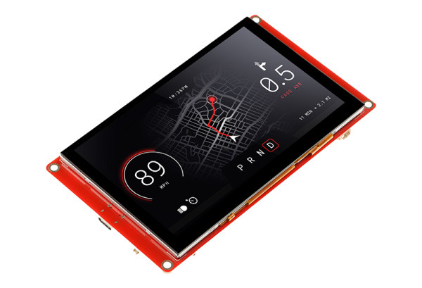

## Drivers

* Processor: ESP32-S3-WROOM-1-N4R8 (using `esp32-s3-devkitc-1` board)
* Touchscreen: `gt911`
* Display: ILI6122 & ILI5960 (using `rpi_dpi_rgb` plaform)

## GPIO Pinout

### i2c (used for touchscreen)

| Pin    | Function      |
| ------ | ------------- |
| GPIO19 | i2c SDA     |
| GPIO20 | i2c SCL     |

### backlight

| Pin    | Function      |
| ------ | ------------- |
| GPIO2  | backlight   |

### display

| Pin    | Function      |
| ------ | ------------- |
| GPIO40 | de_pin      |
| GPIO39 | hsync_pin   |
| GPIO41 | vsync_pin   |
| GPIO0  | pclk_pin    |

### data pins

```yaml
      red:
        - 45        #r1
        - 48        #r2
        - 47        #r3
        - 21        #r4
        - 14        #r5
      green:
        - 5         #g0
        - 6         #g1
        - 7         #g2
        - 15        #g3
        - 16        #g4
        - 4         #g5
      blue:
        - 8         #b1
        - 3         #b2
        - 46        #b3
        - 9         #b4
        - 1         #b5
```

## Simle configuration

```yaml
esphome:
  name: display
  platformio_options:
    build_flags: "-DBOARD_HAS_PSRAM"
    board_build.esp-idf.memory_type: qio_opi
    board_build.flash_mode: dio
  
esp32:
  board: esp32-s3-devkitc-1
  framework:
    type: esp-idf
    sdkconfig_options:
      CONFIG_ESP32S3_DEFAULT_CPU_FREQ_240: y
      CONFIG_ESP32S3_DATA_CACHE_64KB: y
      CONFIG_SPIRAM_FETCH_INSTRUCTIONS: y
      CONFIG_SPIRAM_RODATA: y

psram:
  mode: octal
  speed: 80MHz

output:
  - platform: ledc
    pin: 2
    frequency: 1220
    id: gpio_backlight_pwm

light:
  - platform: monochromatic
    output: gpio_backlight_pwm
    name: Display Backlight
    id: back_light
    restore_mode: ALWAYS_ON

i2c:
  sda: GPIO19
  scl: GPIO20
  scan: true

touchscreen:
  platform: gt911

display:
  - platform: rpi_dpi_rgb
    id: main_display
    color_order: RGB
    invert_colors: True
    update_interval: 5s
    auto_clear_enabled: false
    dimensions:
      width: 800
      height: 480
    de_pin: 40
    hsync_pin: 39
    vsync_pin: 41
    pclk_pin: 0
    pclk_frequency: 12MHz
    data_pins:
      red:
        - 45        #r1
        - 48        #r2
        - 47        #r3
        - 21        #r4
        - 14        #r5
      green:
        - 5         #g0
        - 6         #g1
        - 7         #g2
        - 15        #g3
        - 16        #g4
        - 4         #g5
      blue:
        - 8         #b1
        - 3         #b2
        - 46        #b3
        - 9         #b4
        - 1         #b5
    lambda: |-
      auto red = Color(255, 0, 0);
      auto green = Color(0, 255, 0);
      auto blue = Color(0, 0, 255);
      auto white = Color(255, 255, 255);
      id(main_display).filled_circle(50, 50, 40, red);
      id(main_display).filled_circle(100, 50, 40, green);
      id(main_display).filled_circle(150, 50, 40, blue);
      id(main_display).filled_circle(200, 50, 40, white);

# example button
binary_sensor:
  - platform: touchscreen
    name: Top Left Touch Button
    x_min: 10
    x_max: 240
    y_min: 10
    y_max: 90
    on_press:
      - lambda: |-
            ESP_LOGI("btn", "Button pressed");
```

## Example (using LGVL graphics library)

```yaml
substitutions:
  device_name: display

esphome:
  name: ${device_name}
  platformio_options:
    build_flags: "-DBOARD_HAS_PSRAM"
    board_build.esp-idf.memory_type: qio_opi
    board_build.flash_mode: dio
  
esp32:
  board: esp32-s3-devkitc-1
  framework:
    type: esp-idf
    sdkconfig_options:
      CONFIG_ESP32S3_DEFAULT_CPU_FREQ_240: y
      CONFIG_ESP32S3_DATA_CACHE_64KB: y
      CONFIG_SPIRAM_FETCH_INSTRUCTIONS: y
      CONFIG_SPIRAM_RODATA: y

psram:
  mode: octal
  speed: 80MHz

logger:

# Define a PWM output on the ESP32
output:
  - platform: ledc
    pin: 2
    frequency: 1220
    id: gpio_backlight_pwm

light:
  - platform: monochromatic # Define a monochromatic, dimmable light for the backlight
    output: gpio_backlight_pwm
    name: ${device_name} Display Backlight
    id: back_light
    restore_mode: ALWAYS_ON

display:
  - platform: rpi_dpi_rgb
    id: main_display
    color_order: RGB
    invert_colors: True
    update_interval: never
    auto_clear_enabled: false # takes 2.8 seconds to clear the display
    dimensions:
      width: 800
      height: 480
    de_pin: 40
    hsync_pin: 39
    vsync_pin: 41
    pclk_pin: 0
    pclk_frequency: 12MHz
    data_pins:
      red:
        - 45        #r1
        - 48        #r2
        - 47        #r3
        - 21        #r4
        - 14        #r5
      green:
        - 5         #g0
        - 6         #g1
        - 7         #g2
        - 15        #g3
        - 16        #g4
        - 4         #g5
      blue:
        - 8         #b1
        - 3         #b2
        - 46        #b3
        - 9         #b4
        - 1         #b5

i2c:
  sda: GPIO19
  scl: GPIO20
  scan: true

touchscreen:
  platform: gt911

globals:
  - id: random_int_var
    type: int
    restore_value: no
    initial_value: '0'

binary_sensor:
  - platform: lvgl
    widget: button
    name: Button
    on_press: # genrate a random number between -10 and +10 and update meter
      then:
        - lambda: |-
            id(random_int_var) = (rand() % 20) - 10;
        - lvgl.indicator.update:
            id: power_meter_input
            value: !lambda return id(random_int_var);
        - lvgl.label.update:
            id: power_kw
            text:
              format: "%dkW"
              args: [ 'id(random_int_var)' ]
image:
  - file: mdi:sun-wireless-outline
    id: solar_power_icon
    resize: 50x50

lvgl:
  color_depth: 16
  bg_color: 0
  border_width: 0
  outline_width: 0
  shadow_width: 0
  text_font: unscii_16
  align: center
  style_definitions:
    - id: meter_style
      border_width: 0
      outline_width: 0
      align: center
      bg_color: 0
    - id: title_style
      text_font: MONTSERRAT_40
      align: center
      text_color: 0xFFFFFF
      bg_opa: TRANSP
      bg_color: 0
      radius: 4
      pad_all: 2
    - id: detail_style
      text_font: MONTSERRAT_18
      align: center
      text_color: 0xFFFFFF
      bg_opa: TRANSP
      bg_color: 0
      radius: 4
      pad_all: 2
  widgets:
    - button: # Button
        id: button
        height: 100
        width: 200
        x: 20
        y: 20
        border_width: 0
        outline_width: 0
        align: TOP_LEFT
        checkable: false
        widgets:
        - label:
            align: center
            text: "Button"
    - obj: # Meter
        height: 240
        width: 240
        bg_color: 0
        border_width: 0
        outline_width: 0
        shadow_width: 0
        pad_all: 4
        align: TOP_MID
        widgets:
          - meter: # Gradient color  arc
              height: 100%
              width: 100%
              border_width: 0
              outline_width: 0
              align: center
              bg_color: 0
              scales:
                angle_range: 180
                range_to: 10
                range_from: -10
                ticks:
                  count: 0
                indicators:
                  - line:
                      id: power_meter_input
                      width: 8
                      color: 0xFFFFFF
                      r_mod: 12
                      value: 50
                  - arc:
                      color: 0xFF3000
                      r_mod: 10
                      width: 20
                      start_value: -10
                      end_value: 0
                  - arc:
                      color: 0x00FF00
                      r_mod: 10
                      width: 20
                      start_value: 0
                      end_value: 10
          - arc: # black arc to erase middle part of meter indicator line
              height: 160
              width: 160
              align: center
              arc_color: 0x000000
              arc_width: 150
              start_angle: 0
              end_angle: 360
              indicator:
                arc_width: 150
                arc_color: 0x000000
          - label: # gauge lower and higher range indicators
              styles: detail_style
              y: 8
              x: -99
              text: "-10"
          - label:
              styles: detail_style
              y: 8
              x: 99
              text: "+10"
          - label:  # value label
              styles: title_style
              id: power_kw
              y: -10
          - image:
              src: solar_power_icon
              id: img_solar_power
              align: center
              image_recolor: 0xFFFF00
              image_recolor_opa: 100%
              y: 50
```
