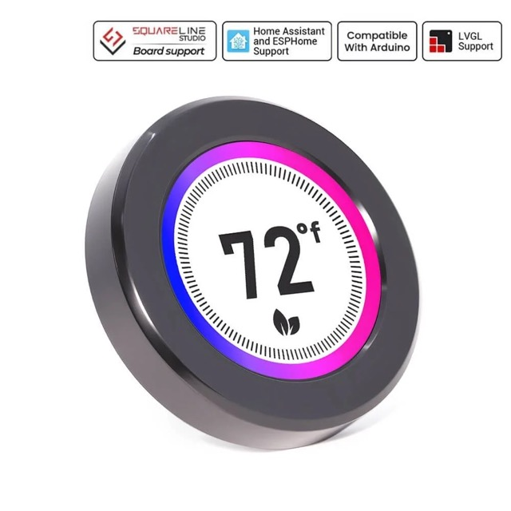

## Product specs

| Feature      | Spec                             |
| ------------ | -------------------------------- |
| CPU          | ESP32-S3R8                       |
| Flash        | 16MB                             |
| PSRAM        | 8MB                              |
| Screen       | 2.1 inch, IPS, 480\*480 (st7701s)|
| Touch screen | Capacitive (cst826)              |
| Size         | 79\*79\*30mm                     |

## Product description

A circular 2.1in IPS display with touchscreen, esp32s3 microcontroller, and rotary encoder.

Vendor documentation:

- [Product page](https://www.elecrow.com/crowpanel-2-1inch-hmi-esp32-rotary-display-480-480-ips-round-touch-knob-screen.html)
- [Wiki](https://www.elecrow.com/wiki/CrowPanel_2.1inch-HMI_ESP32_Rotary_Display_480_IPS_Round_Touch_Knob_Screen.html)
- [Official repository](https://github.com/Elecrow-RD/CrowPanel-2.1inch-HMI-ESP32-Rotary-Display-480-480-IPS-Round-Touch-Knob-Screen)

## Pictures



## Basic Configuration

```yaml
esphome:
  name: crowpanel-21-rotary-display
  on_boot:
    priority: 800
    then:
      # Bring up panel power before toggling RESET, then small delays. Based on Elecrow sample code, though colors are off
      - output.turn_on: lcd_power
      - output.turn_on: display_reset
      - delay: 100ms
      - output.turn_off: display_reset
      - delay: 100ms
      - output.turn_on: tp_reset
      - delay: 100ms
      - output.turn_off: tp_reset
      - delay: 120ms
      - output.turn_on: tp_reset
      - delay: 120ms
      - output.turn_on: tp_intr 

esp32:
  variant: esp32s3
  flash_size: 16MB
  framework:
    type: esp-idf
    sdkconfig_options:
      CONFIG_ESP32S3_DATA_CACHE_64KB: y
      CONFIG_SPIRAM_FETCH_INSTRUCTIONS: y
      CONFIG_SPIRAM_RODATA: y

psram:
  mode: octal
  speed: 80MHz

logger:

wifi:
  networks:
  ssid: !secret wifi_ssid
  password: !secret wifi_password

api:

ota:

web_server:

i2c:
  sda: GPIO38
  scl: GPIO39

spi:
  clk_pin: GPIO2
  mosi_pin: GPIO1

pcf8574:
  - id: pcf
    address: 0x21

output:
  - platform: ledc
    pin: GPIO6
    id: bl_pwm
    frequency: 19531Hz
  - platform: gpio
    id: lcd_power
    pin:
      pcf8574: pcf
      number: 3
      mode:
        output: true
      inverted: false
  - platform: gpio
    id: tp_reset
    pin:
      pcf8574: pcf
      number: 0
      mode:
        output: true
  - platform: gpio
    id: display_reset
    pin:
      pcf8574: pcf
      number: 4
      mode:
        output: true
      inverted: true
  - platform: gpio
    id: tp_intr
    pin:
      pcf8574: pcf
      number: 2
      mode:
        output: true

binary_sensor:
  - platform: gpio
    id: encoder_button
    pin:
      pcf8574: pcf
      number: 5
      mode:
        input: true
      inverted: true

sensor:
  - platform: rotary_encoder
    id: encoder
    name: "Encoder"
    pin_a:
      number: GPIO4
      mode:
        input: true
        pullup: true
    pin_b:
      number: GPIO42
      mode:
        input: true
        pullup: true
    resolution: 2

light:
  - platform: monochromatic
    name: "LCD Backlight"
    output: bl_pwm
    id: display_backlight
    default_transition_length: 0s
    restore_mode: ALWAYS_ON

touchscreen:
  platform: cst816
  id: touch
  skip_probe: True
  update_interval: 25ms
  address: 0x15
  on_touch:
    - lambda: |-
        ESP_LOGI("cal", "x=%d, y=%d, x_raw=%d, y_raw=%0d", touch.x, touch.y, touch.x_raw, touch.y_raw);

display:
  - platform: mipi_rgb
    model: st7701s
    id: my_display
    spi_mode: MODE3
    color_order: RGB
    pixel_mode: 18bit
    invert_colors: false
    dimensions:
      width: 480
      height: 480
    cs_pin: GPIO16
    de_pin: GPIO40
    hsync_pin: GPIO15
    vsync_pin: GPIO7
    pclk_pin: GPIO41
    data_pins:
      red: [GPIO46, GPIO3, GPIO8, GPIO18, GPIO17]
      green: [GPIO14, GPIO13, GPIO12, GPIO11, GPIO10, GPIO9]
      blue: [GPIO5, GPIO45, GPIO48, GPIO47, GPIO21]
    hsync_front_porch: 20
    hsync_pulse_width: 10
    hsync_back_porch: 10
    vsync_front_porch: 8
    vsync_pulse_width: 10
    vsync_back_porch: 10
    auto_clear_enabled: false
    update_interval: never
    pclk_frequency: 18MHz
    pclk_inverted: true
    init_sequence:
      - [0x01]
      - [0xFF, 0x77, 0x01, 0x00, 0x00, 0x10]
      - [0xC0, 0x3B, 0x00]
      - [0xC1, 0x0B, 0x02]
      - [0xC2, 0x00, 0x02]
      - [0xCC, 0x10]
      - [0xCD, 0x08]
      - [0xB0, 0x02, 0x13, 0x1B, 0x0D, 0x10, 0x05, 0x08, 0x07, 0x07, 0x24, 0x04, 0x11, 0x0E, 0x2C, 0x33, 0x1D]
      - [0xB1, 0x05, 0x13, 0x1B, 0x0D, 0x11, 0x05, 0x08, 0x07, 0x07, 0x24, 0x04, 0x11, 0x0E, 0x2C, 0x33, 0x1D]
      - [0xFF, 0x77, 0x01, 0x00, 0x00, 0x11]
      - [0xB0, 0x5d]
      - [0xB1, 0x43]
      - [0xB2, 0x81]
      - [0xB3, 0x80]
      - [0xB5, 0x43]
      - [0xB7, 0x85]
      - [0xB8, 0x20]
      - [0xC1, 0x78]
      - [0xC2, 0x78]
      - [0xD0, 0x88]
      - [0xE0, 0x00, 0x00, 0x02]
      - [0xE1, 0x03, 0xA0, 0x00, 0x00, 0x04, 0xA0, 0x00, 0x00, 0x00, 0x20, 0x20]
      - [0xE2, 0x00, 0x00, 0x00, 0x00, 0x00, 0x00, 0x00, 0x00, 0x00, 0x00, 0x00, 0x00, 0x00]
      - [0xE3, 0x00, 0x00, 0x11, 0x00]
      - [0xE4, 0x22, 0x00]
      - [0xE5, 0x05, 0xEC, 0xA0, 0xA0, 0x07, 0xEE, 0xA0, 0xA0, 0x00, 0x00, 0x00, 0x00, 0x00, 0x00, 0x00, 0x00]
      - [0xE6, 0x00, 0x00, 0x11, 0x00]
      - [0xE7, 0x22, 0x00]
      - [0xE8, 0x06, 0xED, 0xA0, 0xA0, 0x08, 0xEF, 0xA0, 0xA0, 0x00, 0x00, 0x00, 0x00, 0x00, 0x00, 0x00, 0x00]
      - [0xEB, 0x00, 0x00, 0x40, 0x40, 0x00, 0x00, 0x00]
      - [0xEd, 0xFF, 0xFF, 0xFF, 0xBA, 0x0A, 0xBF, 0x45, 0xFF, 0xFF, 0x54, 0xFB, 0xA0, 0xAB, 0xFF, 0xFF, 0xFF]
      - [0xEF, 0x10, 0x0D, 0x04, 0x08, 0x3F, 0x1F]
      - [0xFF, 0x77, 0x01, 0x00, 0x00, 0x13]
      - [0xEF, 0x08]
      - [0xFF, 0x77, 0x01, 0x00, 0x00, 0x00]

lvgl:
  theme:
    dark_mode: true
  touchscreens: touch
  encoders:
    sensor: encoder
    enter_button: encoder_button
```
