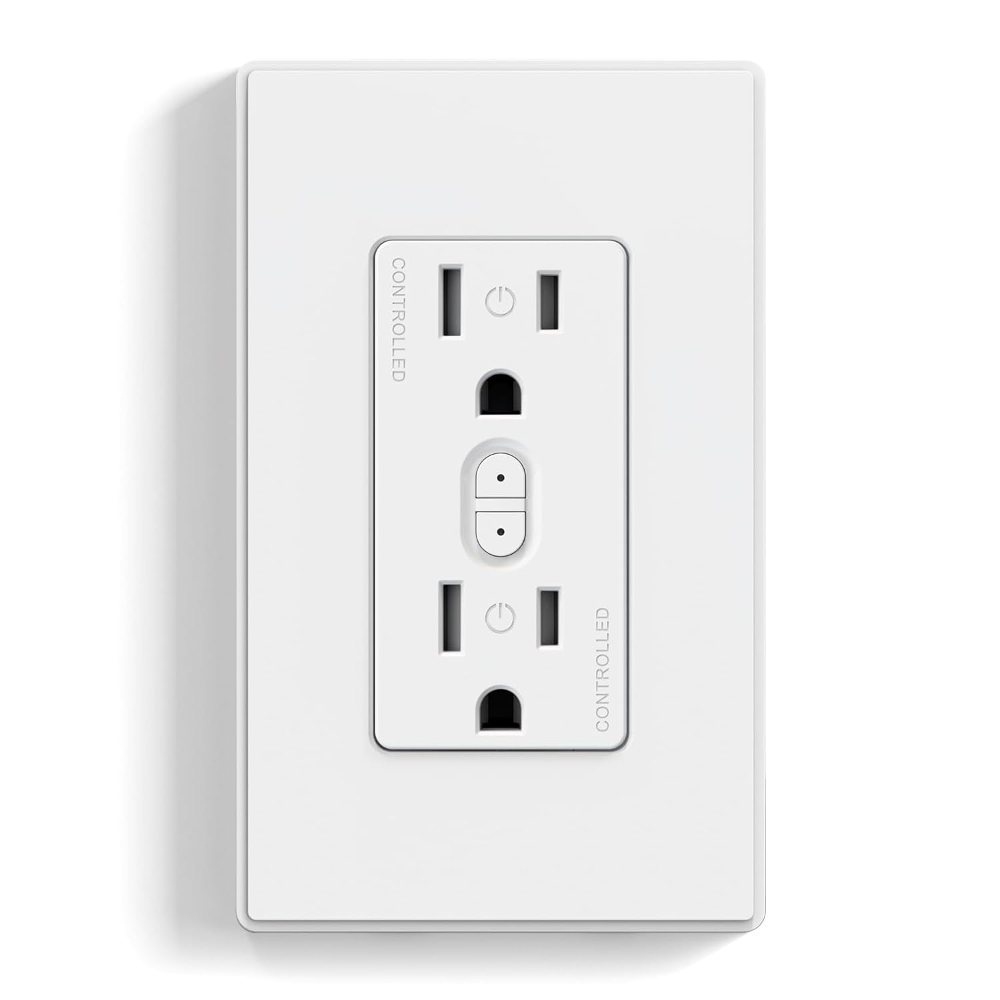
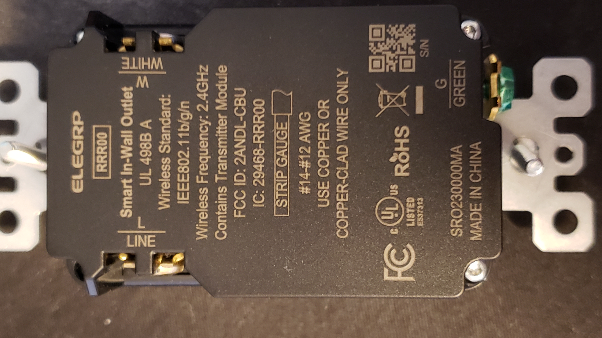
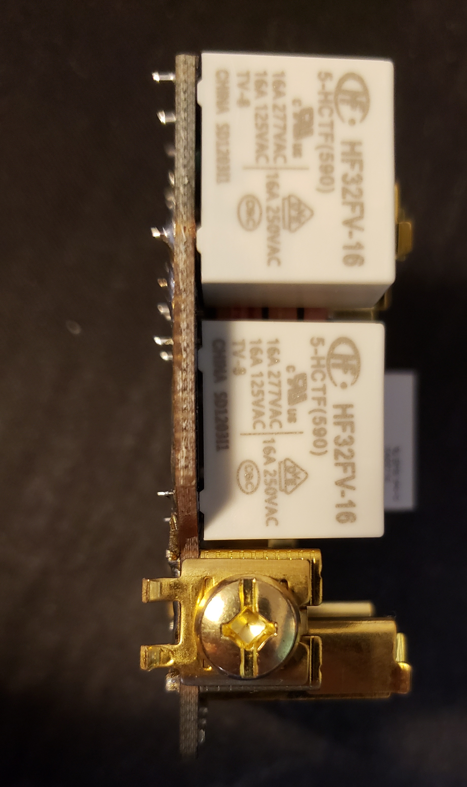
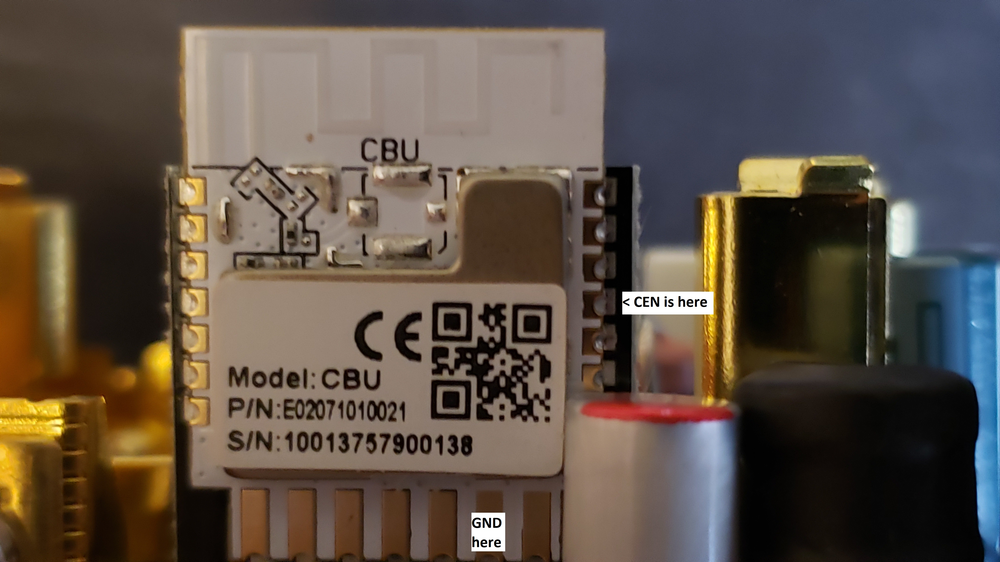

[Amazon Link](https://www.amazon.com/dp/B0CBBMVV5F)

## Elegrp RRR00 Smart In-Wall Outlet with Energy Monitoring

The front has a button for each individually-switched outlet.





The relays are individual, 16A relays. Nice!



Inside is a CBU module, which has a Beken BK7231N:
https://fccid.io/2ANDL-CBU/User-Manual/CBU-User-Manual-updated-5064101.pdf

## Pinout

The PCB on my outlet had some wrong labels for pins. This confused me until I ohmed straight from the base PCB to the CBU module.
Below are the correct labels, in case it helps you.

| CBU module Pin| Function     |Use on outlet                       | Label on ELEGRP PCB (mostly incorrect)
| ------------- | -------------|------------------------------------|---------------------------------------
| 3             |P20, SCL1, TCK|RED LED (LED3) active high             | CEN (incorrect)
| 8             |P8, PWM2      |Lower switch button active low (SW2)    | ADC (incorrect)
| 10            |P6, PWM0      |Upper switch button active low (SW1)     | P8 (incorrect)
| 1             |P14, SCK      |Upper white LED (LED1) active high        | P7 (incorrect)
| 19            |P9, PWM3      |Active high upper outlet enable (R15, Q1)  | P6 (incorrect)
| 17            |P28           |Lower white LED (LED2) active high          | P26 (incorrect)
| 9             |P7, PWM1      |Active high lower outlet enable (R16, Q2)    | P24 (incorrect)
| 15            |P11, TX1      |Programming and TX to BL0942 energy monitor    | TX1
| 16            |P10, TX1      |Programming and RX from BL0942 energy monitor     | RX1
| 13            |GND           |Module GND. Connect to programmer ground when programming|GND
| 14            |3V3           | 3.3V supply to CBU module. Power when programming       | 3.3V

See this pinout for more detail on the CBU side: https://docs.libretiny.eu/boards/cbu/cbu.svg


## Disassembly and Initial Flash Procedure

Run the Line and WHITE scresws all the way in. Remove the 4 T7 Torx screws on the back, and remove cover.
Cover comes out with module. Remove module from cover.
Solder a Sparkfun FTDI Basic's wires to 3.3V, GND, TX, and RX pins.
Run esphome with the yaml below, select the COM port.
When ESPHome prompts to reset by driving CEN low, use a male-male dupont wire or similar to connect CEN to GND.
CEN is the fourth down on the right of the module, GND is second from right on bottom row:


Watch ESPHome for some sign of a flash starting, then release CEN. (as of Nov 2024)
Once flashed and on your network, remove soldered wires and re-assemble!

## YAML Configuration

Here is my config, with the correct pins and a fallback WiFi for OTA in case I change the name of my wifi.
To use, you must create a secrets.yaml file next to this file when compiling, and put your secrets in there.
See this link: https://esphome.io/guides/faq.html#how-do-i-use-my-home-assistant-secrets-yaml

```yaml
# YAML config start
substitutions:
  device_name: "RRR00"
  friendly_name: "Smart In-Wall Outlet with Energy Monitoring"

esphome:
  name: "${device_name}"
  friendly_name: "${friendly_name}"

bk72xx:
  board: cbu

wifi:
  networks:
    - ssid: !secret wifi1_ssid
      password: !secret wifi1_pw
    - ssid: !secret fallbackSSID
      password: !secret fallbackPW
  # Enable fallback hotspot (captive portal) in case wifi connection fails
  ap:
    ssid: "${device_name} Fallback"
    password: !secret fallback_ap_pw
# Captive portal to be able to set the WiFi PW back (requires wifi and AP)
captive_portal:

# Enable logging
logger:
  # Set baud to 0 to disable UART logging https://esphome.io/components/logger
  baud_rate: 0  # (UART logging may interfere with BL0942)

# Enable Home Assistant API
api:
  password: ""
# Use OTA in future so we don't have to re-solder to re-flash
ota:
  platform: esphome
  password: ""

# Device Specific Config

status_led:
  pin:
    number: P20 # Red LED Incorrectly labeled CEN on PCB
    inverted: no # no invert to be normally off, only on when blinking

# Belling BL0942 on RX1 and TX1 https://esphome.io/components/sensor/bl0942.html
uart:
  rx_pin: RX1
  tx_pin: TX1
  baud_rate: 4800
  stop_bits: 1

sensor:
  - platform: wifi_signal
    name: "${device_name} Outlet WiFi Signal"
    update_interval: 60s
  - platform: bl0942
    voltage:
      name: '${device_name} Outlet Voltage'
      accuracy_decimals: 3
      filters:
      - sliding_window_moving_average:
          window_size: 64
          send_every: 64
          send_first_at: 64
    frequency:
      name: "${device_name} Outlet Frequency"
      accuracy_decimals: 3
      filters:
      - sliding_window_moving_average:
          window_size: 64
          send_every: 64
          send_first_at: 64
    current:
      name: '${device_name} Outlet Total Current'
      accuracy_decimals: 3
      filters:
      - sliding_window_moving_average:
          window_size: 64
          send_every: 64
          send_first_at: 64
    power:
      name: '${device_name} Outlet Total Power'
      accuracy_decimals: 3
    energy:
      name: '${device_name} Outlet Total Energy'
      accuracy_decimals: 3

binary_sensor:
  - platform: status
    # Status for helping see if it is online
    name: "${device_name} Outlet Status"

  - platform: gpio
    name: "Upper Outlet button"
    # Upper switch button SW1 shorts P6 low when pressed.
    pin:
      number: P6 # Incorrectly labeled P8 on PCB
      mode: INPUT_PULLUP
      inverted: True
    on_press:
      - switch.toggle: upperRelay

  - platform: gpio
    name: "Lower Outlet button"
    # Lower switch button SW2 shorts P8 low when pressed.
    pin:
      number:  P8 # Incorrectly labeled ADC on PCB
      mode: INPUT_PULLUP
      inverted: True
    on_press:
      - switch.toggle: lowerRelay

switch:
  - platform: gpio
    # Upper outlet active-high to energize on P9
    name: "Upper Outlet"
    pin: P9 # Incorrectly labeled P6 on PCB
    id: upperRelay
    # restore_mode: ALWAYS_ON
    on_turn_on:
      - switch.turn_on: upperLED
    on_turn_off:
      - switch.turn_off: upperLED

  - platform: gpio
    # Lower outlet active-high to energize on P7
    name: "Lower Outlet"
    pin: P7 # Incorrectly labeled P24 on PCB
    id: lowerRelay
    # restore_mode: ALWAYS_ON
    on_turn_on:
      - switch.turn_on: lowerLED
    on_turn_off:
      - switch.turn_off: lowerLED

  - platform: gpio
    # Upper LED active-high on P14
    name: "Upper LED"
    pin: P14 # Incorrectly labeled P7 on PCB
    id: upperLED
  
  - platform: gpio
    # Lower LED active-high on P28
    name: "Lower LED"
    pin: P28 # Incorrectly labeled P26 on PCB
    id: lowerLED
# YAML config end
```
