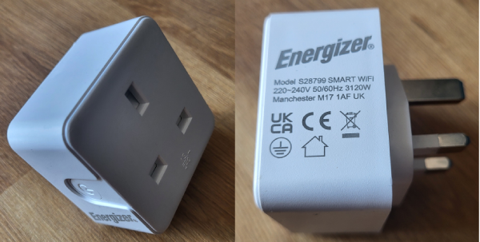
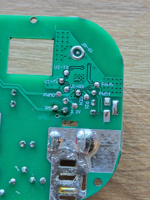

## Initial Install

The device does not appear to be compatible with tuya-cloudcutter.
There is a small recessed clip in each corner of the plug that will require prying.
This will reveal the PCB which has the neutral and live pins soldered through it and a BK7231N chip.
Unsoldering these pins will allow you to remove the PCB which reveals test pads for VCC, GND, CEN, TX1, and RX1 on the underside.





## GPIO Pinout

| Pin | Function            |
| --- | ------------------- |
| P6  | Relay               |
| P24 | Blue LED (Inverted) |
| P26 | Push Button         |

## Basic Configuration

```yaml
esphome:
  name: energizer-smart-plug

bk72xx:
  board: generic-bk7231n-qfn32-tuya

logger:

api:

ota:

wifi:
  ssid: !secret wifi_ssid
  password: !secret wifi_password

captive_portal:

binary_sensor:
  - platform: gpio
    pin:
      number: P26
      inverted: true
    name: Button
    on_click:
      then:
        - switch.toggle: relay

switch:
  - platform: gpio
    name: Relay
    pin: P6
    id: relay
    on_turn_on:
      - light.turn_on: status_light
    on_turn_off:
      - light.turn_off: status_light

light:
  - platform: status_led
    pin:
      number: P24
      inverted: true
    id: status_light
    internal: true
```
