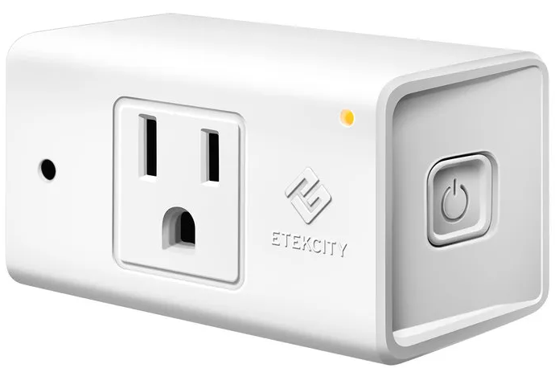
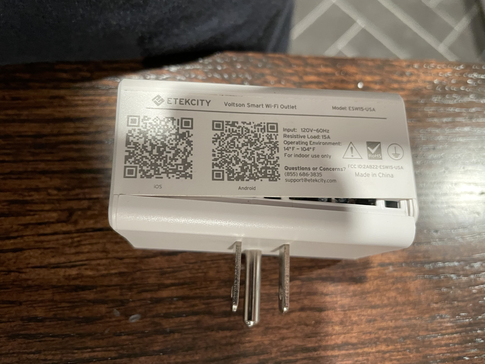
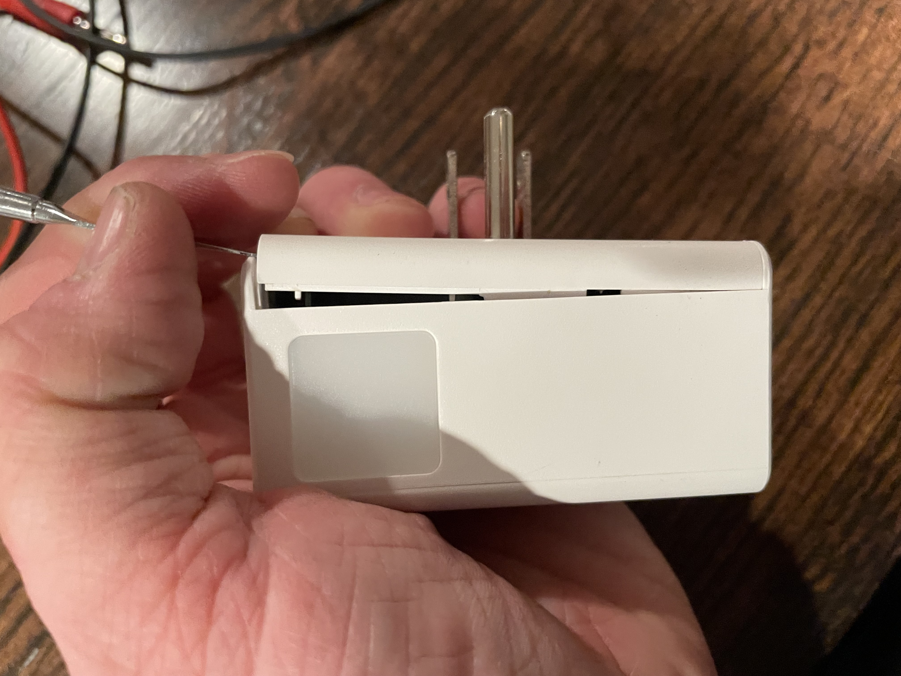
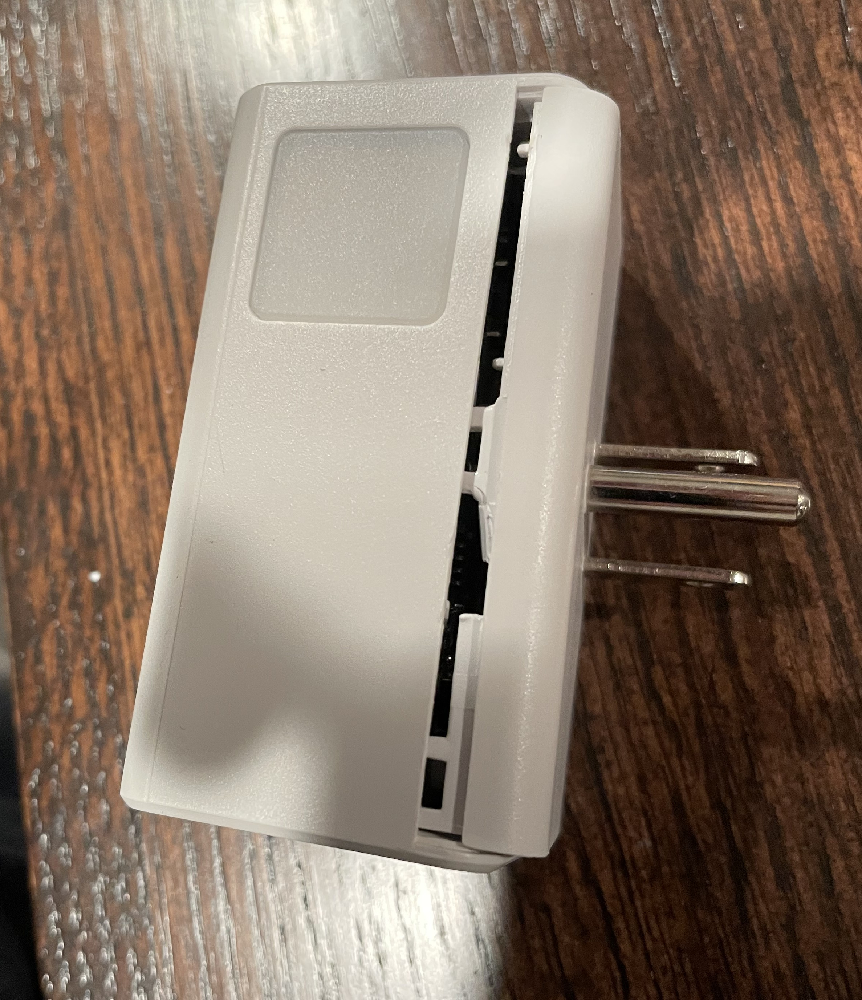
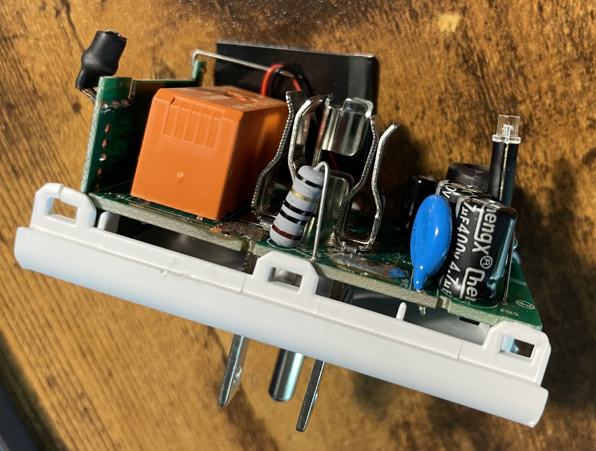
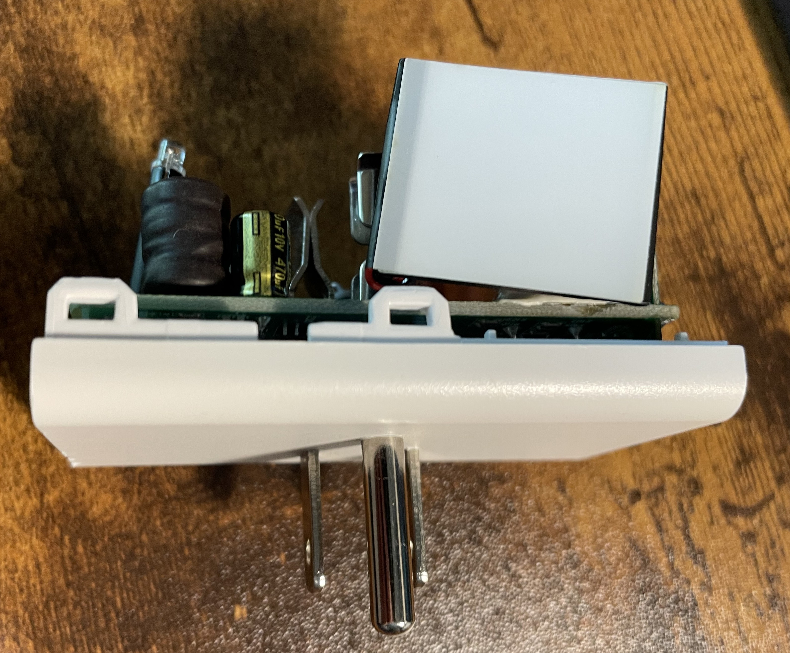
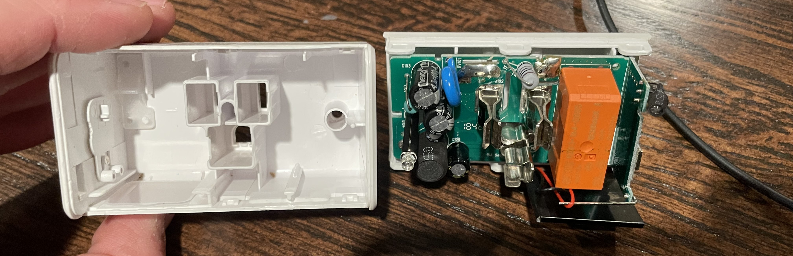
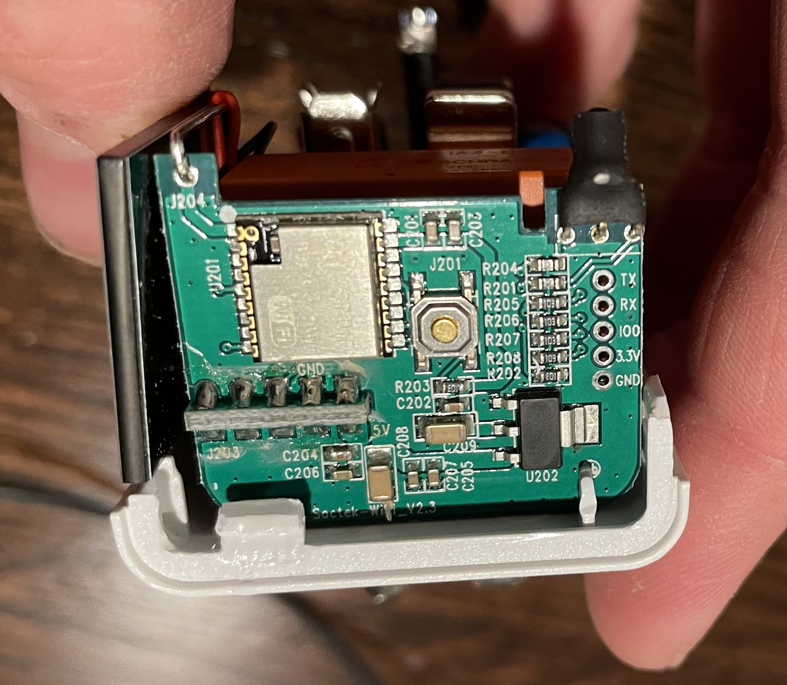
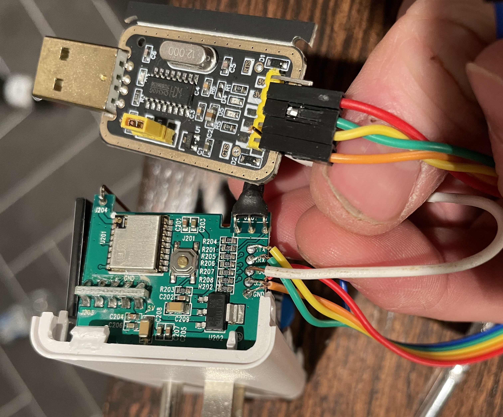

---  
title: Etekcity ESW15
date-published:  2026-05-16  
type: plug  
standard: us  
board: esp8266
difficulty: 3
---

## Product Images




The Etekcity Voltson ESW15-USA is a Wi-Fi connected 15-amp Smart Outlet with energy monitoring,
controlled via the VeSync app when running OEM firmware.

| Specification | Details                                                        |
| ------------- | -------------------------------------------------------------- |
| Manufacturer  | Etekcity                                                       |
| Model         | Voltson ESW15-USA                                              |
| Input         | AC 120V, 60Hz                                                  |
| Max Load      | 15A resistive                                                  |
| Environment   | 14°-104°F / -10°-40°C                                          |
| FCC ID        | [2AB22-ESW15-USA2](https://fcc.report/FCC-ID/2AB22-ESW15-USA)  |

## Disassembly

There are no screws. The plastic shell is held together by plastic clips.
You will a spudger to get between the seam of the plastic shell and disengage each of the 5 clips.







## Flashing New Firmware

### 1. Connect The Device To A USB Serial Converter

With the plastic shell separated, you will now have access to the top of the PCB.




Using the table below as a guide, connect each pin of a USB serial converter to its corresponding test pad on the PCB.

| USB serial converter | Smart Outlet Test Pad |
| -------------------- | --------------------- |
| RX / RXD             | TX                    |
| TX / TXD             | RX                    |
| GND                  | GND                   |
| VCC                  | 3V3                   |
| GND                  | IO0                   |

**_NOTE:_** The IO0 test pad must be pulled low (grounded) during power on, it will put the ESP module into Flash Mode.
You can either connect this to the GND pin of the USB serial converter or the GND test pad on the device.
**You will need to disconnect this pad from ground for the device to boot normally.
If you want to test the firmware before reassembling the plug,
wire this in such a way that you can easily detach it from ground.**

### 2. Boot Into Flash Mode

When an ESP module is powered on normally, it will start executing the installed firmware. The ESP module needs to be
put into Flash Mode before its firmware can be erased, read, or written to.

Follow the steps below to boot the ESP module into Flash Mode:

1. With all the other pins correctly connected to the USB serial converter, disconnect the 3.3V VCC wire and plug the USB
   serial converter into a USB port on a computer.
2. Ensure the IO0 pin is pulled low (connected to any ground source) before proceeding.
3. Plug the VCC wire back into the USB serial converter. The device should boot into Flash Mode, usually indicated by
   the indicator LED lighting up solid yellow.
4. Determine the COM port that the USB serial converter is attached to on the computer, and proceed by either backing up
   the firmware or flashing new firmware to the device.

### 3. Firmware Backup (optional)

If you want to make a backup of the OEM firmware so you can reflash it later for any reason, follow the steps below.

⚠ **SECURITY WARNING:** If the device is already set up, this procedure will also include any specific configurations,
such as Wi-Fi credentials. You may want to factory reset the device and back up a clean version of the firmware as well
if you plan on reselling this item in the future. Additional documentation on how to use esptool can be found
[in the esptool documentation](https://docs.espressif.com/projects/esptool/en/latest/esp32/index.html).

Follow the steps below to back up the firmware currently installed on the ESP module.

1. Download the latest esptool release for your operating system from
   [GitHub](https://github.com/espressif/esptool/releases).
2. Extract it and open a terminal in the folder where esptool is located.
3. With the ESP module booted into Flash Mode, run the following commands to back up or restore the firmware.

**_NOTE:_** The following command examples assume you are using a Windows computer with PowerShell and the USB serial
converter is attached to COM3.

#### Backup Firmware

```bash
.\esptool.exe -b 115200 --port COM3 read_flash 0 ALL Etekcity_Voltson_ESW15-USA.bin
```

#### Restore Firmware

```bash
.\esptool.exe -b 115200 --port COM3 write_flash 0 Etekcity_Voltson_ESW15-USA.bin
```

### 4. Flashing ESPHome

If you do not already have an instance of [ESPHome Dashboard](https://esphome.io/guides/getting_started_hassio.html)
running, or your instance does not meet the requirements to flash devices, you can use this
[official site](https://web.esphome.io) to flash a basic configuration or upload a custom configuration.

1. With the ESP module booted into Flash Mode, connect to the device and flash the new firmware.
2. Once the installation is successful, disconnect the VCC wire from the USB serial converter to power off the device.
3. Disconnect the IO0 test pad from GND so that the device will no longer boot into Flash Mode when powered on.
4. Plug the VCC wire back into the USB serial converter. The device should now boot normally.
5. You should now see an access point with the name "esphome" in it. Connect to the access point and use the
   [captive portal](https://esphome.io/components/captive_portal) to configure the Wi-Fi settings on the device.
   - **_NOTE:_** If [Improv via Serial](https://esphome.io/components/improv_serial) was included in the configuration,
     you can also configure the Wi-Fi settings via serial.
6. Once connected to Wi-Fi, you should be able to access the device's
   [web server](https://esphome.io/components/web_server) via its IP address. If you have not already, you can now adopt
   the device with ESPHome Dashboard.

## ESP Home Configuration

### GPIO Pinout

| Pin    | Function             |
| ------ | -------------------- |
| GPIO4  | Nightlight Output    |
| GPIO5  | Outlet Relay         |
| GPIO12 | HLWBL CF1 Pin        |
| GPIO13 | HLW8012 CF Pin       |
| GPIO14 | Button               |
| GPIO15 | HLWBL SEL Pin        |
| GPIO16 | LED blue             |
| A0     | Ambient Light Sensor |

### Basic ESPHome Configuration

```yaml file=esw15.yaml
```

### Energy Monitoring Tuning

Energy monitoring for this plug is provided by an HLW8012 module. Luckily for us, unlike some other models of this plug,
this one has a GPIO pin (GPIO15) wired to the SEL pin of the HLW8012 module.

This means we can switch between voltage and current monitoring. Some known good default values for voltage_divider,
current_resistor, and current_multiply have been provided in the Basic Configuration.

If you want to fine-tune the energy readings further, follow the instructions for the
[HWL8012 module](https://esphome.io/components/sensor/hlw8012).
