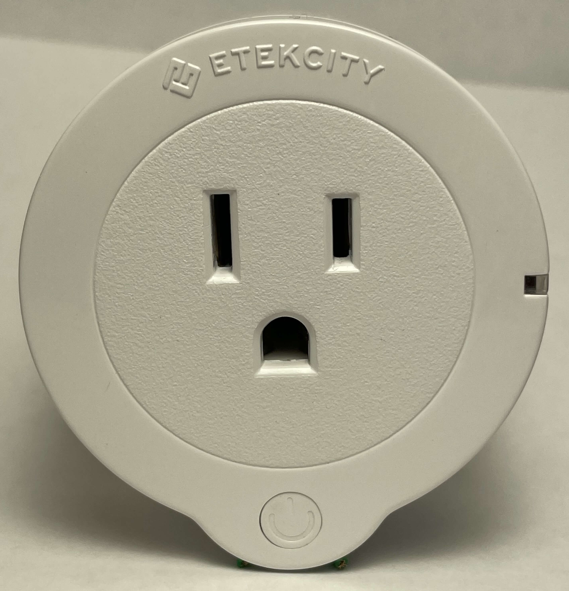
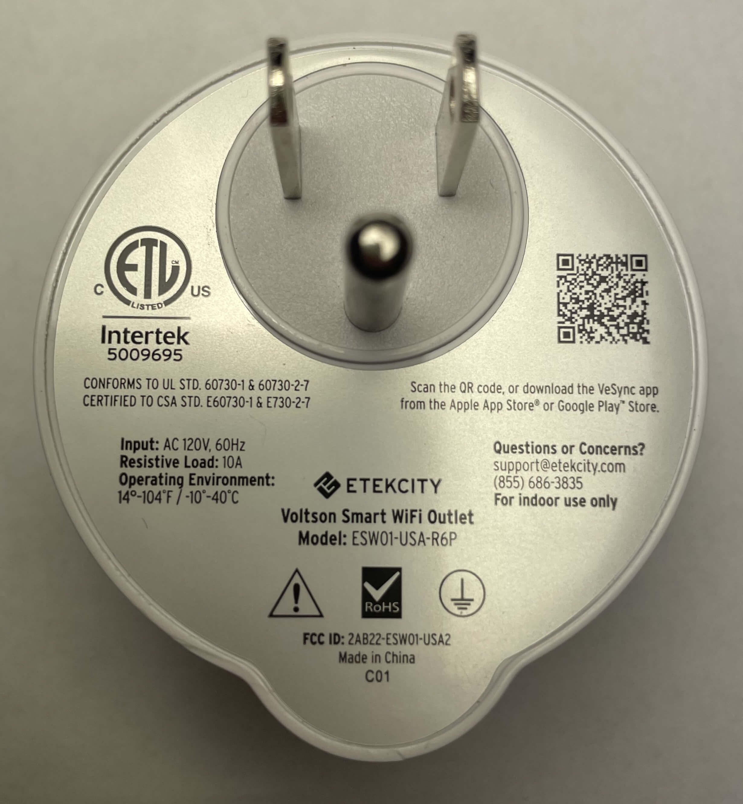
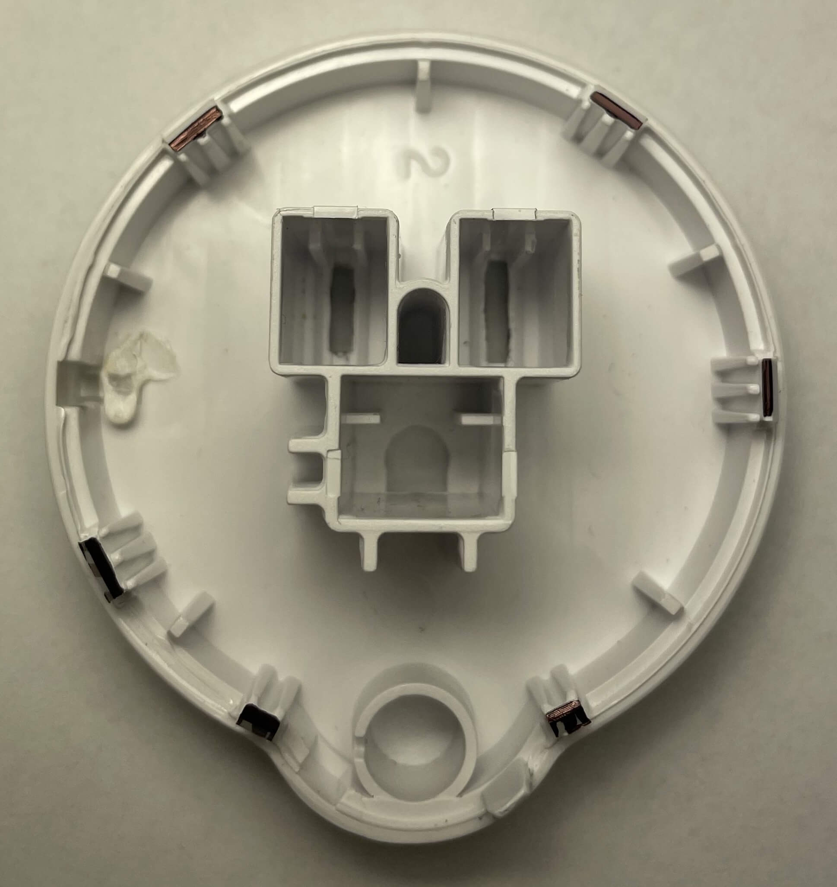
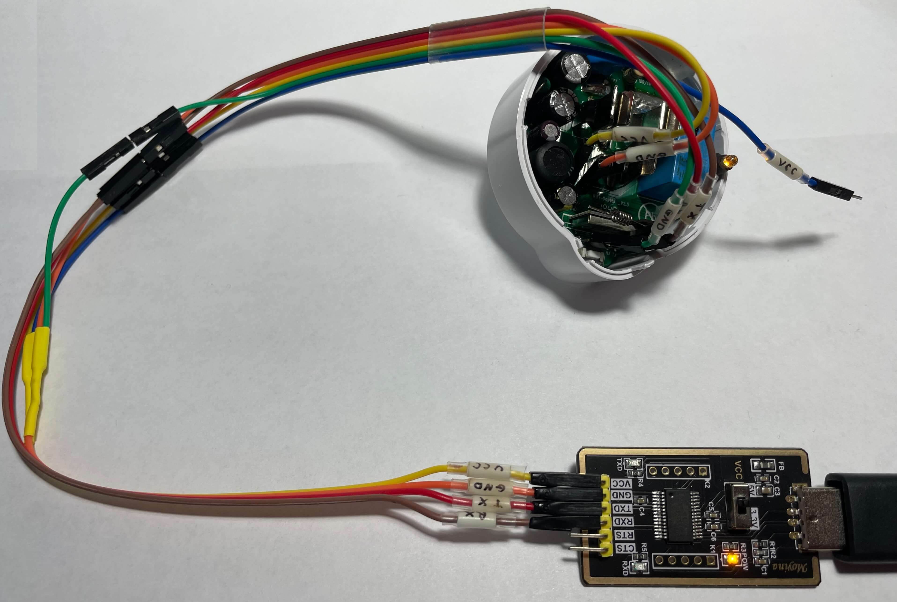

## Product Images




The Etekcity Voltson ESW01-USA-R6P is a Wi-Fi connected 10-amp Smart Outlet with energy monitoring, controlled via the VeSync app when running OEM firmware.

| Specification | Details
| ------------- | -
| Manufacturer  | Etekcity
| Model         | Voltson ESW01-USA-R6P
| Input         | AC 120V, 60Hz
| Max Load      | 10A resistive
| Environment   | 14°-104°F / -10°-40°C
| FCC ID        | [2AB22-ESWO1-USA2](https://fcc.report/FCC-ID/2AB22-ESWO1-USA2)

## Additional Resources

### Etekcity Smart Outlet

- [Etekcity Product Page](https://etekcity.com/products/voltson-smart-wifi-outlet-1)
- [Etekcity Product Manual](https://docs.ai-thinker.com/_media/esp8266/docs/esp-01e_product_specification_en.pdf)

### ESP 01E Module

- [Ai-Thinker - ESP 01E Datasheet](https://docs.ai-thinker.com/_media/esp8266/docs/esp-01e_product_specification_en.pdf)

| Specification   | Details
| --------------- | -
| Manufacturer    | Ai-Thinker
| Module Model    | ESP-01E
| SPI Flash       | 1MB built-in flash
| UART Baud Rate  | 300 ~ 4608000 bps (Default 115200 bps)
| Frequency Range | 2412 ~ 2484MHz
| Power Supply    | 3.0V ~ 3.6V (Typical 3.3V, >500mA)

## Disassembly

Unlike some other versions of this plug, there are no screws. The plastic shell is held together by plastic clips. You will need something thin to get between the seam of the plastic shell and disengage each of the six clips.

The pictures below use black markings to show where the clips are located, depending on how you are holding the smart outlet when disassembling it.




## Flashing New Firmware

### 1. Connect The Device To A USB Serial Converter

With the plastic shell separated, you will now have access to the top of the PCB.


Because this model does not seem to allow the removal of the PCB without desoldering the plug, you will need to carefully solder wires to the visible test pads.

Using the table below as a guide, connect each pin of a USB serial converter to its corresponding test pad on the PCB.

| USB serial converter | Smart Outlet Test Pad
| -------------------- | -
| RX / RXD             | TX
| TX / TXD             | RX
| GND                  | T4/GND
| VCC                  | T5/5V
| GND                  | IO0 (looks like 100)

**_NOTE:_**  The IO0 test pad on the PCB might look like the number 100. This pad is connected to GPIO0 on the ESP 01E. When pulled low (grounded) during power on, it will put the ESP module into Flash Mode. You can either connect this to the GND pin of the USB serial converter or the GND test pad on the device. **You will need to disconnect this pad from ground for the device to boot normally. If you want to test the firmware before reassembling the plug, wire this in such a way that you can easily detach it from ground.**

⚠ **WARNING:** While the AI-Thinker ESP 01E is typically powered by 3.3V, the test pad seems to be connected to other components on the board and requires 5V. Flashing using 3.3V on this test pad has been tested, but even though the installation reports success, the device does not seem to boot correctly afterward, even when powering it with 5V.

### 2. Boot Into Flash Mode

When an ESP module is powered on normally, it will start executing the installed firmware. The ESP module needs to be put into Flash Mode before its firmware can be erased, read, or written to.

Follow the steps below to boot the ESP module into Flash Mode:

1. With all the other pins correctly connected to the USB serial converter, disconnect the 5V VCC wire and plug the USB serial converter into a USB port on a computer.
2. Ensure the IO0 pin is pulled low (connected to any ground source) before proceeding.
3. Plug the VCC wire back into the USB serial converter. The device should boot into Flash Mode, usually indicated by the indicator LED lighting up solid yellow.
4. Determine the COM port that the USB serial converter is attached to on the computer, and proceed by either backing up the firmware or flashing new firmware to the device.



### 3. Firmware Backup (optional)

If you want to make a backup of the OEM firmware so you can reflash it later for any reason, follow the steps below.

⚠ **SECURITY WARNING:** If the device is already set up, this procedure will also include any specific configurations, such as Wi-Fi credentials. You may want to factory reset the device and back up a clean version of the firmware as well if you plan on reselling this item in the future. Additional documentation on how to use esptool can be found [here](https://docs.espressif.com/projects/esptool/en/latest/esp32/index.html).

Follow the steps below to back up the firmware currently installed on the ESP module.

1. Download the latest esptool release for your operating system from [GitHub](https://github.com/espressif/esptool/releases).
2. Extract it and open a terminal in the folder where esptool is located.
3. With the ESP module booted into Flash Mode, run the following commands to back up or restore the firmware.

**_NOTE:_** The following command examples assume you are using a Windows computer with PowerShell and the USB serial converter is attached to COM3.

#### Backup Firmware

```bash
.\esptool.exe -b 115200 --port COM3 read_flash 0 ALL Etekcity_Voltson_ESW01-USA-R6P_1M.bin
```

#### Restore Firmware

```bash
.\esptool.exe -b 115200 --port COM3 write_flash 0 Etekcity_Voltson_ESW01-USA-R6P_1M.bin
```

### 4. Flashing ESPHome

If you do not already have an instance of [ESPHome Dashboard](https://esphome.io/guides/getting_started_hassio.html) running, or your instance does not meet the requirements to flash devices, you can use this [official site](https://web.esphome.io) to flash a basic configuration or upload a custom configuration.

1. With the ESP module booted into Flash Mode, connect to the device and flash the new firmware.
2. Once the installation is successful, disconnect the VCC wire from the USB serial converter to power off the device.
3. Disconnect the IO0 test pad from GND so that the device will no longer boot into Flash Mode when powered on.
4. Plug the VCC wire back into the USB serial converter. The device should now boot normally.
5. You should now see an access point with the name "esphome" in it. Connect to the access point and use the [captive portal](https://esphome.io/components/captive_portal) to configure the Wi-Fi settings on the device.
    - **_NOTE:_** If [Improv via Serial](https://esphome.io/components/improv_serial) was included in the configuration, you can also configure the Wi-Fi settings via serial.
6. Once connected to Wi-Fi, you should be able to access the device's [web server](https://esphome.io/components/web_server) via its IP address. If you have not already, you can now adopt the device with ESPHome Dashboard.

## ESP Home Configuration

### GPIO Pinout

| Pin    | Function
| ------ | -
| GPIO4  | Outlet Relay
| GPIO5  | LED blue
| GPIO12 | HLWBL CF1 Pin
| GPIO13 | HLW8012 CF Pin
| GPIO14 | Button
| GPIO15 | HLWBL SEL Pin
| GPIO16 | LED yellow

### Basic ESPHome Configuration

The configuration below can be used when you initially set up the device to get its basic functionality. Comments and links are included to help you easily navigate the available options.

**⚠ IMPORTANT:** Please pay attention to any comments in the configurations below that start with "**⚠ SECURITY WARNING**". These comments highlight security features that are not necessary for the device to function normally but should be considered for additional security based on your personal risk tolerance.

``` yaml
##############################
### Variable Substitutions ###
##############################
# More information available at https://esphome.io/guides/configuration-types#substitutions
substitutions:
  name: etek-city-outlet
  friendly_name: Etek City Plug
  throttle_average: 60s # How often average sensor values are published (this is NOT how often sensor readings are taken)
  # HLW8012 Energy Monitoring Defaults for the Etekcity Voltson ESW01-USA-R6P
  # These defaults are a good starting point for the Etekcity Voltson ESW01-USA-R6P. However, further tuning will yield the best results.
  # More information on HLW8012 tuning is available at https://esphome.io/components/sensor/hlw8012
  voltage_divider: "2017.5014044943819"
  current_resistor: "0.0009273577235772359"
  current_multiply: "1.0"

##################################
### ESPHome Core Configuration ###
##################################
# More information available at https://esphome.io/components/esphome.html

esphome:
  name: ${name}
  friendly_name: ${friendly_name}
  # As of the publication of this guide, ESPHome Dashboard only seems to use the "name" of the device for mDNS lookups.
  # This causes ESPHome Dashboard's DNS lookups to fail to resolve correctly, resulting in its failure to connect to your device.
  # If you want to add the mac_suffix to the device name, consider adding it to the "name" value in the "substitutions" section.
  # If you still want to enable the "name_add_mac_suffix" option, consider using the "manual_ip" option in the "wifi" section below so ESPHome Dashboard can find your device on the network.
  name_add_mac_suffix: False

# ESP8266 Platform Configuration
# More information available at https://esphome.io/components/esp8266
esp8266:
  board: esp01_1m
  early_pin_init: False # ⚠ IMPORTANT: This setting will prevent the outlet from flickering on/off during reboots!

##########################################
### Connectivity & Additional Services ###
##########################################

# Enable Logging
logger: # More information available athttps://esphome.io/components/logger
  level: INFO # By default, the log level is DEBUG. Increasing the log level severity (e.g., to INFO or WARN) can help improve the performance and memory usage of the application.
    
# OTA flashing
ota:
  - platform: esphome

wifi: # Your Wifi network details
  
# Enable fallback hotspot in case wifi connection fails  
  ap:

# Enable Home Assistant API
api:

# Enable the captive portal
captive_portal:

# You can enable a web server to interact with the plug directly via your web browser.
# ⚠ WARNING: Enabling this component will take up a lot of memory and may decrease overall stability, especially on devices with ESP8266 modules, which this device uses.
# NOTE: This component is not required to interact with the plug via Home Assistant or the API.
web_server: # More information available at https://esphome.io/components/web_server
#  ota: False # ⚠ SECURITY WARNING: Keep in mind that even with an OTA password set, if OTA is enabled in the web server, anyone with access to the web server can reflash new firmware!
#  auth: # ⚠ SECURITY WARNING: Not specifying a username and password here will allow anyone on your network with the IP of the device to interact with it!
#    username: !secret web_server_username
#    password: !secret web_server_password

#############################################################
### Etekcity Voltson ESW01-USA-R6P Specific Configuration ###
#############################################################

# Wi-Fi Link Status LED (Blue)
status_led:
  pin:
    number: GPIO5

# Outlet State LED (Yellow)
output:
- platform: gpio
  id: outlet_state_led
  pin: GPIO16

# Outlet Relay Button
switch:
- platform: gpio
  name: "Outlet"
  id: outlet_relay
  pin: GPIO4
  restore_mode: RESTORE_DEFAULT_ON
  on_turn_on:
    - output.turn_on: outlet_state_led
  on_turn_off:
    - output.turn_off: outlet_state_led

# Outlet Relay Toggle When Button Pushed
binary_sensor:
  - platform: gpio
    id: outlet_button
    pin:
      number: GPIO14
      mode: INPUT_PULLUP
      inverted: true
    on_press:
      - switch.toggle: outlet_relay

sensor:
  # Energy Monitoring via HLW8012 Module
  # More information available at https://esphome.io/components/sensor/hlw8012
  - platform: hlw8012
    sel_pin: GPIO15
    cf_pin: GPIO13
    cf1_pin: GPIO12
    # Energy Monitoring Tuning Options
    current_resistor: ${current_resistor}
    voltage_divider: ${voltage_divider}
    current:
      id: current
      name: Current
      # Energy Monitoring Tuning Filter
      filters:
        - multiply: ${current_multiply}
        - throttle_average: ${throttle_average}
    voltage:
      id: voltage
      name: Voltage
      filters:
        - throttle_average: ${throttle_average}
    power:
      id: wattage
      name: Wattage
      filters:
        - throttle_average: ${throttle_average}
    initial_mode: voltage
    change_mode_every: 8 # How many update intervals pass before the HLW8012 switches to (voltage or current) measurement modes.
    update_interval: 1s # How often sensor readings are taken.
```

### Energy Monitoring Tuning

Energy monitoring for this plug is provided by an HLW8012 module. Luckily for us, unlike some other models of this plug, this one has a GPIO pin (GPIO15) wired to the SEL pin of the HLW8012 module.

This means we can switch between voltage and current monitoring. Some known good default values for voltage_divider, current_resistor, and current_multiply have been provided in the Basic Configuration.

These values have been tuned with a FLUKE 87 and have been tested on a few of these plugs, yielding decent results.

If you want to fine-tune the energy readings further, follow the instructions for the [HWL8012 module](https://esphome.io/components/sensor/hlw8012).

### Total Daily Energy Sensor

If you want to add an additional sensor to track total daily energy usage, add the following to your configuration:

- A new platform entry named "total_daily_energy" under the "sensor" section.
- A new section entry named "time".

```yaml
# Everything from the basic configuration should go here
# ...

sensor:
  # The HLW8012 platform entry (required)
  # All other sensor platform entries should go here
  # ...

  # Total Daily Energy Sensor
  # More information available at https://esphome.io/components/sensor/total_daily_energy
  - platform: total_daily_energy
    name: 'Total Daily Energy'
    power_id: wattage
    unit_of_measurement: 'kWh'
    state_class: total_increasing
    device_class: energy
    accuracy_decimals: 3
    filters:
      # Multiplication factor from W to kW is 0.001
      - multiply: 0.001

# Time Component
# This will reset the "Total Daily Energy Sensor" to 0 at midnight, synced with Home Assistant's clock.
time: # More information available at https://esphome.io/components/time
  - platform: homeassistant
    id: homeassistant_time
```

### Debugging Component

If you need to debug anything on the device, you can add the following:

- A new platform entry named "debug" under the "sensor" section.
- A new section entry named "debug".

```yaml
# Everything from the basic configuration should go here.
# ...

sensor:
  # All other sensor platform entries should go here.
  # ...

  # Debug component
  # More information at https://esphome.io/components/debug
  - platform: debug
    free:
      name: "Heap Free"
    fragmentation:
      name: "Heap Fragmentation"
    block:
      name: "Heap Max Block"
    loop_time:
      name: "Loop Time"

# Enable this to update the debugging sensor.
debug:
  update_interval: 5s
```
