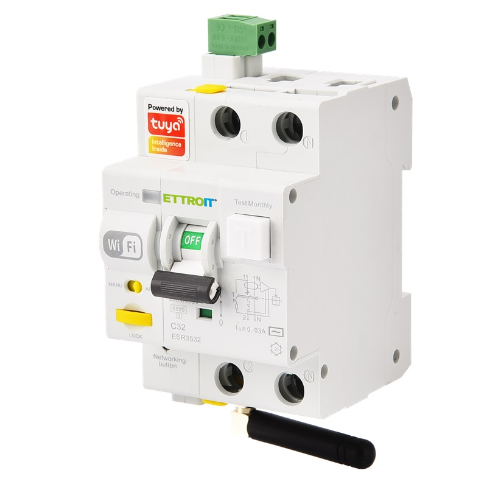
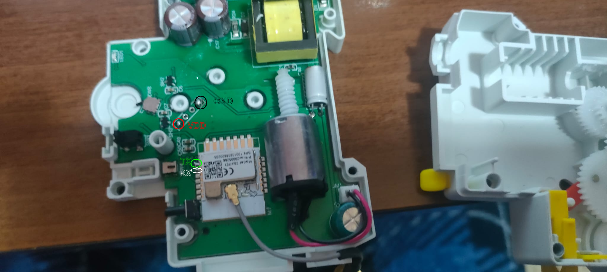

Maker: <https://ettroit.com/>

Also available on Aliexpress with other namings, but without certifications.

## Installation

*NOTE*: Before flashing always make a backup of the original firmware.

These units generally ship with a firmware which is no longer exploitable by tuya-fwcutter,
so some disassembly and soldering will be required to flash using serial.

First, you need to separate the motor unit from the RCBO, open the two plastics un top and botton that keep the unit together, there is also a tiny screw, on the motor unit, remove it before separating the two units.
Second, the 6 rivets need to be drilled out with a 2mm drill bit from the motor unit. You'll need something to replace
these when you reassemble the unit; M1.6 nuts and 16mm bolts work well, also there are available some rivets on the internet marketplaces, in case you want to use rivets, you will need 2mm diameter, 18mm length.

Once open, try to not move the controlling wheels mechanism and keep some photo to remount everything in the right place in case something moves or is accidentally removed from it's place, you will need 4 points to solder and attach the serial connection:



All the pins you need to flash the device are accessible:

- VDD / +3.3v (red circled visible in the open unit)
- GND (black one circled visible in the open unit)

*NOTE*: to check if GND is correct use a multimeter and check who gives you short circuit against metal shell of CBU, that is GND access, other one is VDD

- RX (white circled visible in open unit)
- TX (green circled visible in open unit)

*NOTE*: TX and RX are referred as per CBU spec, so you have to use TX for RX and vice versa when connecting to serial

You don't need to completely remove the board from the device, as shown in the picture above. But do not attempt to flash it while it's connected to the mains!

When ltchiptool says `Getting bus... (now, please do reboot by CEN or by power off/on)` disconnect and reconnect the GND line, and it should proceed.

## Tuya Datapoints

| Datapoints | Function                       |
| ---------- | ------------------------------ |
| 1          | Turns on or off RCBO           |
| 102        | Mechanic Lock (binary sensor)  |
| 103        | Remote Lock (switch)           |
| 104        | Local Lock (binary sensor)     |

*NOTE*: When remote lock is active you won't be able to activate the RCBO locally, also, if not remotely locked, with local lock you won't be able to do any action in the RCBO or other datapoints

## Configuration

- Per-device configuration:

```yaml
substitutions:
  name: "remote-rcbo"
  friendly_name: "Remote RCBO"

bk72xx:
  board: generic-bk7231n-qfn32-tuya

esphome:
  name: $name
  friendly_name: $friendly_name
  name_add_mac_suffix: false

mdns:

text_sensor:
  - platform: libretiny
    version:
      name: LibreTiny Version

# Enable logging
logger:
  level: INFO

# Enable Home Assistant API
api:
  encryption:
    key: !secret api
  reboot_timeout: 30min

ota:
  - platform: esphome
    password: !secret ota

wifi:
  ssid: !secret wifi_ssid
  password: !secret wifi_password
  reboot_timeout: 20min

button:
  - platform: restart
    name: "Restart"
    id: button_restart

binary_sensor:
  - platform: tuya
    id: mlock
    sensor_datapoint: 102
    name: Mechanic Lock
    on_press:
      then: #remove remote lock so we can rearm the device in case it goes offline!
        - switch.turn_off: rlock
  - platform: tuya
    id: llock
    sensor_datapoint: 104
    name: Local Lock

uart:
  rx_pin: RX1
  tx_pin: TX1
  baud_rate: 115200

tuya:

switch:
  - platform: tuya
    switch_datapoint: 1
    name: Switch
    id: MTD
    restore_mode: RESTORE_DEFAULT_OFF
  - platform: tuya
    id: rlock
    switch_datapoint: 103
    name: Remote Lock
    restore_mode: RESTORE_DEFAULT_OFF
```

A more complex configuration can allow the switch to be reset automatically, like the one shown below:

```yaml
substitutions:
  name: "remote-rcbo"
  friendly_name: "Remote RCBO"

bk72xx:
  board: generic-bk7231n-qfn32-tuya

esphome:
  name: $name
  friendly_name: $friendly_name
  name_add_mac_suffix: false

mdns:

text_sensor:
  - platform: libretiny
    version:
      name: LibreTiny Version

# Enable logging
logger:
  level: INFO

# Enable Home Assistant API
api:
  encryption:
    key: !secret api
  reboot_timeout: 30min

ota:
  - platform: esphome
    password: !secret ota

wifi:
  ssid: !secret wifi_ssid
  password: !secret wifi_password
  reboot_timeout: 20min

button:
  - platform: restart
    name: "Restart"
    id: button_restart

binary_sensor:
  - platform: tuya
    id: mlock
    sensor_datapoint: 102
    name: Mechanic Lock
    on_press:
      then: #remove remote lock so we can rearm the device in case it goes offline!
        - switch.turn_off: rlock
    on_release:
      then:
        - lambda: |-
            (id(attempts) = 0);
  - platform: tuya
    id: llock
    sensor_datapoint: 104
    name: Local Lock
    on_release:
      then:
        - lambda: |-
            (id(attempts) = 0);

uart:
  rx_pin: RX1
  tx_pin: TX1
  baud_rate: 115200

tuya:

switch:
  - platform: tuya
    switch_datapoint: 1
    name: Switch
    id: MTD
    restore_mode: RESTORE_DEFAULT_OFF
    on_turn_on:
      then:
        - script.stop: cycle_script
        - script.stop: act_script
        - script.execute: act_script
    on_turn_off:
      then:
        - script.stop: act_script
        - script.stop: cycle_script
        - script.execute: cycle_script
  - platform: tuya
    id: rlock
    switch_datapoint: 103
    name: Remote Lock
    restore_mode: RESTORE_DEFAULT_OFF
    on_turn_off:
      then:
        - lambda: |-
            (id(attempts) = 0);

globals:
  - id: attempts
    type: int
    restore_value: False
    initial_value: '0'

script:
  - id: cycle_script
    mode: single
    then:
      - if:
          condition:
            and:
              - switch.is_off: MTD
              - switch.is_off: rlock
              - binary_sensor.is_off: mlock
              - lambda: |-
                  return (id(attempts) < 3);
          then:
            - lambda: |-
                (id(attempts) += 1);
            - delay: !lambda |-
                return (id(attempts) * 180000);
            - if:
                condition:
                  and:
                    - switch.is_off: MTD
                    - switch.is_off: rlock
                    - binary_sensor.is_off: mlock
                then:
                  - switch.turn_on: MTD
  - id: act_script
    mode: single
    then:
      - delay: 2 min
      - if:
          condition:
            - switch.is_on: MTD
          then:
            - lambda: |-
                (id(attempts) = 0);
```

*NOTE*: this particular configuration will rearm the RCBO for 3 times, with a 3 minute timer multiplied per number or retries (so 3, 6 and 9 minutes).

[Test Report EMC](5-Test-Report-EMC.pdf)
[Test Report LVD](5-Test-Report-LVD.pdf)
[Certification Conformity LVD ECD](M-2025_206_C122911.pdf)
