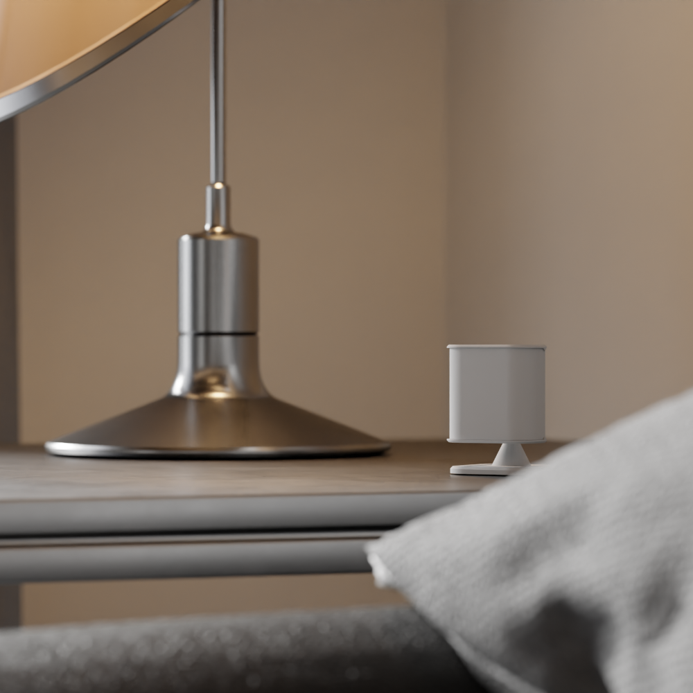
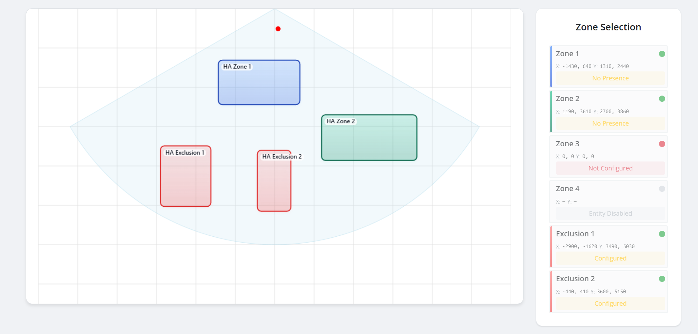

## Description

The Everything Presence Lite is a compact mmWave presence sensor with the following features:

- HiLink LD2450 24GHz mmWave sensor with up to 6m detection range
- Multi-target tracking (up to 3 targets simultaneously)
- BH1750 Light intensity sensor for ambient light detection
- Visual Zone Configurator for easy zone-management
- Up to 4 configurable detection zones
- Up to 2 exclusion zones
- Bluetooth Proxy functionality for Home Assistant
- USB-C powered with injection molded case

Compatible with multiple mmWave sensors including:

- DFRobot SEN0395
- HiLink LD2410C
- Various Seeed mmWave sensors

## Zones

The Everything Presence Zone Configurator makes it easy to setup zones and exclusion zones visually with real-time feedback:

## Setup

1. Plug in the Everything Presence Lite via USB-C.
2. Using the Home Assistant Mobile App, go to Settings > Devices and find the auto discovered Everything Presence Lite
3. Hit add and enter WiFi details
4. In Home Assistant, look at discovered devices.

## Support

- [Shop](https://shop.everythingsmart.io/products/everything-presence-lite)
- [Official Documentation](https://docs.everythingsmart.io/s/products/doc/everything-presence-lite-epl-ZVnBzYzuX2)
- [GitHub](https://github.com/EverythingSmartHome/everything-presence-lite)
- [YouTube](https://www.youtube.com/@EverythingSmartHome)
- [Discord](https://discord.everythingsmarthome.co.uk/)
