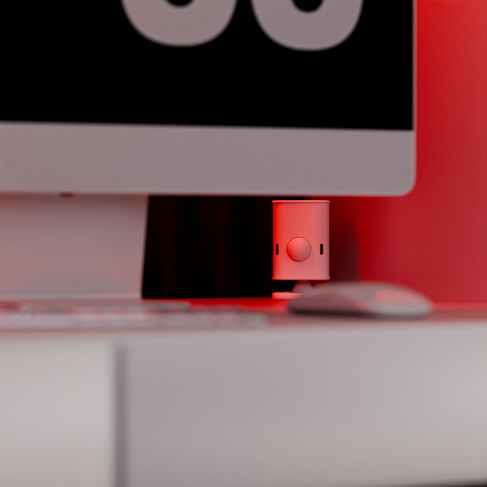

## Description

The Everything Presence One is a comprehensive presence sensor with dual detection technology and the following features:

- DFRobot SEN0395/SEN0609 24GHz mmWave sensor with up to 9m detection range
- Panasonic Industrial PIR EKMC1603111/2/3 with 12m detection range
- SHTC3 Temperature and Humidity sensor
- BH1750 Light intensity sensor
- Bluetooth Proxy functionality for Home Assistant
- ESP32-WROOM-32E with 4MB flash
- USB-C powered with official injection molded case
- Modular design with removable mmWave and PIR modules
- 4 additional GPIO pins for expansion

The EP1 combines both mmWave and PIR for lightning-fast responses and flexability in detecting false positives, detecting both micro and macro movements.

Compatible mmWave sensors (validated only):

- DFRobot SEN0395 (all boards)
- DFRobot SEN0609 (Rev 1.5+)

## Setup

1. Assemble the Everything Presence One kit components.
2. Plug in the Everything Presence One via USB-C.
3. Using the Home Assistant Mobile App, go to Settings > Devices and find the auto discovered Everything Presence One
4. Hit add and enter WiFi details
5. In Home Assistant, check the discovered devices for the auto discovered Everything Presence One using the esphome integration.

## Support

- [Shop](https://shop.everythingsmart.io/products/everything-presence-one-kit)
- [Official Documentation](https://docs.everythingsmart.io/s/products/doc/everything-presence-one-ep1-3R178yZSUP)
- [GitHub](https://github.com/EverythingSmartHome/everything-presence-one)
- [YouTube](https://www.youtube.com/@EverythingSmartHome)
- [Discord](https://discord.everythingsmarthome.co.uk/)
