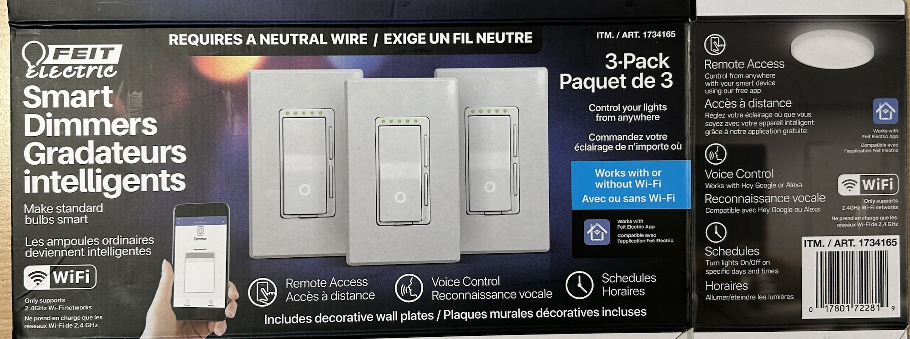
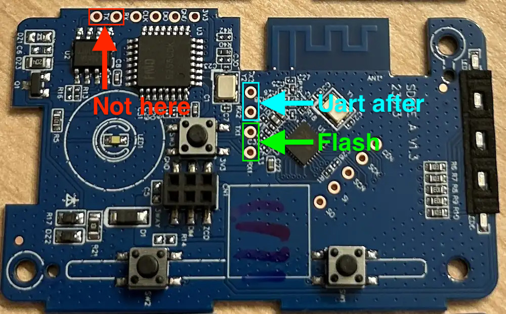

I purchased this at Costco in Canada in November of 2022 and then again in November of 2024. The Costco item number was 1734165.

It is hold together with screws, making it very easy to open and flash.



First, I took the unit apart. Then I soldered pin headers onto the board. I took 3v3 and gnd from a nearby ESP32 devkit and connected it to my computer.

You also need to solder a wire to the NRST pad on the back side of the board. This is the trickiest part as the pad is small. It is possible to remove the pad entirely from the board rendering it unusable so be a bit careful and if you've been working with the board for a bit and it won't take the solder or won't enter programming mode it's possible that you removed the pad.

## Dumping original firmware

Connect NRST to gnd, provide power to the board, then:

```bash
ltchiptool flash read beken-72xx ./dimmer1
```

## Installing ESPhome

I used ltchiptool's UPK2ESPHome to parse the firmware. The result is the configuration below. Put that config into a .yml file and compile the firmware:

```bash
esphome compile dimmer.yml
```

Next, write that firmware:

```bash
ltchiptool flash write .esphome/build/dimmer/.pioenvs/dimmer/esphome_2024.10.0_generic-bk7231n-qfn32-tuya_bk7231n_lt1.7.0.uf2
```

## Basic Configuration

```yaml
esphome:
  name: feit-dimmer-11
  friendly_name: "Feit dimmer 11"

bk72xx:
  board: generic-bk7231n-qfn32-tuya

logger:
  level: verbose

web_server:

captive_portal:

api:

ota:

button:
  - platform: restart
    name: Restart

debug:
  update_interval: 30s

text_sensor:
  - platform: debug
    reset_reason:
      name: Reset Reason
  - platform: libretiny
    version:
      name: LibreTiny Version

sensor:
  - platform: uptime
    name: Uptime

uart:
  rx_pin: RX1
  tx_pin: TX1
  baud_rate: 9600

tuya:
  # DPIDs processed from schema model: 000003w4ro

switch:
  - platform: tuya
    switch_datapoint: 1
    name: Power

number:
  - platform: tuya
    number_datapoint: 2
    name: Brightness
    min_value: 10
    max_value: 1490
    step: 1
  - platform: tuya
    number_datapoint: 3
    name: Brightness Min
    min_value: 10
    max_value: 2000
    step: 1
  - platform: tuya
    number_datapoint: 5
    name: Brightness Max
    min_value: 10
    max_value: 2000
    step: 1
  - platform: tuya
    number_datapoint: 6
    name: Countdown
    unit_of_measurement: s
    min_value: 0
    max_value: 86400
    step: 1

select:
  - platform: tuya
    enum_datapoint: 4
    name: Led Type
    optimistic: true
    options:
      0: Led
      1: Incandescent
      2: Halogen
  - platform: tuya
    enum_datapoint: 101
    name: Switch LED Brightness
    optimistic: true
    options:
      0: "Off"
      1: Low
      2: High
  - platform: tuya
    enum_datapoint: 102
    name:  On Control
    optimistic: true
    options:
      0: Gradual
      1: Instant
      2: Switch
```
