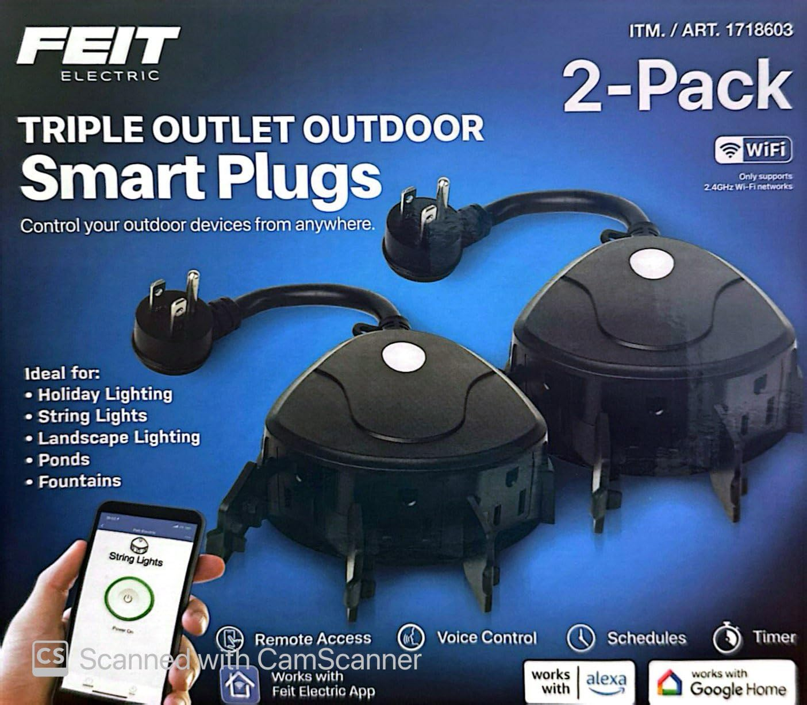
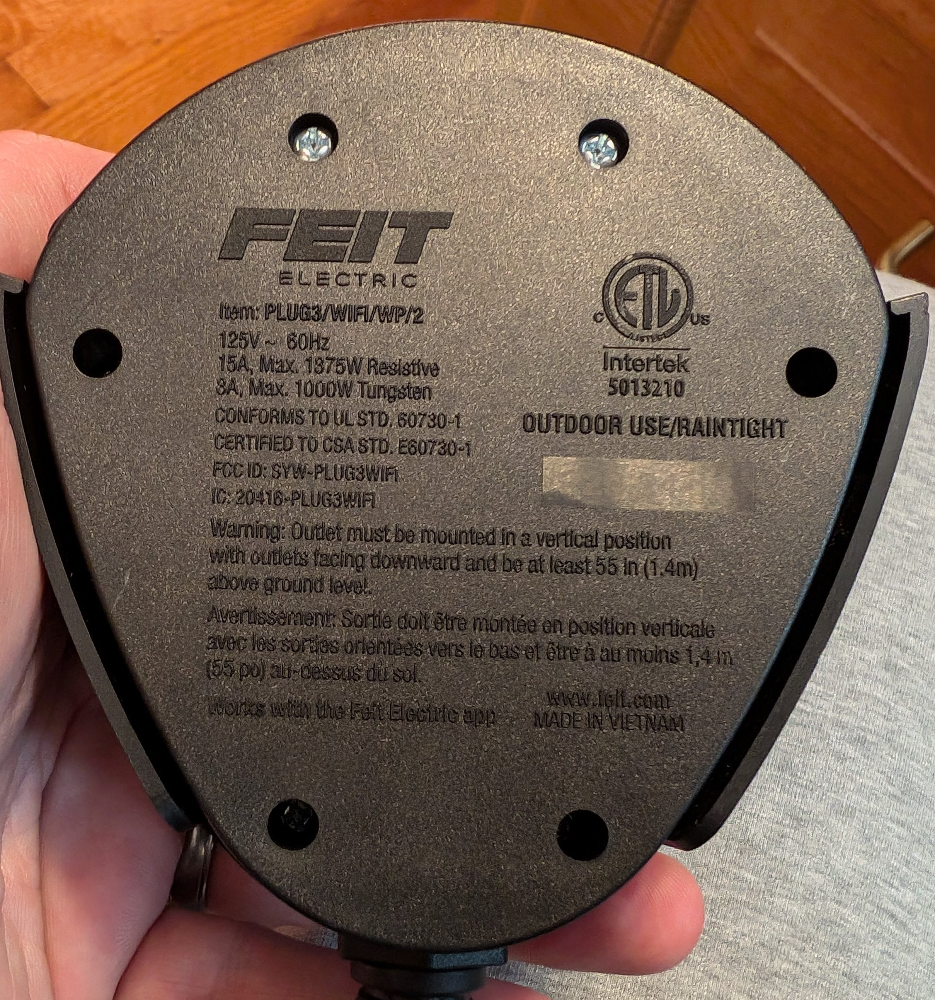
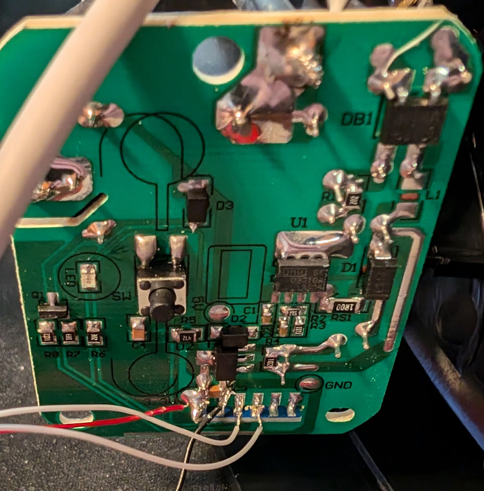

This variant is marked `FCC ID: SYW-PLUG3WIFI` and `IC: 20416-PLUG3WIFI` on the bottom.

[Amazon Link](https://amzn.to/3TlrpOr)



The Feit Electric Triple Outlet Outdoor SmartPlug is sold on [Amazon](https://amzn.to/3TlrpOr) and at [Costco](https://www.costco.com/feit-electric-triple-outlet-outdoor-smart-plugs-2-pack.product.4000263691.html) in the US. I picked up a 2-pack at Costco on sale in September 2024 for around $15. They are plastic but weatherized with a UL rating for wet locations.

Note that there is a variant (labled IC: [2046-PLUG3WIFIN](/devices/Feit-PLUG3-WIFI-WP-2-N/)) with a different board and pinout.

The SmartPlug leverages a CB2S module based on the BK7231N chip (a variant of bk72xx) which controls a single relay (powering all three receptacles), a status LED, and a physical pushbutton switch. I did not check to see what firmware was on it out of the box as I just assumed all of the newer devices are not vulnerable to the CloudCutter method and that disassembly would be required. I did dump the firmware and ROM though and will update if I get around to digging in to it.

## GPIO Pinout

| Pin | Function            |
| --- | --------------------|
| P6  | (PWM0) Pushbutton   |
| P7  | (PWM1) Status LED   |
| P8  | (PWM2) Relay        |
| P10 | (RXD1) UART 1 RX    |
| P11 | (TXD1) UART 1 TX    |

Disassembly is straightforward but DO NOT open the device while it is plugged into mains power as that presents a safety hazard. There are six phillips head screws on the bottom; they are all the same size. Remove those screws and set aside.


Once inside, there are two screws (which are a different size than the first 6) that hold the PCB in place. Remove those screws and keep them separate from the first six. With all of the screws removed you can lift the board up and twist it a but to expose the underside of the CB2S module. Unlike [previous variants](https://community.home-assistant.io/t/costco-feit-dual-outlet-outdoor-smart-plug/167786) of this product, there was no convenient header pinout on the PCB exposing the UART & power pins. You will need to connect to the 3.3v, Ground, RX1, and TX1 pins according to the [pinout](https://docs.libretiny.eu/boards/cb2s/). I did this by carefully tack-soldering some bus wire to the pins but there are other [creative methods](https://www.youtube.com/watch?v=t0o8nMbqOSA) if soldering isn't your thing. Note: the video is for a different chip and offered only as an example on interfacing to modules without soldering.



Next, use a USB FTDI adapter (I used [this](https://www.amazon.com/HiLetgo-FT232RL-Converter-Adapter-Breakout/dp/B00IJXZQ7C/) one) and connect the 3.3V and ground wires from before to the respective pins on the adapter. For the RX and TX, you need to be sure to connect the RX from the CB2S module to the TX pin of the USB adapter and similarly the TX from the module to the RX of the adapter. You will also need a jumper wire connected to ground of the adapter that you will use to tap the CEN pin the CB2S module when you need to reset the module.

## Preparing to flash

Using ESPhome, create a new device and give it a name. On the "Installation" screen, click 'SKIP THIS STEP' at the bottom. For the device type, you can select "Generic - BK7231N (Tuya QFN32)". Copy the encryption key if you plan on using it otherwise click 'skip'. Now you should see that device in the list; click on 'EDIT' just below and copy over the config with the one below. Make sure to update with your Wifi credentials and encryption key if using. Then click 'INSTALL' and then choose the 'Manual download' option. The reason for this is we need to use a special tool for the initial flash; ESPhome OTA updates will work as expected after the initial installation. Once it's compiled, select the top button to download the uf2 file.

Using a Windows computer, [download](https://github.com/libretiny-eu/ltchiptool/releases) and run LTCHIPTOOL and be sure you are on the 'Flashing' tab. Plug in your USB FTDI adapter and select it from the 'Device port' list, set the baud rate of 115200, and set the 'Chip family' to 'Beken 72xx'. It is recommended to read through the [Beken BK72xx](https://docs.libretiny.eu/docs/platform/beken-72xx/) info page to better understand the following steps.

## Dumping original firmware

If you'd like to dump the original firmware, obviously you need to do this before flashing. If you have no interest in ever returning to the stock firmware skip to the next section. In the 'Output file' box, select the location you would like to save the file to. Select "Read flash" and then click 'Start'. Now is when you need that jumper wire you attached to ground earlier. Use it to tap the CEN pin briefly while LTCHIPTOOL is trying to read the device. This will reboot the CB2S where it very briefly goes into program mode before continuing to its regular routine. You should see the progress of the read begin. You may have to try this a couple times to get it right. It will take a minute or two to dowload the flash. If you'd like to download the ROM for whatever reason (contains the bootloader/download mode), you can also do that now using the same method but selecting 'Read ROM' before hitting 'Start' again.

## Installing ESPhome

On the 'Flashing' tab within LTCHIPTOOL, choose 'Write flash / identify file' option and then browse to the uF2 file you compiled earlier and then press 'Start'. You will again need to tickle the CEN pin on the CB2S module with your ground wire to get it to start flashing. Once it completes, it should reboot and join your WiFi network. You can now disconnect your temporary wire connections to the PCB, carefully reseat the PCB on to the pegs and return the two screws to secure it. Place the top cover back onto the base ensuring that the cord and outlet seals are all seated properly. Secure it all shut with the remaining 6 screws and you're done!!

## Basic Configuration

```yaml
substitutions:https://docs.libretiny.eu/docs/platform/beken-72xx/#wiring
  project_name: outdoor-Plug
  friendly_name: "Outdoor Plug"

esphome:
  name: ${project_name}
  friendly_name: ${friendly_name}

bk72xx:
  board: generic-bk7231n-qfn32-tuya

# Note: UART config is optional
uart:
  rx_pin: P10 #RX1
  tx_pin: P11 #TX1
  baud_rate: 115200

output:
  - platform: gpio
    pin: P8
    id: 'relay'

binary_sensor:
  - platform: gpio
    id: button_physical
    internal: false  # optional if you'd like the button state in HA, change to true
    pin:
      number: P6
      inverted: true
      mode: INPUT_PULLUP

light:
  - platform: status_led
    id: led_status
    pin:
      number: P7
      inverted: true
# - platform: binary
#   id: lights
#   name: ${friendly_name} lights
#   output: rly_sw
#   on_turn_on:
#     - light.turn_on: led_status
#   on_turn_off:
#     - light.turn_off: led_status

# Note: If you only have lights plugged into the SmartPlug, you could use
# and light component instead of a switch. The automations included below
# mimic the operation of the device with factory firmware.

switch:
  - platform: output
    id: rly_sw
    name: ${friendly_name}
    output: relay
    on_turn_on:
      - light.turn_on: led_status
    on_turn_off:
      - light.turn_off: led_status

logger:
api:
  encryption:
    key: ""
ota:
  password: ""
wifi:
  networks:
  ap:
    password: !secret captive_portal_ap_password
captive_portal:

```

## References

<https://docs.libretiny.eu/boards/cb2s/>       - CB2S pinout
<https://www.youtube.com/watch?v=t0o8nMbqOSA>  - Video of LTCHIPTOOL process on different device
