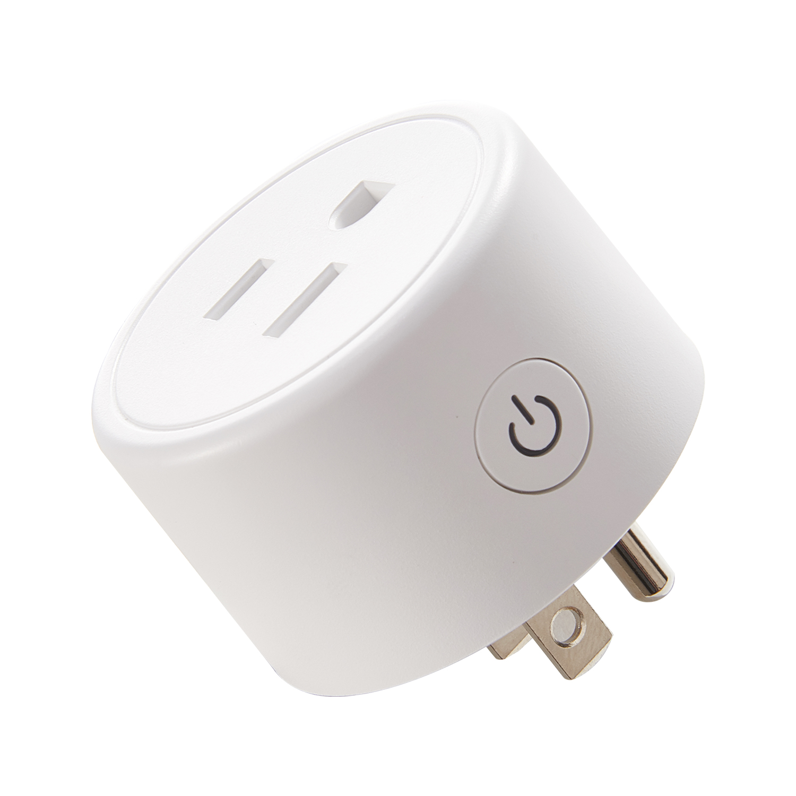

  

Model reference: FK-PW801US

Equivalent devices:

- [CloudFree CF-P1](https://devices.esphome.io/devices/cloudfree-cf-p1/)

Manufacturer: [FrankEver](https://frankever.com/product/)

## GPIO Pinout

| Pin    | Function                   |
|--------|----------------------------|
| GPIO02 | Blue LED (Inverted: true)  |
| GPIO13 | Push Button                |
| GPIO15 | Relay                      |

## Basic Config

```yaml
substitutions:
  device_name: frankever-fk-pw801us
  friendly_name: FrankEver FK-PW801US
  device_description: FrankEver smart plug with button and blue led.

esphome:
  name: ${device_name}
  comment: ${device_description}

esp8266:
  board: esp01_1m

wifi:
  # Enable fallback hotspot (captive portal) for WiFi configuration
  ap:
    ssid: ${friendly_name}

captive_portal:

# Enable logging
logger:

# Enable Home Assistant API
api:

# Enable OTA
ota:

binary_sensor:
  - platform: gpio
    device_class: power
    id: button
    pin:
      number: GPIO13
      inverted: true
      mode: INPUT_PULLUP
    on_press:
      - switch.toggle: relay
  - platform: status
    name: "Connection Status"

switch:
  - platform: gpio
    name: Relay
    pin: GPIO15
    id: relay
    restore_mode: RESTORE_DEFAULT_OFF
    on_turn_on:
      - light.turn_on: led
    on_turn_off:
      - light.turn_off: led

light:
  - platform: status_led
    id: led
    restore_mode: RESTORE_DEFAULT_OFF
    pin:
      number: GPIO02
      inverted: true

sensor:
  - platform: uptime
    name: Uptime
    filters:
      - lambda: return x / 60.0;
    unit_of_measurement: minutes
  - platform: wifi_signal
    name: Wifi Signal
    update_interval: 60s

text_sensor:
  - platform: version
    name: ESPHome Version
  - platform: wifi_info
    ip_address:
      name: IP Address
```
