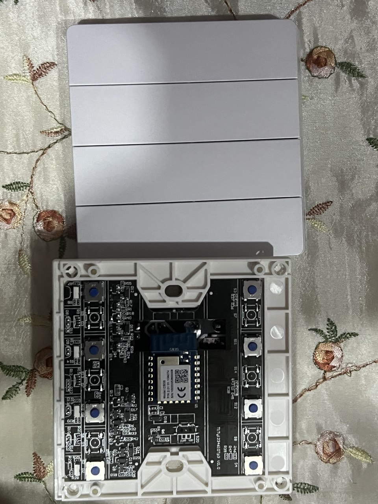
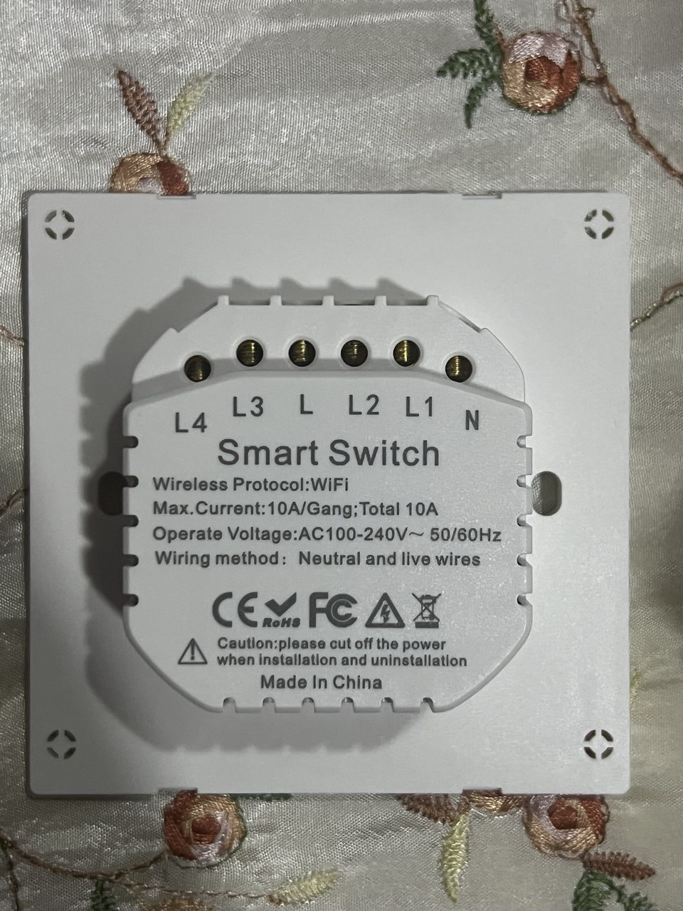
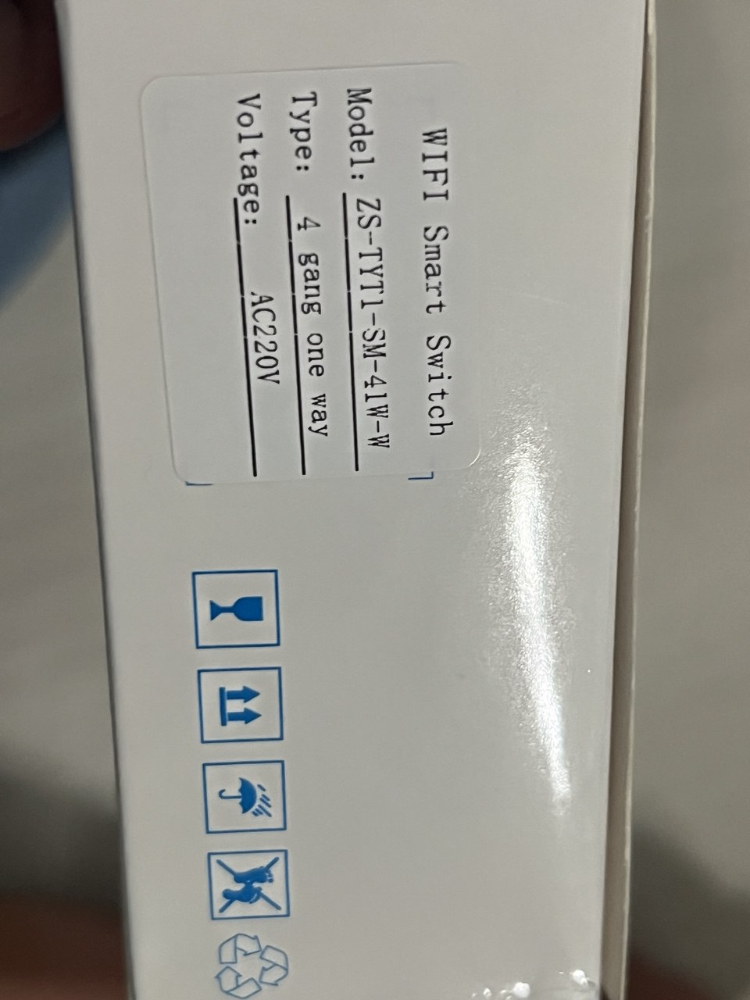
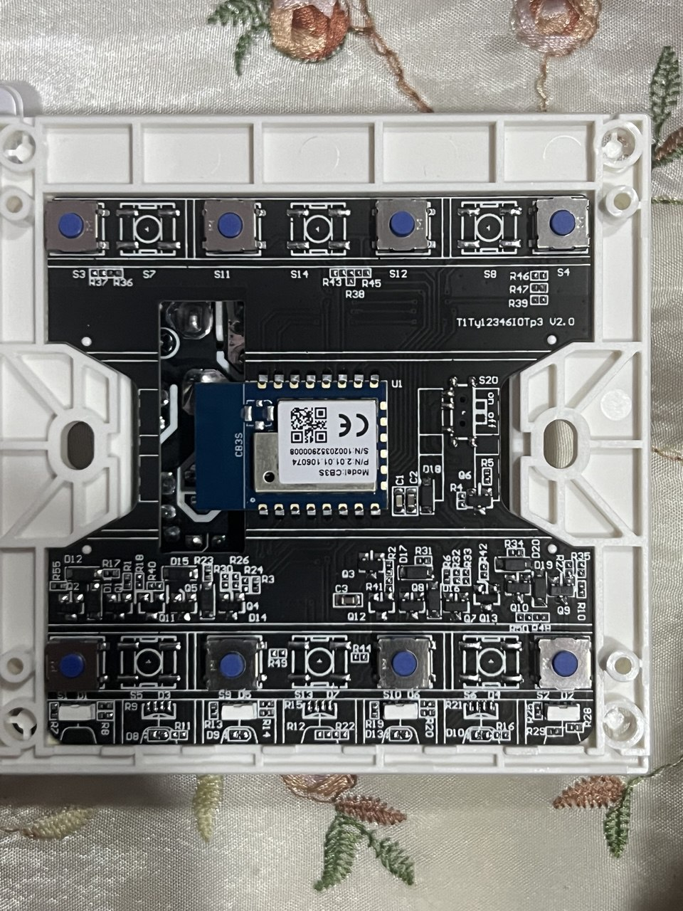

- Has a BK7231N chip (CB3S)
- Push button wall switch with button on each sides. 2 buttons one each gang which can toggled top or bottom with both wired to the same GPIO pin.

## GPIO Pinout

### 4-Gang Version

| Pin    | Function           |
| ------ | ------------------ |
| GPIO26 | Button 1           |
| GPIO14  | Relay 1            |
| GPIO24  | Button 2           |
| GPIO9  | Relay 2            |
| GPIO6  | Button 3           |
| GPIO8  | Relay 3            |
| GPI23  | Button 4           |
| GPIO7  | Relay 4            |
| GPI10  | Wifi LED indicator |

## PCB



## Basic Configuration (4 gang)

```yaml
esphome:
  name: 4g-switch-girier

bk72xx:
  board: generic-bk7231n-qfn32-tuya

logger:

web_server:

captive_portal:

mdns:

api:
    
ota:
  platform: esphome

wifi:
  networks:
  - ssid: !secret wifi_ssid
    password: !secret wifi_password
    priority: 1
  - ssid: !secret wifi2_ssid
    password: !secret wifi2_password
    priority: 2
  output_power: 10dB

  # Enable fallback hotspot in case wifi connection fails
  ap:
    password: !secret ap_password


button:
  - platform: restart
    name: Restart

debug:
  update_interval: 30s

text_sensor:
  - platform: debug
    reset_reason:
      name: Reset Reason
  - platform: libretiny
    version:
      name: LibreTiny Version

sensor:
  - platform: uptime
    name: Uptime

binary_sensor:
  - platform: gpio
    id: binary_switch_1
    pin:
      number: P26
      inverted: true
      mode: INPUT_PULLUP
    on_press:
      then:
        - switch.toggle: switch_1
  - platform: gpio
    id: binary_switch_2
    pin:
      number: P24
      inverted: true
      mode: INPUT_PULLUP
    on_press:
      then:
        - switch.toggle: switch_2
  - platform: gpio
    id: binary_switch_3
    pin:
      number: P6
      inverted: true
      mode: INPUT_PULLUP
    on_press:
      then:
        - switch.toggle: switch_3
  - platform: gpio
    id: binary_switch_4
    pin:
      number: P23
      inverted: true
      mode: INPUT_PULLUP
    on_press:
      then:
        - switch.toggle: switch_4

switch:
  - platform: gpio
    id: switch_1
    name: Relay 1
    pin: P14
  - platform: gpio
    id: switch_2
    name: Relay 2
    pin: P9
  - platform: gpio
    id: switch_3
    name: Relay 3
    pin: P8
  - platform: gpio
    id: switch_4
    name: Relay 4
    pin: P7

status_led:
  pin:
    number: P10
    inverted: true

```


