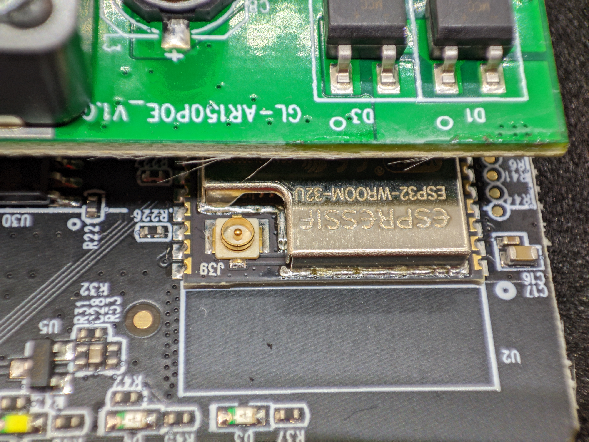
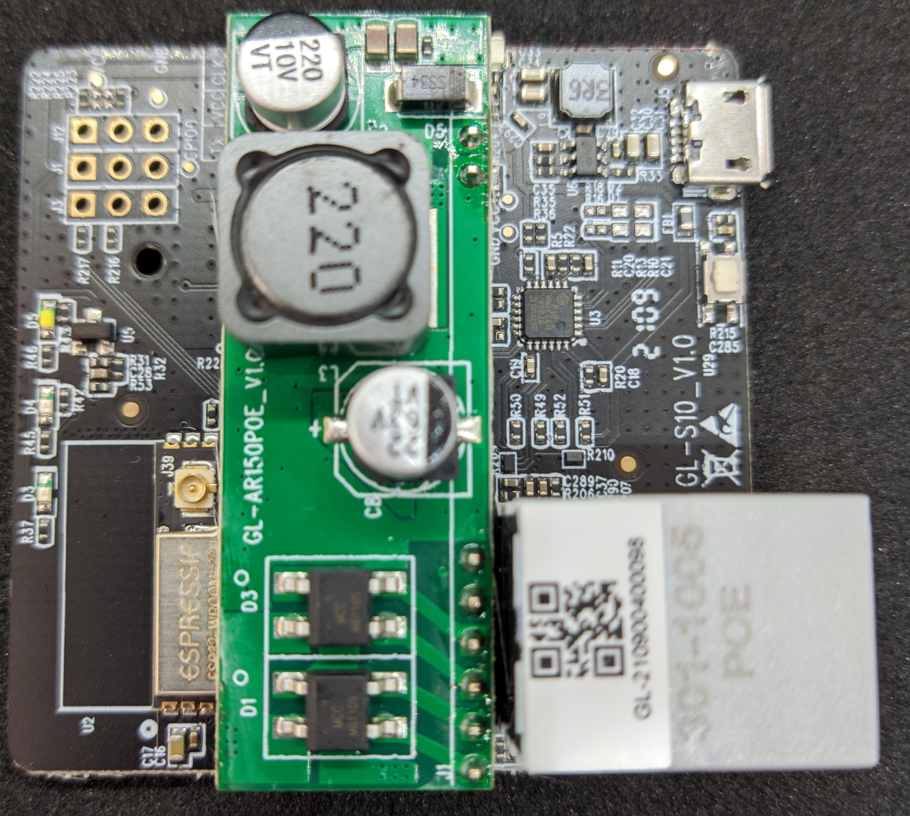
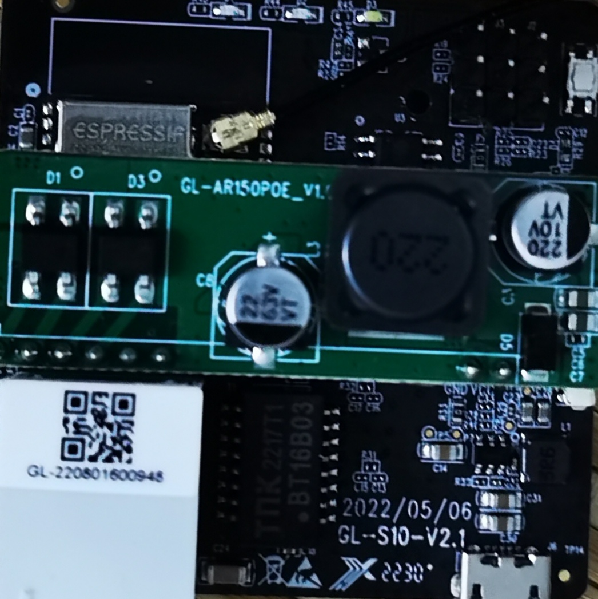
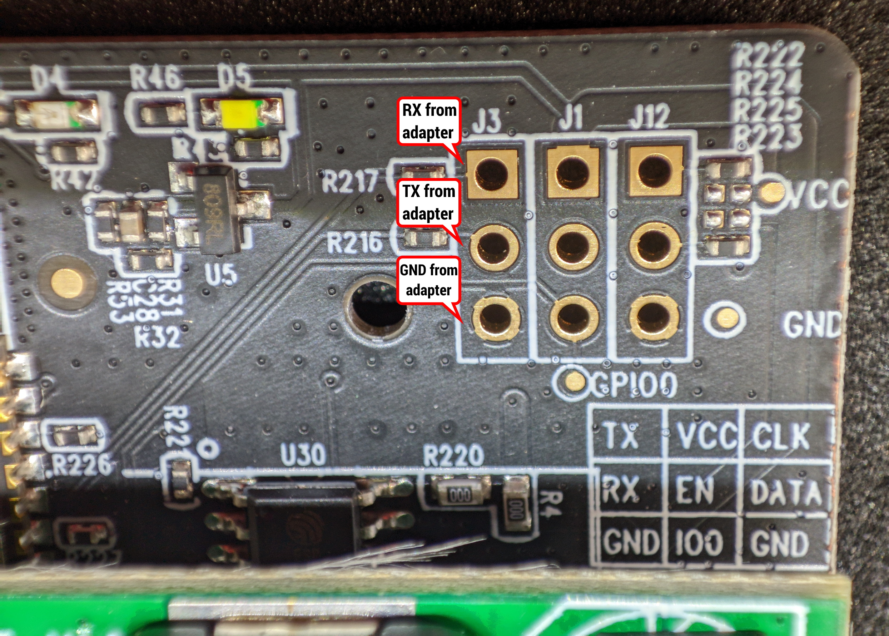
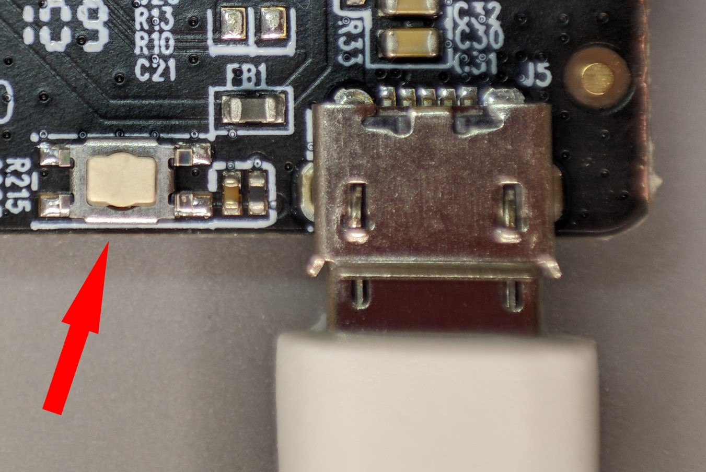
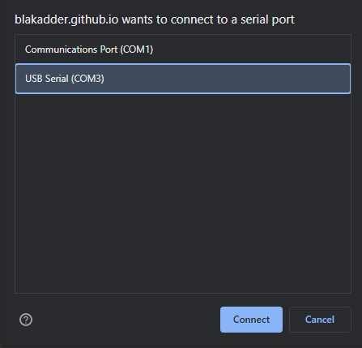
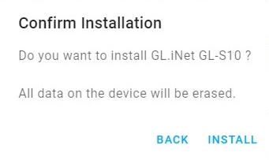
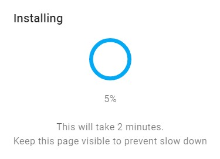
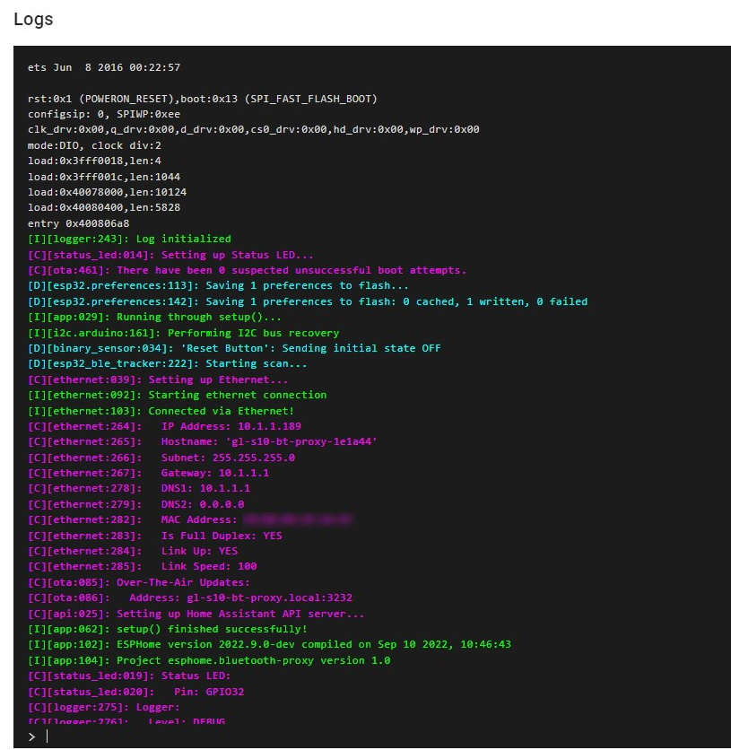

## Product description

GL-iNet, widely known for their amazing line of hackable routers (like the Mango travel router) also makes the GL-S10, a “Bluetooth IoT Gateway”.

Its a perfect little device in a small sized case of 57x57x25mm (not counting the antenna). It runs on an ESP32 with 4MB flash and 8MB PSRAM and sports Ethernet with PoE and an external antenna for better range. Gl.iNet claims coverage of 80m in an open and non-interference environment which is a bit too much, but if it can cover a quarter of that it’ll be great.

The sugar on top is that it costs only ~$24 on their [website](https://store.gl-inet.com/products/gl-s10-bluetooth-iot-gateway) or [AliExpress](https://www.aliexpress.us/item/3256803802198078.html).

## Disassembly

While you don’t need to have many tools to flash this device you will need an USB to serial adapter and I recommend the very cheap CH340G or FT232 that I’ve been using for years. You will also need some female-to-female Dupont wires and 2.54 pin headers.

If you want to go the solderless route you will only need male-to-female Dupont wires.

There are no screws or glue stopping you from opening this case. GL.iNet even left a little notch in the back plate where you will start.


Once opened disconnect the external antenna from the IPEX connector on the ESP32 module.



Take the out PCB and prepare it for flashing.



WARNING There are a few hardware revisions of [GL-S10](https://github.com/esphome/bluetooth-proxies/issues/19). This tutorial uses images of the v1.0 version but applies to all revisions, only the ESPHome configuration is different due to a new Ethernet chip.

Newer revisions using the IP101PHY chip have [issues with severe packet loss](https://github.com/espressif/esp-idf/issues/10540) and will likely not be reliable enough for your use.

## Flashing

There is a cluster of 9 pin holes which have the TX, RX and GND pins required for flashing. It is best to solder in some pin headers but you can do it solderless.

If you are going solderless, make very sure to constantly apply some pressure to the pins during the flashing process to establish good contact between the pads and Dupont connectors. An extra pair of hands will be helpful.



Connect the wires as pictured. Do NOT connect VCC from the adapter. You will use the device’s USB power port for powering it up.


Install using my [web installer for GL-S10](https://blakadder.github.io/bluetooth-proxies). Select your hardware version of GL-S10 and click “CONNECT”.

Hold down the button next to the USB port while plugging the power in to put the device in flash mode.



Select the COM port to your USB to serial adapter and click “Connect”.



Once the installer has connected to GL-S10 you need to click “INSTALL GL.INET GL-S10”. Confirm the installation.



Wait until the device is erased, Bluetooth proxy is installed and finally the installation complete message is displayed.



Clicking on “NEXT” brings you back to the initial dialogue. Now is the time to plug in the Ethernet cable. If you’re using PoE Ethernet DO NOT plug both the USB and Ethernet at once. There will be smoke and sadness! If you’re not using PoE unplug the power USB cable and plug it back.

GL-S10 will now boot in its working mode.


Click “LOGS & CONSOLE” to check if the Bluetooth proxy starts properly. It should look something like this:



## ESPHome Configuration

Configuration file was made to mimic the original functions as close as possible. That means the Power LED will always be on and Bluetooth LED turns on when connected to Home Assistant or other API endpoint. Network LED serves as a [status LED](https://esphome.io/components/status_led.html).

I2C ports are preconfigured to the CLK and DAT pin holes on the PCB which makes the GL-S10 expandable. During my testing I connected a BH1750 illumination sensor and it just worked, zero problems. I would warn against putting any temperature sensors inside the case due the the heat generated from the ESP32 and power supply.

I chose to make the Reset button not reset the device but just serve as a normal button sensor in HA.

### V1

```yaml
substitutions:
  name: gl-s10-bt-proxy

esphome:
  name: ${name}
  name_add_mac_suffix: true
  project:
    name: gl-s10.bluetooth-proxy
    version: "1.1"
# turn on Power LED when esphome boots
  on_boot:
    then:
      - output.turn_on: power_led

esp32:
  board: esp32doit-devkit-v1
  framework:
    type: arduino

## Configuration fo V1.x hardware revision
ethernet:
  type: LAN8720
  mdc_pin: GPIO23
  mdio_pin: GPIO18
  clk_mode: GPIO17_OUT
  phy_addr: 1

api:
logger:
ota:

dashboard_import:
  package_import_url: github://blakadder/bluetooth-proxies/gl-s10.yaml@main

esp32_ble_tracker:
  scan_parameters:
    interval: 1100ms
    window: 1100ms
    active: true

bluetooth_proxy:
    active: true

button:
- platform: safe_mode
  name: Safe Mode Boot
  entity_category: diagnostic

## DEVICE SPECIFIC CONFIGURATION
# network LED (white one) configured as status led
status_led:
  pin:
    number: GPIO32
    inverted: true

# button on the side labeled RESET
binary_sensor:
  - platform: gpio
    pin:
      number: GPIO33
      inverted: true
    name: "Reset Button"
# Bluetooth LED on when connected to Home Assistant
  - platform: status
    name: "${name} Status"
    internal: true
    on_press:
      - output.turn_on: bluetooth_led
    on_release:
      - output.turn_off: bluetooth_led

# output settings for LED's marked Power and Bluetooth
# power LED use: see code line 12
# bluetooth LED use: see code line 63
output:
  - platform: gpio
    pin: GPIO14
    inverted: true
    id: power_led
  - platform: gpio
    pin: GPIO12
    inverted: true
    id: bluetooth_led

# since these pins are broken out inside and labeled as I2C pins they're configured here
i2c:
  sda: 15
  scl: 13
  scan: true
```

### V2.1

```yaml
substitutions:
  name: gl-s10-bt-proxy
  friendly_name: Bluetooth Proxy

esphome:
  name: ${name}
  friendly_name: ${friendly_name}
  name_add_mac_suffix: true
  project:
    name: gl-s10.bluetooth-proxy
    version: "2.1"
  # turn on Power LED when esphome boots
  on_boot:
    then:
      - output.turn_on: power_led

esp32:
  board: esp32doit-devkit-v1
  framework:
    type: esp-idf

# Configuration fo V2.3 hardware revision
ethernet:
  type: IP101
  mdc_pin: GPIO23
  mdio_pin: GPIO18
  clk_mode: GPIO0_IN
  phy_addr: 1
  power_pin: GPIO5

api:
logger:
ota:

dashboard_import:
  package_import_url: github://blakadder/bluetooth-proxies/gl-s10_v2.yaml@main

esp32_ble_tracker:
  scan_parameters:
    interval: 1100ms
    window: 1100ms
    active: true
#
# The LED is disabled for ESPHome 2023.6.0+ since we do not
# decode the advertising packets on device anymore, and adding
# the LED blink would force the device to decode the packets
# just to blink the LED.
#
# Bluetooth LED blinks when receiving Bluetooth advertising
#  on_ble_advertise:
#    then:
#      - output.turn_on: bluetooth_led
#      - delay: 0.5s
#      - output.turn_off: bluetooth_led

bluetooth_proxy:
  active: true

button:
  - platform: safe_mode
    name: Safe Mode Boot
    entity_category: diagnostic

## DEVICE SPECIFIC CONFIGURATION
# network LED (white one) configured as status led
status_led:
  pin:
    number: GPIO32
    inverted: true

# button on the side labeled RESET
binary_sensor:
  - platform: gpio
    pin:
      number: GPIO33
      inverted: true
    name: "Reset Button"

# output settings for LED's marked Power and Bluetooth
# power LED use: see code line 15
# bluetooth LED use: see code line 60
output:
  - platform: gpio
    pin: GPIO14
    inverted: true
    id: power_led
  - platform: gpio
    pin: GPIO12
    inverted: true
    id: bluetooth_led

# since these pins are broken out inside and labeled as I2C pins they're configured here
i2c:
  sda: 15
  scl: 13
  scan: true
```

## Credits

Credits to [blakadder](https://blakadder.com/gl-s10/) who originally posted this and has the yaml in his [repo](https://github.com/blakadder/bluetooth-proxies/tree/main)
