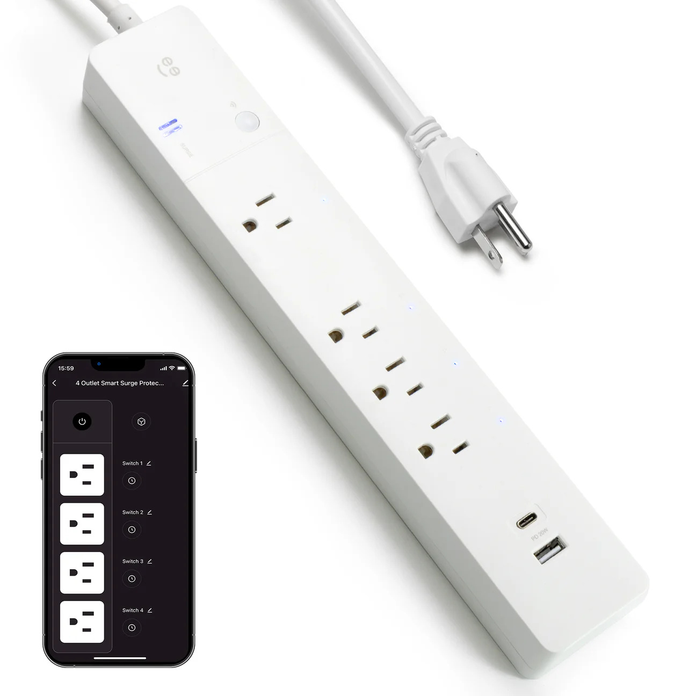

[Amazon Link](https://www.amazon.com/dp/B0D4R98V5F)

## Product Image



## General Notes

Manufacturer: [Geeni](https://mygeeni.com/)

## Access

## GPIO Pinout

| Pin | Function                       |
| --- | ------------------------------ |
| P6  | Outlet 1 (nearest to the plug)  |
| P7  | Outlet 2                       |
| P24 | Button                         |
| P26 | Blue LED (inverted)            |

## Disassembly Guide

1. Remove all the back screws
2. Snap apart the halves
3. Remove 2 screws holding the PCB where the power cord attaches
4. Gently pull out the copper strips for the neutral and groun pins of the outlets
5. Pull out the PCB and flip it over
6. Solder your serial adaptor wires to the GND, VCC, RX and TX pads.

## Configuration

```yaml

esphome:
  name: strip4
  friendly_name: strip4

bk72xx:
  board: cb2s

logger:
api:
captive_portal:
ota:
  - platform: esphome
    # Optional: Add your password if you have one configured
    # password: "your_ota_password" 

wifi:
  ssid: !secret wifi_ssid
  password: !secret wifi_password
  ap:

#Pinout: https://docs.libretiny.eu/boards/cb2s/#pinout
#PCB CB2S

## ---------------- ##
##    Status LED    ##
## ---------------- ##

light:
  - platform: status_led
    name: "Status LED"
    id: led
    pin:
      number: P11
      inverted: true
## ---------------- ##
##  Binary Sensors  ##
## ---------------- ##
binary_sensor:
  # Button 1
  - platform: gpio
    id: bP10
    pin:
      number: P10
      inverted: true
    name: "Button"
    on_press:
      - switch.toggle: switch_1
## ---------------- ##
##      Switches    ##
## ---------------- ##
switch:
  - platform: gpio
    id: switch_1
    name: Outlet 1
    pin: P6
    restore_mode: ALWAYS_ON
  - platform: gpio
    id: switch_2
    name: Outlet 2
    pin: P7
    restore_mode: ALWAYS_ON
  - platform: gpio
    id: switch_3
    name: Outlet 3
    pin: P26
    restore_mode: ALWAYS_ON
  - platform: gpio
    id: switch_4
    name: Outlet 4
    pin: P24
    restore_mode: ALWAYS_ON

time:
  - platform: homeassistant
    id: homeassistant_time

text_sensor:
  - platform: wifi_info
    ip_address:
      name: "IP Address"
    ssid:
      name: "Connected SSID"
  - platform: libretiny
    version:
      name: LibreTiny Version
```
