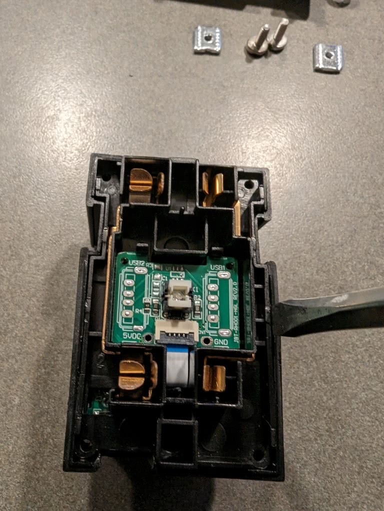

[Amazon Link](https://amzn.to/4bL2H0S)

## Product Image


## General Notes

Model Reference: 6W8007

Manufacturer: [Geeni](https://mygeeni.com/)

The Geeni Smart Wi-Fi Outlet is available at Amazon and is also available as a 2-pack.

This plug is not able to be converted with tuya-convert as of May 2024. You will need to disassemble and flash with a USB to Serial adapter. The pins are easily accessible once the device is disassembled.

## GPIO Pinout

| Pin    | Function              |
| ------ | --------------------- |
| P6     | Relay 1               |
| P7     | Relay 2               |
| P24    | Button                |
| P26    | Blue LED (inverted)   |

## Disassembly Guide

1) Unscrew back cover with Qty. 4 - Phillips #1 screws - note: loosen the 2 terminal screws for hot/neutral but don't remove. They'll stay in place for reassembly. Don't take them all the way out like I did
   
2) Separate outlet into 2 parts
   
   
3) Separate back half (black plastic) by prying the insert holding the chips
   
4) Access CB2S for flashing. I placed it in a small vise to hold vertical and used needle probes to flash the chip, then reassembled in reverse order.
   
   

## Configuration

```yaml
substitutions:
  device_description: Geeni 6W8007 Smart Wi-Fi Outlet
  device_name: geeni-wifi-outlet-${device_location}
  device_friendly_name: Geeni Smart Wifi Outlet ${device_friendly_location}
  device_make: Geeni
  device_model: 6W8007
  device_chipset: Beken BK7231N
  device_friendly_location: ADD LOCATION
  device_location: ADD-LOCATION
  
esphome:
  name: $device_name
  friendly_name: $device_friendly_name
  
bk72xx:
  board: cb2s
  
logger:
  baud_rate: 0
  
web_server:
  port: 80
  
captive_portal:

mdns:

# Add your own api encryption key if you use it or use a secrets file one, your choice
api:
  encryption:
    key: !secret api_key

ota:
  password: ""

wifi:
  ssid: !secret wifi_ssid
  password: !secret wifi_password
  ap:
    ssid: $device_name
    password: !secret wifi_ap_password

text_sensor:
  - platform: libretiny
    version:
      name: LibreTiny Version

sensor:
  - platform: uptime
    name: ${device_friendly_name} Uptime
    unit_of_measurement: minutes
    filters:
      - lambda: return x / 60.0;

  - platform: wifi_signal
    name: ${device_friendly_name} Signal
    update_interval: 60s

light:
  - platform: status_led
    name: "led"
    internal: true
    id: led
    pin:
      number: P26
      inverted: true

switch:
  - platform: gpio
    id: switch_1
    name: Relay 1
    pin: P6
  - platform: gpio
    id: switch_2
    name: Relay 2
    pin: P7

binary_sensor:
  - platform: gpio
    id: binary_switch_all
    pin:
      number: P24
      inverted: true
      mode: INPUT_PULLUP
    on_multi_click:
    - timing:
        - ON for at most 1s
        - OFF for at least 0.5s
      then:
        - switch.toggle: switch_1
    - timing:
        - ON for at most 1s
        - OFF for at most 1s
        - ON for at most 1s
        - OFF for at least 0.2s
      then:
        - switch.toggle: switch_2
```
