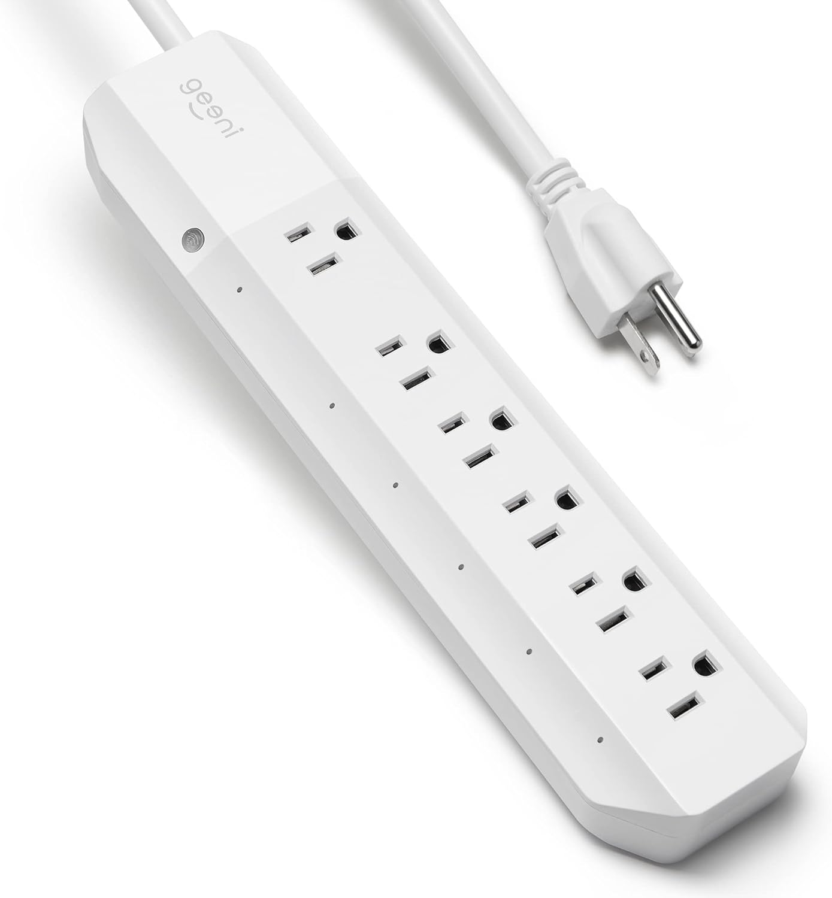
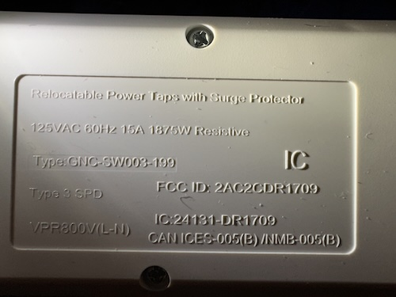
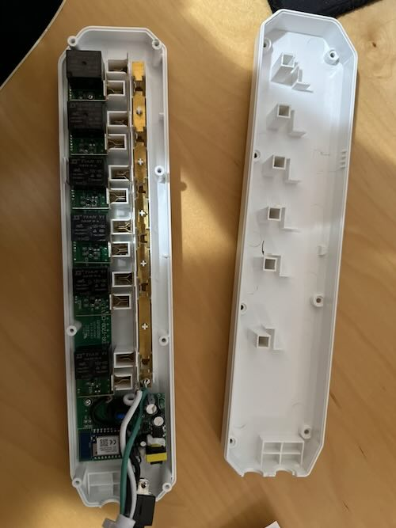
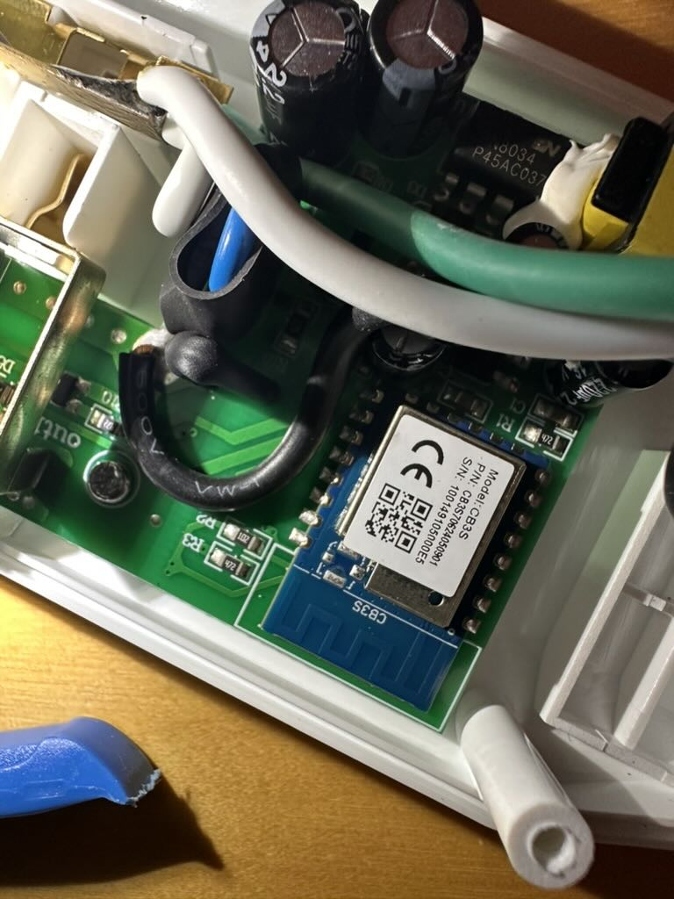

[Amazon Link](https://www.amazon.com/dp/B07DB3W915)

[Manufacturer Link](https://mygeeni.com/collections/surge-protectors/products/geeni-gn-sw003-199-surge-smart-protector-white?variant=21552685711439)

## Product Image



<details>
  <summary>View back plate product information</summary>



</details>

<details>
  <summary>View disassembled pictures</summary>




</details>

## Description

This device has 6 outlets, and a combined blue led button. The button toggles all pins when pressed.

The device is based on the [Tuya CB3S module](https://developer.tuya.com/en/docs/iot/cb3s?id=Kai94mec0s076). The device couldn't be converted with tuya-cloudcutter and required serial flashing.

The CB3S is soldered onto the main board, but is easily accessible and pins are exposed. The device can easily be be opened by unscrewing the screws at the back.

Warning: The `SW003-199-199S` variant has a different chip and pinout configuration. Be sure to verify the module being used before flashing.

## Serial flashing

The official [Tuya CB3S module](https://developer.tuya.com/en/docs/iot/cb3s?id=Kai94mec0s076) documentation contains a diagram with the position of each pin on the module. The module has multiple UARTs, UART1 is the one used for flashing.

| Pin | Function |
| --- | -------- |
| 1   | RST/CEN  |
| 8   | 3V3      |
| 9   | GND      |
| 15  | RXD1     |
| 16  | TXD1     |

Esphome can directly flash the device over serial. When asked, power cycle the device while holding RST/CEN low, then disconnect RST/CEN to let the chip boot into the flashing program.

## GPIO Pinout

| Pin | Function                 |
| --- | ------------------------ |
| P6  | Outlet 1 (cord side)     |
| P24 | Outlet 2                 |
| P26 | Outlet 3                 |
| P8  | Outlet 4                 |
| P7  | Outlet 5                 |
| P9  | Outlet 6                 |
| P14 | Status LED (inverted)    |
| P23 | Toggle button (inverted) |

## Basic Configuration

```yaml
esphome:
  name: geeni-powerstrip

bk72xx:
  board: cb3s

wifi:
  ssid: !secret wifi_ssid
  password: !secret wifi_password
  ap:

logger:

api:

ota:

switch:
  - platform: gpio
    id: switch_1
    name: Outlet 1
    pin: P6
  - platform: gpio
    id: switch_2
    name: Outlet 2
    pin: P24
  - platform: gpio
    id: switch_3
    name: Outlet 3
    pin: P26
  - platform: gpio
    id: switch_4
    name: Outlet 4
    pin: P8
  - platform: gpio
    id: switch_5
    name: Outlet 5
    pin: P7
  - platform: gpio
    id: switch_6
    name: Outlet 6
    pin: P9

binary_sensor:
  - platform: gpio
    id: binary_switch_all
    pin:
      number: P23
      inverted: true
      mode: INPUT_PULLUP
    on_press:
      then:
        - switch.toggle: switch_1
        - switch.toggle: switch_2
        - switch.toggle: switch_3
        - switch.toggle: switch_4
        - switch.toggle: switch_5
        - switch.toggle: switch_6

status_led:
  pin:
    number: P14
    inverted: true
```
