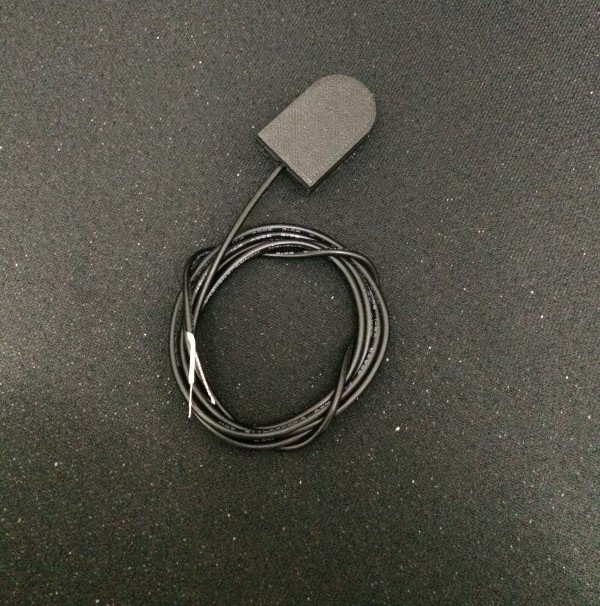

## GREC1 Device Info

The GREC1 is a multi purpose interfacing device specifically designed for collecting data on energy meters. Impulse interfaces are provided for glow and wire impulse meters. RS485 and RS232 are also included for meters that send serial data such as MODBUS. The serial interfaces can also be used for other use cases where the distance proximity is around 5-8 meters. Longer distances are not recommended for the design. The device is available in two configurations which are directly AC powered with NEMA 5-15 plug or USB powered. We make a USB Mini version which includes a cable or a USB-C version without a cable.

Available from [https://www.gelidus.ca/](https://www.gelidus.ca/)

Inside the enclosure.


- 40 x 80 mm PCB
- Direct USB ESP programming with a CH340 serial interface.
- Powerful ESP32S Dual Core 240Mhz 4MB Flash, BLE and WiFi module!
- PCB layout strictly follows ESP antenna specifications providing excellent WiFi range.
- 8 Pin Quick connects for collectors, Photo Diode, Wired, RS232, RS485.
- Powered directly with US AC plug receptacle blades on the AC model (120 VAC).
- USB model can be USB powered or with 3.3v via an un-populated 5 pin header.
- Follows UL/CSA specifications.
- Optional 1 Meter Photo Detection sensor assembly.
- 3D printed protective enclosure.


## Interface Circuit Connections


## Photo Sensor Assembly



## GREC1 YAML Example

```yaml

esphome:
  name: grec1
  friendly_name: "GREC1"

esp32:
  board: esp32dev
  framework:
    type: arduino

# Enable logging
logger:

# Enable Home Assistant API
api:
  services:
    - service: reset_total_energy
      then:
        - button.press:
            id: button_reset_total
  encryption:
    key: "<YOUR_API_KEY>"

ota:
  - platform: esphome
    password: "<YOUR_OTA_PASSWORD>"

substitutions:
  device_name: grec1
  friendly_name: GREC1

  # GPIO J2 Connections
  #   |       GREC1       |
  #   |                   |
  #   | ----------------- |
  #   | |1|2|3|4|5|6|7|8| |
  #   | ----------------- |
  #     -----------------

  photo_pulse_pin: GPIO22   # J2 Pin 1 - Shielded wire to a Photo diode GND = Cathode, Impluse = Anode
  wired_pulse_pin: GPIO27   # J2 Pin 3 - Input is zener clamped to 3.3v, max +50VDC, can also be configued for pullup with active low
  digi_pot_pin: GPIO25      # DAC voltage output, this GPIO allows you to digitally control photo diode sensitivity
  rs485_rx_pin: GPIO14      # J2 Pin 7 - RS485 B Input (JP2 2-3) Default
  rs485_tx_pin: GPIO16      # J2 Pin 8 - RS485 A Output (JP1 2-3) Default
  flow_control_pin: GPIO15  # RS485 Transmit/Recieve control
  rs232_rx_pin: GPIO19      # J2 Pin 5 - RS232 Recieve
  rs232_tx_pin: GPIO17      # J2 Pin 6 - RS232 Transmit
  rs232_in_pin: GPIO18      # J2 Pin 7 - Optional RS232 pin config when RS485 is not required (JP2 1-2)
  rs232_out_pin: GPIO20     # J2 Pin 8 - Optional RS232 pin config when RS485 is not required (JP1 1-2)

wifi:
  ssid: <YOUR_SSID> # or !secret wifi_ssid
  password: <YOUR_PASSWORD> # or !secret wifi_password

  ap:
    ssid: "grec1"
    password: ""
    ap_timeout: 10s

# Security is recommended!
web_server:
  port: 80
  # auth:
  #   username: !secret web_server_username
  #   password: !secret web_server_password

captive_portal:

uart:
  - id: uart_modbus_client
    tx_pin: ${rs485_tx_pin}
    rx_pin: ${rs485_rx_pin}
    baud_rate: 115200
    # debug:

#Digital to Analog Output Control
output:
  - platform: esp32_dac
    id: digi_pot_voltage
    pin: ${digi_pot_pin}

modbus:
  - uart_id: uart_modbus_client
    flow_control_pin: ${flow_control_pin} #Only required when using the RS485 interface
    id: modbus_client

modbus_controller:
  id: modbus_grec1
  modbus_id: modbus_client
  address: 0x02  # Address of the Modbus Device
  update_interval: 15s

number:
  # Set the pulse rate of the LED on your meter
  - platform: template
    id: select_pulse_rate
    name: 'Pulse rate - imp/kWh'
    optimistic: true
    mode: box
    min_value: 100
    max_value: 10000
    step: 100
    restore_value: yes
    initial_value: 10000

  # Reset total energy to given value
  - platform: template
    id: select_reset_total
    name: 'Reset Value - Total Energy kWh'
    entity_category: config
    optimistic: true
    mode: box
    min_value: 0
    max_value: 1000000
    step: 1
    initial_value: 0

  # Define a number input component to set DAC value
  - platform: template
    name: "Photo Sensitivity Level"
    id: dac_output_level
    min_value: 0
    max_value: 255
    initial_value: 127
    step: 1
    optimistic: true

    # Trigger action on value change
    on_value:
      then:
        - output.set_level:
            id: digi_pot_voltage
            level: !lambda "return x / 255.0;"
    restore_value: true

button:
  # Reset the total energy entity
  - platform: template
    id: button_reset_total
    name: "Reset - Total Energy"
    on_press:
      - pulse_meter.set_total_pulses:
          id: sensor_energy_pulse_meter
          value: !lambda "return id(select_reset_total).state * id(select_pulse_rate).state;"

  - platform: restart
    name: "Restart - GREC1"

sensor:
  # Photo diode pulse meter example (Glow meter)
  # This configuration requires the ${digi_pot_pin} output to be configured
  # The digital potentiometer defaults to an output value of ~1.5v
  # The photo diode circuit will conduct and drop below the reference when photons are absorbed.
  # You should set the digital voltage to be around the mid point of this voltage drop.
  # There is no need to measure it since if it's set to low or to high it stops detecting the pulse.
  # Once the range is known for example 120-140 then set it to 130 which is the mid point.
  # Not setting at the midpoint will cause significant false counts do to reading noise near the comparator threshhold.
  - platform: pulse_meter
    id: sensor_energy_pulse_meter
    name: '${friendly_name} - Power Consumption'
    unit_of_measurement: W
    state_class: measurement
    device_class: power
    icon: mdi:flash-outline
    accuracy_decimals: 0
    pin:
      number: ${photo_pulse_pin}
      inverted: true
      mode:
        input: true
        pullup: true

# Wired Example Active low
#    pin:
#      number: ${wired_pulse_pin}
#      inverted: true
#      mode:
#        input: true
#        pullup: true

    filters:
      # multiply value = (60 / imp value) * 1000
      # - multiply: 60
      - lambda: return x * ((60.0 / id(select_pulse_rate).state) * 1000.0);

    total:
      id: sensor_total_energy
      name: '${friendly_name} - Total Energy'
      unit_of_measurement: kWh
      icon: mdi:circle-slice-3
      state_class: total_increasing
      device_class: energy
      accuracy_decimals: 3
      filters:
        # multiply value = 1 / imp value
        # - multiply: 0.001
        - lambda: return x * (1.0 / id(select_pulse_rate).state);

  # Total day usage
  - platform: total_daily_energy
    id: sensor_total_daily_energy
    name: '${friendly_name} - Daily Energy'
    power_id: sensor_energy_pulse_meter
    unit_of_measurement: kWh
    icon: mdi:circle-slice-3
    state_class: total_increasing
    device_class: energy
    accuracy_decimals: 3
    filters:
      # Multiplication factor from W to kW is 0.001
      - multiply: 0.001
  - platform: wifi_signal
    name: "${friendly_name} - WiFi Signal"
    update_interval: 120s

# Modbus sensor example
#   - platform: modbus_controller
#     id: eMETER1_voltage_l1
#     modbus_controller_id: modbus_grec1
#     name: "eMETER1 voltage L1"
#     register_type: holding
#     address: 0x0000  # Address on the Modbus server
#     device_class: voltage
#     value_type: S_DWORD_R
#     accuracy_decimals: 1
#     unit_of_measurement: V

time:
  - platform: homeassistant
    id: homeassistant_time

status_led:
  pin: GPIO23
```

## GREC1 Connections

J2 Pinouts


- Pin 1 - Impulse Photo Diode +
  This connection should be provisioned using a single wire core cable with a stranded shield, the photo diode anode should be soldered to the core wire and cathode grounded with the shield. This signal feeds into the integrated LM393 comparator.
- Pin 3 - Impulse Wired +
  This is a digital logic input, it is zener clamped to limiting it at +3.3v intermally, the signal should be wired along with a ground for reference.
- Pin 5 & 6 - RS232-TX/RX
  These connections are Standard EIA signal levels and should have a ground reference when used. See the DB Connector Reference for commonly used pins.
- Pin 7 & 8 - RS485-A/B (Optionally RS232 with JP1 and JP2)
  These pins are also standard EIA levels but do not have components supporting the maximum RS485 1200M distances. Keep these to short distances 5-10 meters. It’s recommended to use twisted pair lines. Since these connections are typically used on serial busses it should have softweare flow control enabled for ESPHome components. Specifically TX control must be enabled and this is configured in a components YAML definition.
- Pin 7 & 8 - RS232 enable JP1 and JP2 position 1-2 soldered.
  These are optionally setable as RS232 when RS485 is not required. This provisons addition flow control capability e.g. EIA level input and output DSR/RTS etc.

| Name                | Abbreviation | Direction | DB-25 pin | DE-9 pin |
| ------------------- | ------------ | --------- | --------- | -------- |
| Transmitted Data    | TxD          | Out       | 2         | 3        |
| Received Data       | RxD          | In        | 3         | 2        |
| Request To Send     | RTS          | Out       | 4         | 7        |
| Clear To Send       | CTS          | In        | 5         | 8        |
| Data Terminal Ready | DTR          | Out       | 20        | 4        |
| Data Set Ready      | DSR          | In        | 6         | 6        |
| Data Carrier Detect | DCD          | In        | 8         | 1        |
| Signal Ground       | G            | Common    | 7         | 5        |

More to see @ https://www.gelidus.ca
