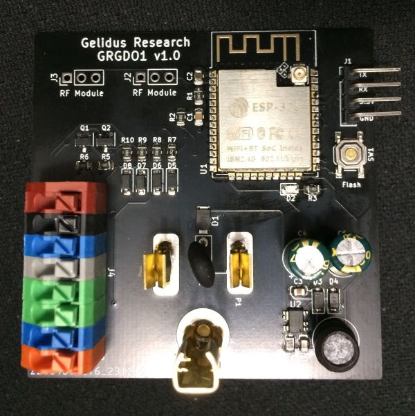

## GRGDO1 Device Info

Availble from [https://www.gelidus.ca/](https://www.gelidus.ca/)

Inside the enclosure.



- 60 x 60 mm PCB
- 4 Pin ESP programming header (3.3v)
- Powerful ESP32S Dual Core 240Mhz 4MB Flash, BLE and WiFi module!
- PCB layout strictly follows ESP antenna specifications providing excellent WiFi range
- 8 Pin Quick connect
- Flash enable button (power cycle based)
- Powered directly with US AC plug receptacle blades (120 VAC)
- AU/NZ Type 1 220VAC also available
- US AC receptacle passthrough plug (120 VAC)
- Follows UL/CSA specifications.
- 1 Meter of 3 conductor 22 AWG bell wire
- 3D printed protective safety enclosure.


## Firmware Options

Two firmware options are available for the GRGDO1:

- **RATGDO** [GitHub Repository](https://github.com/ratgdo/esphome-ratgdo.git)
- **Secplus GDO** [GitHub Repository](https://github.com/GelidusResearch/esphome-secplus-gdo.git)

## GRGDO1 Secplus GDO YAML Example

```yaml
external_components:
  - source: github://gelidusresearch/esphome-secplus-gdo
    components: [secplus_gdo]
    refresh: 0s

substitutions:
  id_prefix: grgdo1
  friendly_name: "GDO"
  uart_tx_pin: GPIO22 # J4 Pin 1 or 3 Red CTRL
  uart_rx_pin: GPIO21 # J4 Pin 1 or 3 Red CTRL
  dry_contact_open_pin: GPIO18 # J4 Pin 6 Green
  dry_contact_close_pin: GPIO19 # J4 Pin 7 Blue
  dry_contact_light_pin: GPIO17 # J4 Pin 8 Orange
  garage_door_cover_name: Garage Door
  garage_light_name: Garage Light
  garage_openings_name: Garage Openings
  garage_lock_name: Lock
  garage_motion_name: Motion
  garage_obstruction_name: Obstruction
  garage_motor_name: Motor
  garage_button_name: Wall Button
  garage_sync_name: Synced

esp32:
  board: esp32dev
  framework:
    type: esp-idf
    version: recommended

esphome:
  name: gdo1
  friendly_name: gdo1
  comment: "ESP32: Garage Door Opener"
  libraries:
    - https://github.com/gelidusresearch/gdolib
  platformio_options:
    build_flags:
      - -Wl,--wrap=esp_panic_handler
      - -DUART_SCLK_DEFAULT=UART_SCLK_APB

wifi:
  on_connect:
    lambda: id(grgdo).start_gdo();
  ssid: !secret wifi_ssid
  password: !secret wifi_password

  ap:
    ssid: "gdo1"
    password: ""
    ap_timeout: 10s

captive_portal:

logger:

api:
  encryption:
    key: "YOUR API KEY GOES HERE"

ota:
  platform: esphome

web_server:
  include_internal: true

status_led:
  pin: GPIO4

secplus_gdo:
  id: grgdo
  input_gdo_pin: ${uart_rx_pin}
  output_gdo_pin: ${uart_tx_pin}

light:
  - platform: secplus_gdo
    name: Garage Door Light
    secplus_gdo_id: grgdo
    id: gdo_light

cover:
  - platform: secplus_gdo
    name: Garage Door
    secplus_gdo_id: grgdo
    id: gdo_door

text_sensor:
  - platform: version
    name: ESPHome Version
    hide_timestamp: true

sensor:
  - platform: secplus_gdo
    secplus_gdo_id: grgdo
    id: gdo_openings
    type: openings
    name: "Garage Door Openings"
    unit_of_measurement: "openings"
    icon: mdi:open-in-app
  # - platform: dht
  #   model: DHT22
  #   pin: GPIO3
  #   temperature:
  #     name: "Temperature"
  #     accuracy_decimals: 1
  #   humidity:
  #     name: "Humidity"
  #     accuracy_decimals: 1
  #   update_interval: 60s

lock:
  - platform: secplus_gdo
    id: gdo_lock_remotes
    secplus_gdo_id: grgdo
    name: "Lock remotes"

binary_sensor:
  - platform: secplus_gdo
    name: "Garage Motion Sensor"
    id: gdo_motion
    secplus_gdo_id: grgdo
    device_class: motion
    type: motion
  - platform: secplus_gdo
    name: "Garage Door Obstruction Sensor"
    id: gdo_obst
    secplus_gdo_id: grgdo
    device_class: problem
    type: obstruction
  - platform: secplus_gdo
    name: "Garage Door Motor"
    id: gdo_motor
    secplus_gdo_id: grgdo
    device_class: running
    type: motor
  - platform: secplus_gdo
    name: "Garage Button"
    id: gdo_button
    secplus_gdo_id: grgdo
    entity_category: diagnostic
    type: button
  - platform: secplus_gdo
    name: $garage_sync_name
    id: gdo_synced
    secplus_gdo_id: grgdo
    type: sync
    device_class: connectivity

  - platform: gpio
    id: "${id_prefix}_dry_contact_open"
    pin:
      number: ${dry_contact_open_pin} #  dry contact for opening door
      inverted: true
      mode:
        input: true
        pullup: true
    name: "Dry contact open"
    entity_category: diagnostic
    on_press:
      - if:
          condition:
            binary_sensor.is_off: ${id_prefix}_dry_contact_close
          then:
            - cover.open: gdo_door
  - platform: gpio
    id: "${id_prefix}_dry_contact_close"
    pin:
      number: ${dry_contact_close_pin} # dry contact for closing door
      inverted: true
      mode:
        input: true
        pullup: true
    name: "Dry contact close"
    entity_category: diagnostic
    on_press:
      - if:
          condition:
            binary_sensor.is_off: ${id_prefix}_dry_contact_open
          then:
            - cover.close: gdo_door
  - platform: gpio
    id: "${id_prefix}_dry_contact_light"
    pin:
      number: ${dry_contact_light_pin} # dry contact for triggering light
      inverted: true
      mode:
        input: true
        pullup: true
    name: "Dry contact light"
    entity_category: diagnostic
    on_press:
      then:
        - light.toggle: gdo_light
    disabled_by_default: false

switch:
  - platform: secplus_gdo
    id: gdo_learn
    type: learn
    secplus_gdo_id: grgdo
    name: Learn
    icon: mdi:plus-box
    entity_category: config

  - platform: secplus_gdo
    id: gdo_toggle_only
    type: toggle_only
    secplus_gdo_id: grgdo
    name: Toggle Only
    icon: mdi:plus-box

select:
  - platform: secplus_gdo
    id: gdo_protocol
    secplus_gdo_id: grgdo
    name: protocol
    icon: mdi:settings
    entity_category: config

number:
  - platform: secplus_gdo
    name: Opening duration
    secplus_gdo_id: grgdo
    entity_category: config
    id: gdo_open_duration
    type: open_duration
    unit_of_measurement: "ms"
    internal: true

  - platform: secplus_gdo
    name: Closing duration
    secplus_gdo_id: grgdo
    entity_category: config
    id: gdo_close_duration
    type: close_duration
    unit_of_measurement: "ms"

  - platform: secplus_gdo
    name: Client ID
    secplus_gdo_id: grgdo
    entity_category: config
    id: gdo_client_id
    type: client_id
    mode: box

  - platform: secplus_gdo
    name: Rolling Code
    secplus_gdo_id: grgdo
    entity_category: config
    id: gdo_rolling_code
    type: rolling_code
    mode: box

  # Remidiates wall button brownouts by throttling TX activity
  # 350ms recommened on 880LM units
  - platform: secplus_gdo
    name: Min Command Interval
    secplus_gdo_id: grgdo
    entity_category: config
    id: gdo_min_command_interval
    type: min_command_interval
    mode: box
    unit_of_measurement: "ms"

  # Add Time to Close (TTC) control, 0s = disabled
  - platform: secplus_gdo
    name: Time to Close
    secplus_gdo_id: grgdo
    entity_category: config
    id: gdo_time_to_close
    type: time_to_close
    mode: box
    unit_of_measurement: "s"

button:
  - platform: restart
    name: Restart
    id: restart_button
    entity_category: config
  - platform: factory_reset
    name: Factory Reset
    entity_category: config
  - platform: template
    name: Reset door timings
    entity_category: config
    on_press:
      - number.set:
          id: gdo_open_duration
          value: 0
      - number.set:
          id: gdo_close_duration
          value: 0
      - button.press:
          id: restart_button
  - platform: template
    name: Re-sync
    entity_category: config
    on_press:
      - number.increment:
          id: gdo_client_id
      - button.press:
          id: restart_button

```

## RATGDO YAML Example

```yaml

external_components:
  - source: github://descipher/esphome-ratgdo/components/ratgdo
    components: [ratgdo]
    refresh: 0s

esphome:
  name: grgdo1
  friendly_name: grgdo1

esp32:
  board: esp32dev
  framework:
    type: arduino

# Enable logging
logger:

# Enable Home Assistant API
api:
  encryption:
    key: "<your key>"

ota:
  #  - platform: esphome # post 2024.5.x
  password: "<your password>"

wifi:
  ssid: !secret wifi_ssid
  password: !secret wifi_password

  ap:
    ssid: "grgdo1"
    password: !secret iot_captive_password

captive_portal:

web_server:

preferences:
  flash_write_interval: 600s

substitutions:
  id_prefix: grgdo1
  friendly_name: "GDO"
  uart_tx_pin: GPIO22 # J4 Pin 1 Red or 3 Blue to Opener Red CTRL terminal
  uart_rx_pin: GPIO21 # J4 Pin 1 Red or 3 Blue to Opener Red CTRL terminal
  input_obst_pin: GPIO23 # J4 Pin 4 Grey OBST
  dry_contact_open_pin: GPIO18 # J4 Pin 6 Green
  dry_contact_close_pin: GPIO19 # J4 Pin 7 Blue
  dry_contact_light_pin: GPIO17 # J4 Pin 8 Orange

ratgdo:
  id: ${id_prefix}
  input_gdo_pin: ${uart_rx_pin}
  output_gdo_pin: ${uart_tx_pin}
  input_obst_pin: ${input_obst_pin}
  protocol: secplusv2

sensor:
  - platform: ratgdo
    id: ${id_prefix}_openings
    type: openings
    entity_category: diagnostic
    ratgdo_id: ${id_prefix}
    name: "Openings"
    unit_of_measurement: "openings"
    icon: mdi:open-in-app
  # - platform: dht              #Optional Add-on DHT22
  #   model: DHT22
  #   pin: GPIO3
  #   temperature:
  #     name: "Temperature"
  #     accuracy_decimals: 1
  #   humidity:
  #     name: "Humidity"
  #     accuracy_decimals: 1
  #   update_interval: 60s

binary_sensor:
  - platform: ratgdo
    type: motion
    id: ${id_prefix}_motion
    ratgdo_id: ${id_prefix}
    name: "Motion"
    device_class: motion
  - platform: ratgdo
    type: obstruction
    id: ${id_prefix}_obstruction
    ratgdo_id: ${id_prefix}
    name: "Obstruction"
    device_class: problem
  - platform: ratgdo
    type: button
    id: ${id_prefix}_button
    ratgdo_id: ${id_prefix}
    name: "Button"
    entity_category: diagnostic
  - platform: ratgdo
    type: motor
    id: ${id_prefix}_motor
    ratgdo_id: ${id_prefix}
    name: "Motor"
    device_class: running
    entity_category: diagnostic
  - platform: gpio
    id: "${id_prefix}_dry_contact_open"
    pin:
      number: ${dry_contact_open_pin} #  dry contact for opening door
      inverted: true
      mode:
        input: true
        pullup: true
    name: "Dry contact open"
    entity_category: diagnostic
    on_press:
      - if:
          condition:
            binary_sensor.is_off: ${id_prefix}_dry_contact_close
          then:
            - cover.open: ${id_prefix}_garage_door
  - platform: gpio
    id: "${id_prefix}_dry_contact_close"
    pin:
      number: ${dry_contact_close_pin} # dry contact for closing door
      inverted: true
      mode:
        input: true
        pullup: true
    name: "Dry contact close"
    entity_category: diagnostic
    on_press:
      - if:
          condition:
            binary_sensor.is_off: ${id_prefix}_dry_contact_open
          then:
            - cover.close: ${id_prefix}_garage_door
  - platform: gpio
    id: "${id_prefix}_dry_contact_light"
    pin:
      number: ${dry_contact_light_pin} # dry contact for triggering light
      inverted: true
      mode:
        input: true
        pullup: true
    name: "Dry contact light"
    entity_category: diagnostic
    on_press:
      - light.toggle: ${id_prefix}_light

number:
  - platform: ratgdo
    id: ${id_prefix}_rolling_code_counter
    type: rolling_code_counter
    entity_category: config
    ratgdo_id: ${id_prefix}
    name: "Rolling code counter"
    mode: box
    unit_of_measurement: "codes"

  - platform: ratgdo
    id: ${id_prefix}_opening_duration
    type: opening_duration
    entity_category: config
    ratgdo_id: ${id_prefix}
    name: "Opening duration"
    unit_of_measurement: "s"

  - platform: ratgdo
    id: ${id_prefix}_closing_duration
    type: closing_duration
    entity_category: config
    ratgdo_id: ${id_prefix}
    name: "Closing duration"
    unit_of_measurement: "s"

  - platform: ratgdo
    id: ${id_prefix}_client_id
    type: client_id
    entity_category: config
    ratgdo_id: ${id_prefix}
    name: "Client ID"
    mode: box

cover:
  - platform: ratgdo
    id: ${id_prefix}_garage_door
    device_class: garage
    name: "Door"
    ratgdo_id: ${id_prefix}

light:
  - platform: ratgdo
    id: ${id_prefix}_light
    name: "Light"
    ratgdo_id: ${id_prefix}

button:
  - platform: restart
    name: "Restart"
  - platform: safe_mode
    name: "Safe mode boot"
    entity_category: diagnostic

  - platform: template
    id: ${id_prefix}_query_status
    entity_category: diagnostic
    name: "Query status"
    on_press:
      then:
        lambda: !lambda |-
          id($id_prefix).query_status();

  - platform: template
    id: ${id_prefix}_query_openings
    name: "Query openings"
    entity_category: diagnostic
    on_press:
      then:
        lambda: !lambda |-
          id($id_prefix).query_openings();

  - platform: template
    id: ${id_prefix}_sync
    name: "Sync"
    entity_category: diagnostic
    on_press:
      then:
        lambda: !lambda |-
          id($id_prefix).sync();

  - platform: template
    id: ${id_prefix}_toggle_door
    name: "Toggle door"
    on_press:
      then:
        lambda: !lambda |-
          id($id_prefix).door_toggle();

status_led:
  pin: GPIO4

```

## Secplus GDO Feature Set Example


