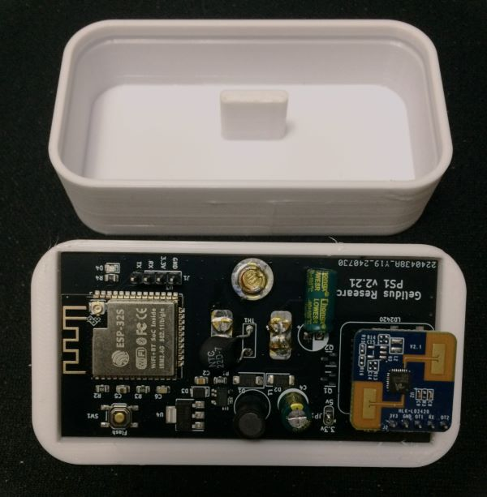
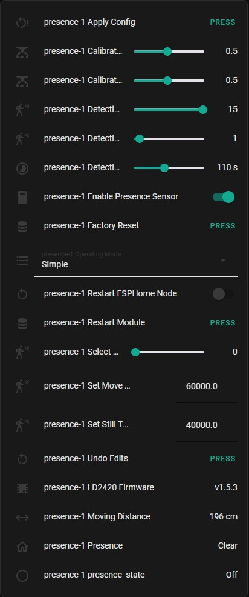

## GRPS1 Device Info



The Gelidus Research PS1 supports either the LD2420 or LD2410C HLK 24Mhz Radar Module.

- Compact 40 x 80 mm PCB
- 4 Pin ESP programming header (3.3v  only)
- Powerful ESP32S Dual Core 240Mhz 4MB Flash, BLE and WiFi module
- Dual core ESP32S enables simultaneous Wifi and BLE radios for optional BLE tracking
- 5 Pin HLK-LD2420 socket populated with an HLK-LD2420
- Also supports an LD2410C with JP1 set at 5 Volts.
- Powered directly with US AC plug receptacle blades (110-240 VAC)
- Designed to insert into a 3D printed protective Radome housing.

## Example LD2420 YAML Configuration

```yaml
esphome:
  name: presence-1
  friendly_name: presence-1

esp32:
  board: esp32dev
  framework:
    type: arduino

# Enable logging
# Use higher baud rates to avoid long running delay warns
# e.g. 230400, 256000, 460800, 921600
logger:
  baud_rate: 921600

# Enable Home Assistant API
api:
  encryption:
    key: "<your_key>"

ota:
  - platform: esphome # Required for 2024.5.0 and up
    password: "<your_password>"

wifi:
  ssid: !secret iot_ssid
  password: !secret iot_password

  # Enable fallback hotspot (captive portal) in case wifi connection fails
  ap:
    ssid: "presence-1"
    password: !secret captive_password
    ap_timeout: 30s

captive_portal:

web_server:
  password: !secret iot_password

uart:
  id: ld2420_uart
  tx_pin: GPIO17
  rx_pin: GPIO16
  baud_rate: 115200
  parity: NONE
  stop_bits: 1

# The LD2420 has 16 sense gates 0-15 and each gate detects 0.7 meters 15th gate = 9m
ld2420:

text_sensor:
  - platform: ld2420
    fw_version:
      name: LD2420 Firmware

sensor:
  - platform: ld2420
    moving_distance:
      name : Moving Distance

binary_sensor:
  - platform: ld2420
    has_target:
      name: Presence

  # Optional use of te GPIO binary output to enable/disable HA detection states
  - platform: gpio
    pin: GPIO4
    name: GPIO Presence
    id: gpio_presence_sensor
  - platform: template
    name: presence_state
    lambda: |-
      if (id(enable_presence_sensor).state && id(gpio_presence_sensor).state) {
        return true;
      } else {
        return false;
      }

switch:
  - platform: restart
    name: Restart ESPHome Node

  # Enable/disable presence_state entity output
  - platform: template
    name: "Enable Presence Sensor"
    id: enable_presence_sensor
    restore_mode: RESTORE_DEFAULT_ON
    optimistic: True

select:
  - platform: ld2420
    operating_mode:
      name: Operating Mode

number:
  - platform: ld2420
    presence_timeout:
      name: Detection Presence Timeout
    min_gate_distance:
      name: Detection Gate Minimum
    max_gate_distance:
      name: Detection Gate Maximum
    gate_select:
      name: Select Gate to Set
    still_threshold:
      name: Set Still Threshold Value
    move_threshold:
      name: Set Move Threshold Value
    gate_move_sensitivity:
      name: Calibration Move Sensitivity Factor
    gate_still_sensitivity:
      name: Calibration Still Sensitivity Factor

# When gate select is defined the individual gate_n: threshold optionals are ignored.
# This mode offers a compressed UI.
# With gate_select still and move_threshold are required.

#    gate_select:
#      name: Select Gate to Set
#    still_threshold:
#      name: Set Still Threshold Value
#    move_threshold:
#      name: Set Move Threshold Value

    gate_move_sensitivity:
      name: Calibration Move Sensitivity Factor
    gate_still_sensitivity:
      name: Calibration Still Sensitivity Factor
    gate_0:
      move_threshold:
        name: Gate 0 Move Threshold
      still_threshold:
        name: Gate 0 Still Threshold
    gate_1:
      move_threshold:
        name: Gate 1 Move Threshold
      still_threshold:
        name: Gate 1 Still Threshold
    gate_2:
      move_threshold:
        name: Gate 2 Move Threshold
      still_threshold:
        name: Gate 2 Still Threshold
    gate_3:
      move_threshold:
        name: Gate 3 Move Threshold
      still_threshold:
        name: Gate 3 Still Threshold
    gate_4:
      move_threshold:
        name: Gate 4 Move Threshold
      still_threshold:
        name: Gate 4 Still Threshold
    gate_5:
      move_threshold:
        name: Gate 5 Move Threshold
      still_threshold:
        name: Gate 5 Still Threshold
    gate_6:
      move_threshold:
        name: Gate 6 Move Threshold
      still_threshold:
        name: Gate 6 Still Threshold
    gate_7:
      move_threshold:
        name: Gate 7 Move Threshold
      still_threshold:
        name: Gate 7 Still Threshold
    gate_8:
      move_threshold:
        name: Gate 8 Move Threshold
      still_threshold:
        name: Gate 8 Still Threshold
    gate_9:
      move_threshold:
        name: Gate 9 Move Threshold
      still_threshold:
        name: Gate 9 Still Threshold
    gate_10:
      move_threshold:
        name: Gate 10 Move Threshold
      still_threshold:
        name: Gate 10 Still Threshold
    gate_11:
      move_threshold:
        name: Gate 11 Move Threshold
      still_threshold:
        name: Gate 11 Still Threshold
    gate_12:
      move_threshold:
        name: Gate 12 Move Threshold
      still_threshold:
        name: Gate 12 Still Threshold
    gate_13:
      move_threshold:
        name: Gate 13 Move Threshold
      still_threshold:
        name: Gate 13 Still Threshold
    gate_14:
      move_threshold:
        name: Gate 14 Move Threshold
      still_threshold:
        name: Gate 14 Still Threshold
    gate_15:
      move_threshold:
        name: Gate 15 Move Threshold
      still_threshold:
        name: Gate 15 Still Threshold

button:
  - platform: ld2420
    apply_config:
      name: Apply Config
    factory_reset:
      name: Factory Reset
    restart_module:
      name: Restart Module
    revert_config:
      name: Undo Edits

status_led:
  pin: GPIO23
```

## Example LD2410C YAML Configuration

```yaml
esphome:
  name: presence-1
  friendly_name: presence-1

esp32:
  board: esp32dev
  framework:
    type: arduino

# Enable logging
# Use higher baud rates to avoid long running delay warns
# e.g. 230400, 256000, 460800, 921600
logger:
  baud_rate: 921600

# Enable Home Assistant API
api:
  encryption:
    key: "<your_key>"

ota:
  - platform: esphome # Required for 2024.5.0 and up
    password: "<your_password>"

wifi:
  ssid: !secret iot_ssid
  password: !secret iot_password

  # Enable fallback hotspot (captive portal) in case wifi connection fails
  ap:
    ssid: "presence-1"
    password: !secret captive_password
    ap_timeout: 30s

captive_portal:

web_server:
  password: !secret iot_password

uart:
  id: ld2410_uart
  tx_pin: GPIO17
  rx_pin: GPIO4
  baud_rate: 256000
  parity: NONE
  stop_bits: 1

ld2410:

sensor:
  - platform: ld2410
    light:
      name: light
    moving_distance:
      name : Moving Distance
    still_distance:
      name: Still Distance
    moving_energy:
      name: Move Energy
    still_energy:
      name: Still Energy
    detection_distance:
      name: Detection Distance
    g0:
      move_energy:
        name: g0 move energy
      still_energy:
        name: g0 still energy
    g1:
      move_energy:
        name: g1 move energy
      still_energy:
        name: g1 still energy
    g2:
      move_energy:
        name: g2 move energy
      still_energy:
        name: g2 still energy
    g3:
      move_energy:
        name: g3 move energy
      still_energy:
        name: g3 still energy
    g4:
      move_energy:
        name: g4 move energy
      still_energy:
        name: g4 still energy
    g5:
      move_energy:
        name: g5 move energy
      still_energy:
        name: g5 still energy
    g6:
      move_energy:
        name: g6 move energy
      still_energy:
        name: g6 still energy
    g7:
      move_energy:
        name: g7 move energy
      still_energy:
        name: g7 still energy
    g8:
      move_energy:
        name: g8 move energy
      still_energy:
        name: g8 still energy

number:
  - platform: ld2410
    timeout:
      name: timeout
    light_threshold:
      name: light threshold
    max_move_distance_gate:
      name: max move distance gate
    max_still_distance_gate:
      name: max still distance gate
    g0:
      move_threshold:
        name: g0 move threshold
      still_threshold:
        name: g0 still threshold
    g1:
      move_threshold:
        name: g1 move threshold
      still_threshold:
        name: g1 still threshold
    g2:
      move_threshold:
        name: g2 move threshold
      still_threshold:
        name: g2 still threshold
    g3:
      move_threshold:
        name: g3 move threshold
      still_threshold:
        name: g3 still threshold
    g4:
      move_threshold:
        name: g4 move threshold
      still_threshold:
        name: g4 still threshold
    g5:
      move_threshold:
        name: g5 move threshold
      still_threshold:
        name: g5 still threshold
    g6:
      move_threshold:
        name: g6 move threshold
      still_threshold:
        name: g6 still threshold
    g7:
      move_threshold:
        name: g7 move threshold
      still_threshold:
        name: g7 still threshold
    g8:
      move_threshold:
        name: g8 move threshold
      still_threshold:
        name: g8 still threshold

binary_sensor:
  - platform: ld2410
    has_target:
      name: Presence
    has_moving_target:
      name: Moving Target
    has_still_target:
      name: Still Target
  - platform: gpio
    pin: GPIO16
    name: gpio out pin presence
    device_class: presence

text_sensor:
  - platform: ld2410
    version:
      name: firmware version

switch:
  - platform: ld2410
    engineering_mode:
      name: engineering mode
  - platform: restart
    name: Restart

button:
  - platform: ld2410
    factory_reset:
      name: factory reset
    restart:
      name: restart
    query_params:
      name: query params

select:
  - platform: ld2410
    light_function:
      name: light function

status_led:
  pin: GPIO23

```

## GRPS1 Features Example


