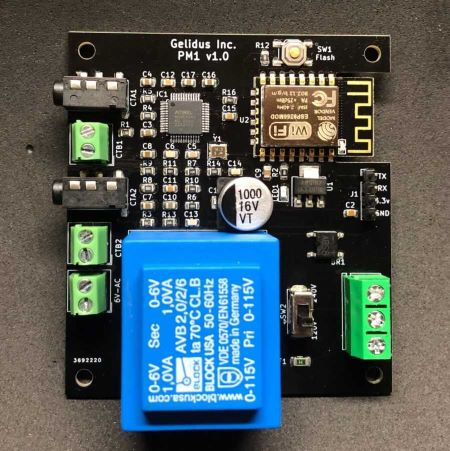
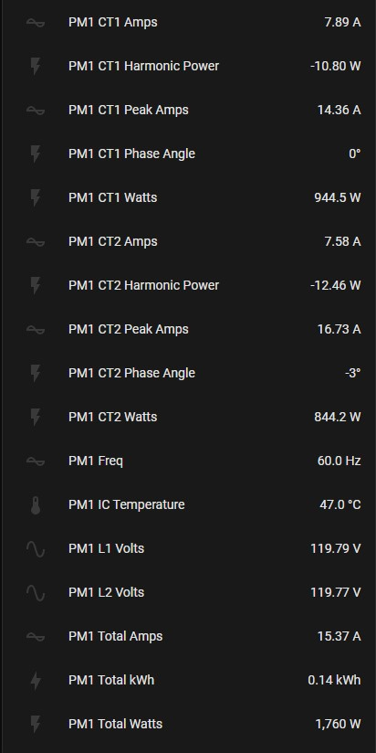

## GRPM1 Device Info



The PM1 board runs on an ESP12F WIFI module and is powered with 115-240V AC using an integrated isolation transformer.

ESPhome Component Docs: https://esphome.io/components/sensor/atm90e32

## Voltage

The PM1 integrates an ATM90E32 IC and is configured to measure single split phase AC lines and up to 2 AC voltages. The default configuration isolates one AC phase voltage to the ATM90E32 chip. An optional 6V AC isolation transfomer can be used to monitor both Split AC line voltages. https://www.gelidus.ca/product/pm1-reference-voltage-transformer-120vac-to-6vac-kit/

The Gelidus Split Single Phase Power Meter https://www.gelidus.ca/product/esphome-power-meter-1 is ideal for most home power distributions in North America.

This sensor is pre calibrated for the SCT013-100-50ma or SCT023-200-100ma current transformers and the integrated AC mains isolation transformer.

Note: The PM1 and two 100A/50ma SCT013's supports any 200A service, the SCT023 supports larger conductors and up to a 400A service.

Full Setup Guide: https://github.com/GelidusResearch/device.docs/blob/main/pm1.guides/PM1-Setup-Basic-120V.md

## Current

Calibrations for the **Split Single Phase Energy Meter** require **gain_pga** at ``2X``

- 100A/50mA SCT-013
- 200A/100mA SCT-023

A typical current_cal for the 100A/50ma SCT013 and the 200A/100ma SCT023 is ~15270.

There are some variables in the manufacturing of CT's, if the highest level precision is desired then the current should be calculated
and adjusted and the use of an option AC line transfomer is nessesary.

Formula: Amps Measured / Amps Reported * current_cal value in the running yaml file = adjusted value to use.
This also applies to AC voltages, however it should not normally be required.

## Active Energy

The ATM90E32 chip has a high-precision built-in ability to count the amount of consumed energy on a per-current transformer basis.
For each current transformer both the Forward and Reverse active energy is counted in watt-hours.
Forward Active Energy is used to count consumed energy, whereas Reverse Active Energy is used to count exported energy
(e.g. with solar pv installations).
The counters are reset every time a given active energy value is read from the ATM90E32 chip.

## Example

```yaml
  sensor:
    - platform: atm90e32
      cs_pin: 5
      phase_a:
        forward_active_energy:
          name: ${disp_name} ct1 FAWattHours
          id: ct1FAWattHours
          state_topic: ${disp_name}/ct1/forward_active_energy
        reverse_active_energy:
          name: ${disp_name} ct1 RAWattHours
          id: ct1RAWattHours
          state_topic: ${disp_name}/ct1/reverse_active_energy
```

## Default config

```yaml
esphome:
  name: power-meter-1

esp8266:
  board: esp12e

# Enable logging
logger:

# Enable Home Assistant API
api:
  encryption:
    key: <your api key>
  ota:
    password: !secret wifi_password

wifi:
  ssid: !secret wifi_ssid
  password: !secret wifi_password

  # Enable fallback hotspot (captive portal) in case wifi connection fails
  ap:
    ssid: power-meter-1
    password: !secret captive_portal_password

captive_portal:

web_server:
  port: 80

spi:
  clk_pin: 14
  miso_pin: 12
  mosi_pin: 13

substitutions:
# Change the disp_name to something you want
  disp_name: PM1
# Interval of how often the power is updated
  update_time: 15s

# Current transformer calibrations:
# 100A/50mA SCT-013 with 2x gain: 15270
# 200A/100mA SCT-023 with 2x gain: 15270
# 120V operation with the Integrated Block AVB 2,0/2/6 Transformer: ~4470
# 120V operation with GRPM1 AC 120/6V Transformer Kit:  ~4610
# 240V operation with the Integrated Block AVB 2,0/2/6 Transformer: ~8940
# 240V operation with GRPM1 AC 240/6V Transformer Kit:  ~9140

  phase_a_current_cal: '15270'
  phase_c_current_cal: '15270'
  phase_a_voltage_cal: '4470'
  phase_c_voltage_cal: '4470'


sensor:

  - platform: wifi_signal
    name: ${disp_name} WiFi Signal
    update_interval: 60s

  - platform: atm90e32
    cs_pin: 5
    phase_a:
      voltage:
        name: ${disp_name} L1 Volts
        accuracy_decimals: 2
      current:
        name: ${disp_name} CT1 Amps
        id: "ct1Amps"
      power:
        name: ${disp_name} CT1 Watts
        accuracy_decimals: 1
        id: "ct1Watts"
      peak_current:
        name: ${disp_name} CT1 Peak Amps
        accuracy_decimals: 2
        id: "ct1PeakAmps"
      phase_angle:
        name: ${disp_name} CT1 Phase Angle
        id: "ct1PhaseAngle"
        accuracy_decimals: 0
      harmonic_power:
        name: ${disp_name} CT1 Harmonic Power
        accuracy_decimals: 2
        id: "ct1HarmonPower"
      gain_voltage: ${phase_a_voltage_cal}
      gain_ct: ${phase_a_current_cal}
    phase_c:
      voltage:
        name: ${disp_name} L2 Volts
        accuracy_decimals: 2
      current:
        name: ${disp_name} CT2 Amps
        id: "ct2Amps"
      power:
        name: ${disp_name} CT2 Watts
        accuracy_decimals: 1
        id: "ct2Watts"
      peak_current:
        name: ${disp_name} CT2 Peak Amps
        accuracy_decimals: 2
        id: "ct2PeakAmps"
      phase_angle:
        name: ${disp_name} CT2 Phase Angle
        id: "ct2PhaseAngle"
        accuracy_decimals: 0
      harmonic_power:
        name: ${disp_name} CT2 Harmonic Power
        accuracy_decimals: 2
        id: "ct2HarmonPower"
      gain_voltage: ${phase_c_voltage_cal}
      gain_ct: ${phase_c_current_cal}
    frequency:
      name: ${disp_name} Freq
    line_frequency: 60Hz
    gain_pga: 2x
    chip_temperature:
      name: ${disp_name} IC Temperature
    update_interval: ${update_time}
  - platform: template
    name: ${disp_name} Total Amps
    id: "totalAmps"
    lambda: return id(ct1Amps).state + id(ct2Amps).state;
    accuracy_decimals: 2
    unit_of_measurement: A
    update_interval: ${update_time}
    device_class: current
  - platform: template
    name: ${disp_name} Total Watts
    id: "totalWatts"
    lambda: return id(ct1Watts).state + id(ct2Watts).state;
    accuracy_decimals: 0
    unit_of_measurement: W
    device_class: power
    update_interval: ${update_time}

  - platform: total_daily_energy
    name: ${disp_name} Total kWh
    power_id: totalWatts
    filters:
      - multiply: 0.001
    unit_of_measurement: kWh
    device_class: energy
    state_class: total_increasing

time:
  - platform: homeassistant
    id: homeassistant_time

switch:
  - platform: restart
    name: ${disp_name} Restart
```

## PM1 Features Example


