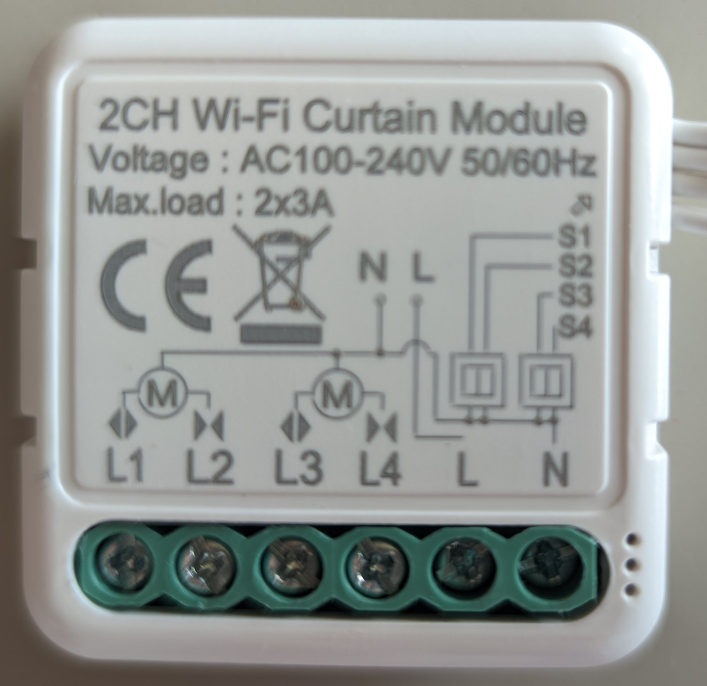
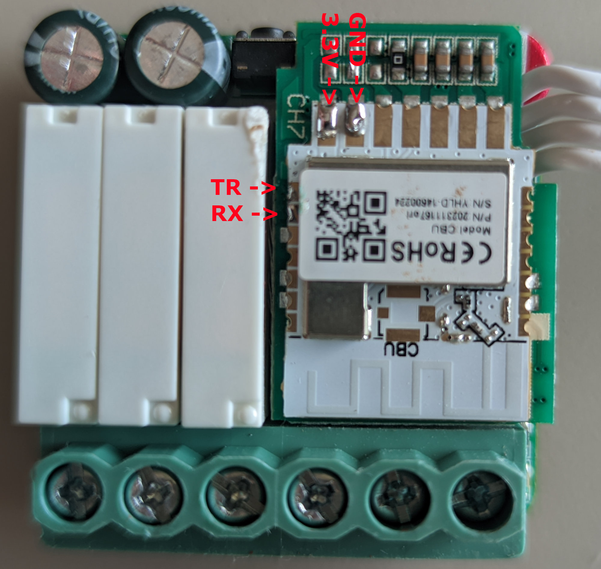

## General Notes

This is a generic dual channel curtain module using a BK7231N chip. To flash it you need to solder 3.3V, GND these are easily accessible at the front of the module. 
Also RX, TX which are at the inner side of the module next to one of the relays. 
The whole wifi module is suspended on pins because there is a relay under it. So I just bent the wifi bord a bit just to make enough space for soldering the two wires.
It uses a wifi board called CBU.

## Product Images




## GPIO Pinout (Per top to bottom when installed)

| Pin    | Function                       |
| ------ | ------------------------------ |
| GPIO11 | S1, Curtain1 Open switch       |
| GPIO10 | S2, Curtain1 Close switch      |
| GPIO9  | S3, Curtain2 Open switch       |
| GPIO8  | S4, Curtain2 Close switch      |
| GPIO4  | L1, to Curtain1 Open motor     |
| GPIO17 | L2, to Curtain1 Close motor    |
| GPIO20 | L3, to Curtain2 Open motor     |
| GPIO2  | L4, to Curtain2 Close motor    |
| GPIO19 | LED                            |


## Basic Configuration

```yaml
esphome:
  name: double-cover
  friendly_name: Livingroom_double_cover
  on_boot:
     - delay: 1s
     - switch.turn_off: "L2_close"
     - switch.turn_off: "L4_close"
     - delay: 1s
     - switch.turn_on: L1_open
     - switch.turn_on: L3_open
     - delay: 40s
     - switch.turn_off: L1_open
     - switch.turn_off: L3_open
     - cover.open: "right_cover"
     - cover.open: "left_cover"

bk72xx:
  board: generic-bk7231n-qfn32-tuya

# Enable logging
logger:

# Enable Home Assistant API
api:
  encryption:
    key: !secret api_key

ota:
  - platform: esphome
    password: !secret ota_password

wifi:
  ssid: !secret wifi_ssid
  password: !secret wifi_password

  ap:
    ssid: "Double-Cover"
    password: !secret ap_password

captive_portal:

web_server:
  
switch:

  - platform: gpio
    pin: 
      number: P20
      inverted: False
    id: L1_open
    restore_mode: ALWAYS_OFF
    name: "Cover1_open"
    internal: True

  - platform: gpio
    pin: 
      number: P28
      inverted: False
    id: L2_close
    restore_mode: ALWAYS_OFF
    name: "Cover1_close"
    internal: True

  - platform: gpio
    pin: 
      number: P17
      inverted: False
    id: L3_open
    restore_mode: ALWAYS_OFF
    name: "Cover2_open"
    internal: True

  - platform: gpio
    pin: 
      number: P16
      inverted: False
    id: L4_close
    restore_mode: ALWAYS_OFF
    name: "Cover2_close"
    internal: True

# LED
#  - platform: gpio
#    pin: 
#      number: P9
#      inverted: False
#    id: P9_id
#    restore_mode: ALWAYS_OFF
#    name: "P9"

binary_sensor:
  - platform: gpio
    pin: 
      number: P26
      inverted: True
    id: "S1_open"
    device_class: running
    internal: True
    on_press:
      - cover.stop: "left_cover"
      - delay: 300ms
      - cover.open: "left_cover"
    on_release: 
      - cover.stop: "left_cover"

  - platform: gpio
    pin: 
      number: P6
      inverted: True
    id: "S2_close"
    device_class: running
    internal: True
    on_press:
      - cover.stop: "left_cover"
      - delay: 300ms
      - cover.close: "left_cover"
    on_release: 
      - cover.stop: "left_cover"

  - platform: gpio
    pin: 
      number: P7
      inverted: True
    id: "S3_open"
    device_class: running
    internal: True
    on_press:
      - cover.stop: "right_cover"
      - delay: 300ms
      - cover.open: "right_cover"
    on_release: 
      - cover.stop: "right_cover"

  - platform: gpio
    pin: 
      number: P8
      inverted: True
    id: "S4_close"
    device_class: running
    internal: True
    on_press:
      - cover.stop: "right_cover"
      - delay: 300ms
      - cover.close: "right_cover"
    on_release: 
      - cover.stop: "right_cover"

cover:
  - platform: time_based
    device_class: shutter
    has_built_in_endstop: false
    name: "left-cover"
    id: "left_cover"
    open_action:
      - switch.turn_off: "L2_close"
      - delay: 300ms
      - switch.turn_on: "L1_open"
    open_duration: 40s
    close_action:
      - switch.turn_off: "L1_open"
      - delay: 300ms
      - switch.turn_on: "L2_close"
    close_duration: 36s
    stop_action:
      - switch.turn_off: "L2_close"
      - switch.turn_off: "L1_open"
    assumed_state: true

  - platform: time_based
    device_class: shutter
    has_built_in_endstop: false
    name: "right-cover"
    id: "right_cover"
    open_action:
      - switch.turn_off: "L4_close"
      - delay: 300ms
      - switch.turn_on: "L3_open"
    open_duration: 40s
    close_action:
      - switch.turn_off: "L3_open"
      - delay: 300ms
      - switch.turn_on: "L4_close"
    close_duration: 36s
    stop_action:
      - switch.turn_off: "L4_close"
      - switch.turn_off: "L3_open"
    assumed_state: True
```
