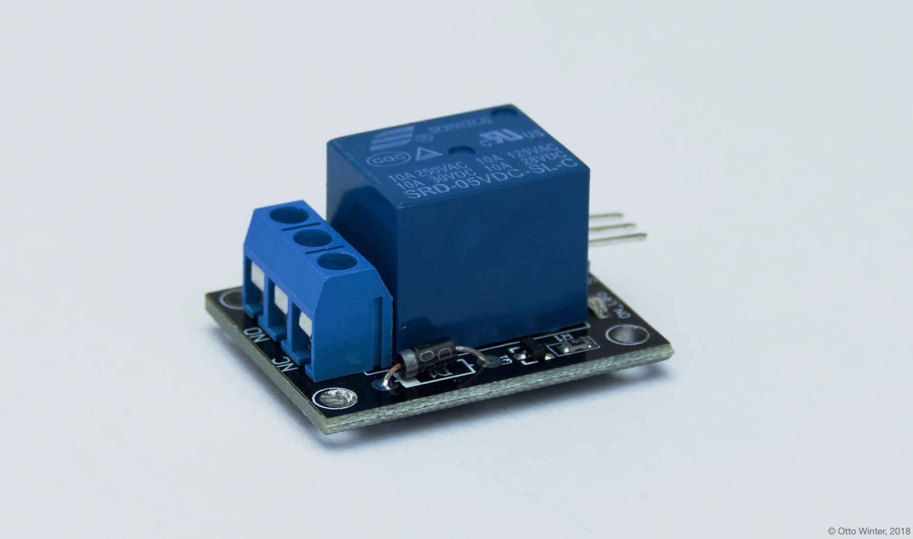

Relays are simple electronics components that allow you to switch a high
load using only a single pin on your board.

On the inside of a relay there is a coil that's connected to the input
signal. Every time the input signal switches on, the current flowing
through the coil induces a magnetic field that closes a contact.

On the output side you have three pins: common (`COM`), normally open
(`NO`) and normally closed (`NC`). Connect `COM` and one of `NO` and
`NC` in series with your load. When the input turns on, `NO` is
connected to `COM` and when the input turns off, `NC` is connected to
`COM`.

To use a relay with ESPHome, use a GPIO Switch component:

``` yaml
switch:
  - platform: gpio
    name: "Relay"
    pin: <PIN_RELAY_IS_CONNECTED_TO>
```

## Note

Relays are a very common component in electronics, so there are *many*
types of them and I won't attempt to describe all of them (partly due
to my own lack of knowledge). Please check with the datasheet of your
relay to see its current limits, what voltage it requires and so on.
Please also note that relays are physical components - as such, they
have a limited number of switches that can happen before they break.

## See Also

- [How do relays work](https://www.explainthatstuff.com/howrelayswork.html).
