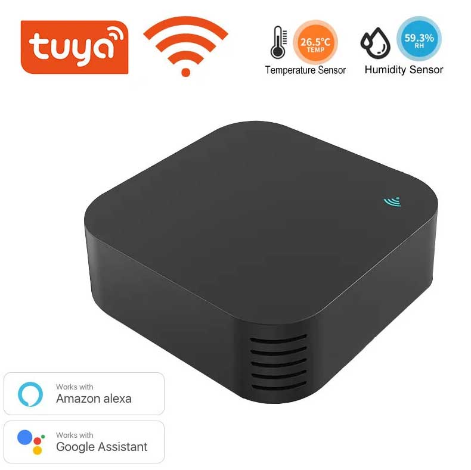
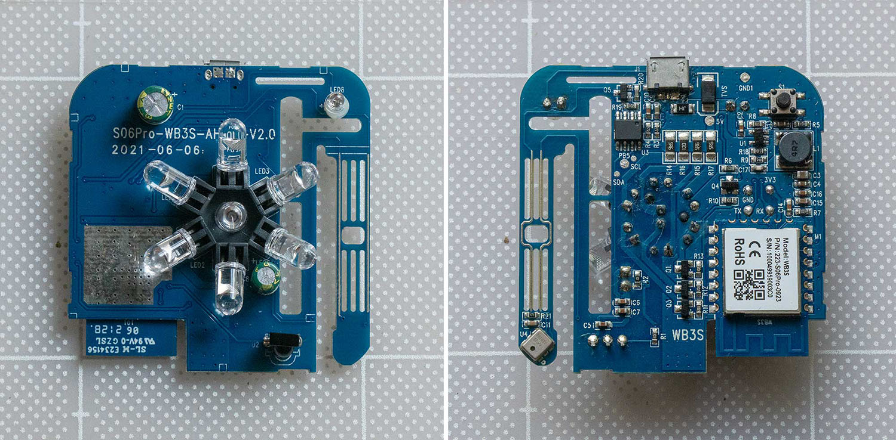

# Generic Tuya S06 Pro Wifi IR Blaster (WB3S)



[S06 Pro](https://s.click.aliexpress.com/e/_c4WmrJJt) universal remote controller with built-in temperature and humidity sensor (AHT10), based on the WB3S Wi-Fi module.

This device supports both IR transmitting and receiving, making it suitable for ESPHome IR remote projects such as air conditioners, TVs, fans, and other IR-controlled devices.

This device is based on PCB version `S06Pro-WB3S-AHT10-V2`. I also have a full detailed teardown and flashing instruction here: [Tuya S06 Pro Teardown](https://simplymaker.net/smart-home/tuya-s06-pro-ir-blaster-wb3s-teardown-and-esphome-flashing/)



## GPIO Pinout
| Pin     | Function           |
| ------- | ------------------ |
| P26     | Remote Transmitter |
| P8      | Remote Receiver    |
| P6      | Reset Button       |
| P9      | Status LED         |
| TX1/RX1 | Tuya UART          |

## Flashing
This device can be flashed directly over UART using [LTChipTool](https://docs.libretiny.eu/docs/flashing/tools/ltchiptool/).

| Serial | CB3S        |
| ------ | ----------- |
| RX     | TX1         |
| TX     | RX1         |
| RST    | CEN         |
| 3.3V   | 3.3V        |
| GND    | GND         |

To enter bootloader mode:
briefly short CEN to GND while LTChipTool shows Connecting...

## Basic Configuration

```yaml file=ir-s06-pro.yaml
```
