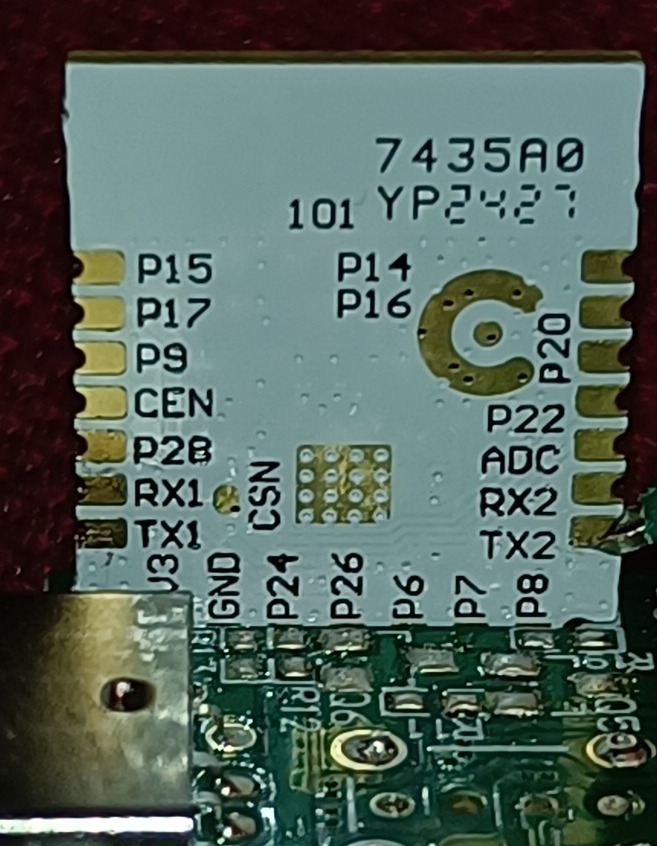
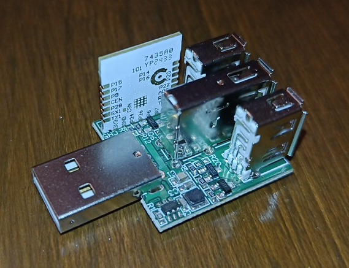

## General Notes

There are various models of these generic USB Wifi switches.  They come with 1, 2, or 3 individually switchable USB output ports, but only the first passes data.

## GPIO Pinout

| Pin | Function      |
| --- | ------------- |
| P6  | LED           |
| P7  | Relay 1       |
| P8  | Button        |
| P26 | Relay 2       |
| P24 | Relay 3       |

## Flashing

They use a Tuya CBU module with easily accessible flashing pins.



The 3 output model restricts access to the uart2 pins for logging, but they aren't necessary for flashing.



I used ``ltchiptool`` to backup the original firmware and flash an esphome uf2 binary to it.

## Configuration

```yaml
bk72xx:
  board: cbu

switch:
  - platform: gpio
    id: relay1
    name: "Relay 1"
    pin: 7
  - platform: gpio
    id: relay2
    name: "Relay 2"
    pin: 26
  - platform: gpio
    id: relay3
    name: "Relay 3"
    pin: 24

output:
  - platform: libretiny_pwm
    id: led
    pin: 6

light:
  - platform: monochromatic
    name: LED
    output: led

binary_sensor:
  - platform: gpio
    id: button
    pin:
      number: 8
      inverted: true
      mode: input_pullup
    name: Side button
    on_click:
      then:
        - switch.toggle: relay1
```
