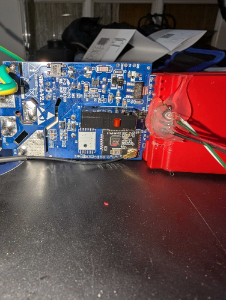
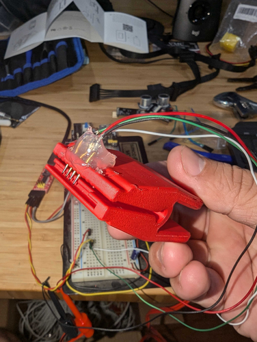

## Flashing

As of November 2024, there are two methods of flashing this device, using a serial adapter and ltchiptool, or OTA using tuya-cloudcutterflash

Attention: Recently purchased units (Decemeber, 2024) contain a Lightning Semi LN882H rather than the Beken BK7231N.  These units cannot be flashed with ESPHome.  The newly purchased units also have screw terminals on the switch body for the wiring.  The older units had four wires coming off of the back of the switch body.

### OTA

CAUTION: either install the device properly in the wall before attempting, or have another way of safely powering the device. OTA flashing when the device is powered with mains current can be dangerous

Newer versions of this switch use the BK7231N chip, running 1.0.1 firmware. These devices are able to be flashed using tuya-cloudcutter.

Install Tuya-cloudcutter, following instructions [here](https://github.com/tuya-cloudcutter/tuya-cloudcutter/tree/main/custom-firmware)

Once the tool is installed, run it with this command:

```sudo ./tuya-cloudcutter.sh -p gosund-sw5-a-v2.1-smart-switch-bk7231n-v1.0.1 -f ESPHome-Kickstart-v23.08.29_bk7231n_app.ota.ug.bin```

Follow the onscreen instructions to put the device into "slow blink" mode, and then power off/back on when prompted. This will install the ESPHome Kickstart firmware. From there is is possible to OTA install full ESPHome.

### Serial

The newer versions off amazon US (2024+) of this device came with a Beken BK7231N chip

For newer devices, use a USB to serial adapter, and solder wires onto the pads marked TX, RX, 3.3V and GND.
If you have the stock firmware on the device, you can hold the button for 5 seconds to reset it to get itchiptool to
work.

build the firmware in esphome and flash it using the itchiptool

download the firmware in the uf2 format

Install itchiptool from [here](https://github.com/libretiny-eu/ltchiptool)

figure out the serial port the device is connected to and run the following command
(in my case it was /dev/ttyUSB0 in linux, but in windows it will be a com port)

run the following command to flash the firmware
`ltchiptool flash write -d /dev/ttyUSB0 YOUR_FIRMWARE_FILE.uf2`

you will see an output like this:

```text
I: Detected file type: UF2 - esphome 2023.11.6
I: Connecting to 'Beken 7231N' on /dev/ttyUSB0 @ 115200
I: Connect UART1 of the BK7231 to the USB-TTL adapter:
I:
I:     --------+        +--------------------
I:          PC |        | BK7231
I:     --------+        +--------------------
I:          RX | ------ | TX1 (GPIO11 / P11)
I:          TX | ------ | RX1 (GPIO10 / P10)
I:             |        |
I:         GND | ------ | GND
I:     --------+        +--------------------
I:
I: Using a good, stable 3.3V power supply is crucial. Most flashing issues
I: are caused by either voltage drops during intensive flash operations,
I: or bad/loose wires.
I:
I: The UART adapter's 3.3V power regulator is usually not enough. Instead,
I: a regulated bench power supply, or a linear 1117-type regulator is recommended.
I:
I: To enter download mode, the chip has to be rebooted while the flashing program
I: is trying to establish communication.
I: In order to do that, you need to bridge CEN pin to GND with a wire.
```

Power cycle the device by removing the 3.3v

> Don't disconnect the usb/serial converter just remove 3.3v to the device to power cycle it

When it turns back on it will be in download mode and you should see something similar to this:

```text
I: |-- Success! Chip info: BK7231N
I: Writing 'MY_CUSTOM_FIRMWARE.uf2'
I: |-- esphome 2023.11.6 @ 2023-12-15 07:08:48 -> generic-bk7231n-qfn32-tuya
Writing (0x011000)  [###############################################################-]   99%  00:00:00
W: The current command timeout of 1.0 second(s) is too low for reading 905216 bytes CRC. Increasing to 3 second(s).
Booting firmware  [################################################################]  100%
```

Congrats you are done! You can now disconnect it and wire in the normal switch!

## Pinout

| Pin | Function  |
|-----|-----------|
| P7  | Button    |
| P6  | Green LED |
| P14 | Relay     |
| P16 | Red LED   |

## Example YAML Config

```yaml
esphome:
  name: ghome_sw5
  friendly_name: Ghome SW5

bk72xx:
  board: generic-bk7231n-qfn32-tuya

logger:

api:
  encryption:
    key: !secret api_key

ota:
  - platform: esphome
    password: !secret ota_password

wifi:
  ssid: !secret wifi_ssid
  password: !secret wifi_password

  ap:
    ssid: "Ghome SW5 Fallback Hotspot"
    password: !secret fallback_password

captive_portal:

# Status LED configuration
status_led:
  pin:
    number: P7  # WiFi/Green LED
    inverted: true

# Output configuration for the red LED
output:
  - platform: gpio
    id: red_led
    pin:
      number: P16  # Red LED
      inverted: false

# Light configuration for Home Assistant
light:
  - platform: binary
    output: red_led
    id: led
    name: "Red LED"

# Binary sensor for the button
binary_sensor:
  - platform: gpio
    pin:
      number: P8  # Button
      mode: INPUT_PULLUP
    id: button1
    on_press:
      then:
        - switch.toggle: relay1

# Relay switch configuration
switch:
  - platform: gpio
    pin: P14  # Relay
    id: relay1
    name: "Relay Switch"
    on_turn_on:
      - light.turn_off: led  # Turn off the red LED when relay is on
    on_turn_off:
      - light.turn_on: led  # Turn on the red LED when relay is off
```

## Notes/Issues/Troubleshooting

Use an external 3.3v power supply, the onboard regulator is not enough to power the device and flash.

There are at least 2 versions of this device and I found photos with the bk7231t they are not compatible, you need to
build the firmware for the correct chip. I know because I was scratching my head until I actually took a photo and
confirmed the chip on my board

- Here is the amazon link to the device I bought: [Amazon Link](https://www.amazon.com/dp/B09JZ6W1BH)
  - Good as of Sept 2024
- This is an exact teardown of the device (with the other
  controller) [Teardown](https://www.elektroda.com/rtvforum/topic3892160.html)
- I designed and 3d printed a pogo based clip to flash the device here is
  the [Onshape Link](https://cad.onshape.com/documents/bd911beb7a4a52211fd6ff0a/w/639be8dce01942437b84688a/e/92c75704a7d638fc027182f4?renderMode=0&uiState=66d5ece2b7272918ae9b9502)
- Amazon link for the pogo pins [Amazon Link](https://www.amazon.com/gp/product/B00TX43QEQ)
  - Labeled on amazon `uxcell 100 Pcs PL75-B1 0.7mm Tip 16mm Spring Test Probes Pin for PCB Board`

## Extra Images For Reference

A Board mounted in the clip


A Closeup of fully assembled clip


Janky flashing setup with a dedicated 3.3v power supply

