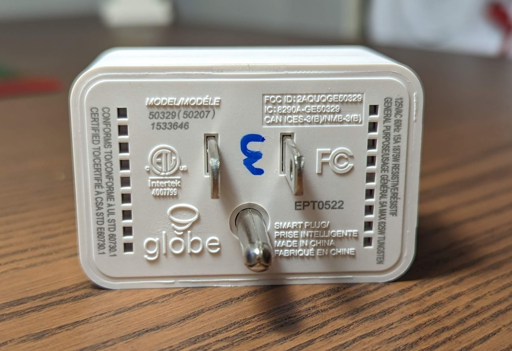
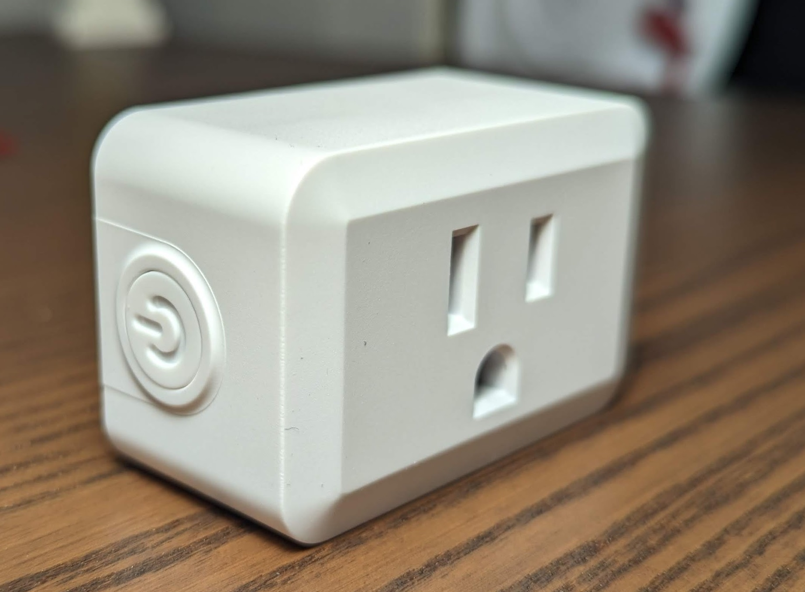
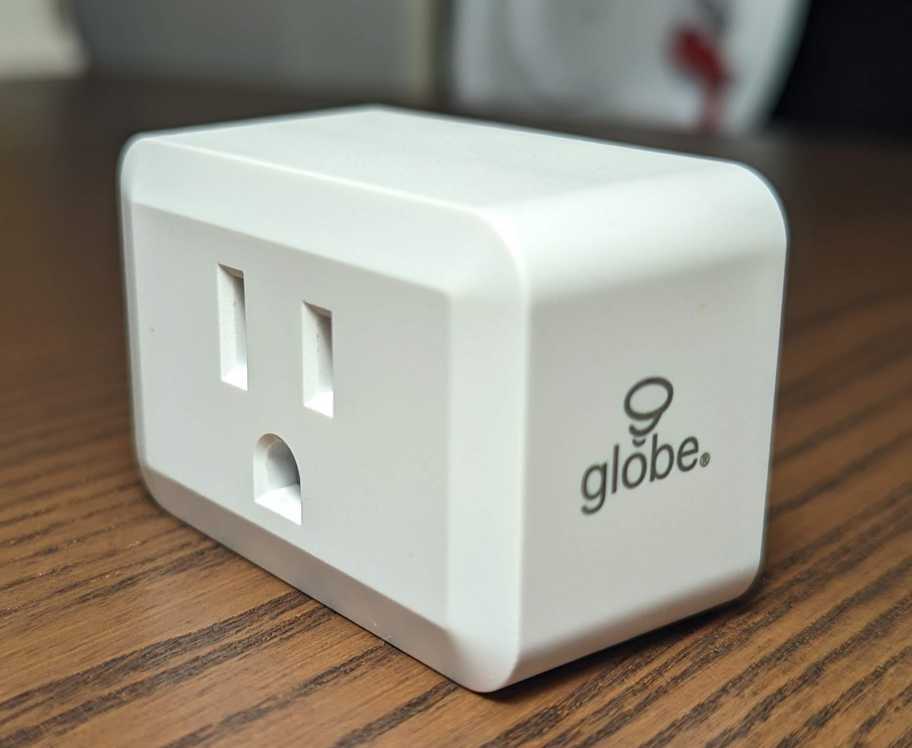

Sold at Costco model (**_50207_**)

## Custom Firmware Needed

This device uses the WB2S module that comes with Tuya firmware which can be flashed to esphome using cloudcutter following instructions [in this DigiBlur guide](https://digiblur.com/2023/04/10/tuya-cloudcutter-with-esphome-how-to-guide/)

Support for WB2S modules is available in ESPHome 2023.9.0 (<https://github.com/esphome/esphome/pull/3509>).

## GPIO Pinout

Due to the fact that this uses a custom esphome firmware the pin numbers start with a P instead of the usual GPIO

| Pin | Name   | Function     |
| --- | ------ | ------------ |
| P7  | LED    | Status LED   |
| P26 | Button | Power Button |
| P24 | Outlet | Relay        |

## Basic Configuration

```yaml
# Globe Electric 50329 smart plug
substitutions:
  number: "1"
  device_name: globe-plug-${number}
  device_description: Globe Electric 50329 Smart plug
  friendly_name: Globe Plug ${number}

esphome:
  name: ${device_name}
  comment: ${device_description}

bk72xx:
  board: wb2s

# Enable logging
logger:

# Enable Home Assistant API
api:
  encryption:
    key: "YOUR KEY HERE"

web_server:
  port: 80
  auth:
    username: admin
    password: !secret web_server_password

ota:
  password: !secret ota_password

wifi:
  ssid: !secret wifi_ssid
  password: !secret wifi_password

text_sensor:
  - platform: wifi_info
    ip_address:
      name: ESP IP Address
    ssid:
      name: ESP Connected SSID
    bssid:
      name: ESP Connected BSSID
    mac_address:
      name: ESP Mac Wifi Address

time:
  - platform: homeassistant
    id: homeassistant_time

sensor:
  - platform: uptime
    name: ${friendly_name} Uptime
    unit_of_measurement: minutes
    filters:
      - lambda: return x / 60.0;

  - platform: wifi_signal
    name: ${friendly_name} Signal
    update_interval: 60s

light:
  - platform: status_led
    name: "led"
    internal: true
    id: led
    pin:
      number: P7
      inverted: true

binary_sensor:
  - platform: gpio
    pin:
      number: P26
      inverted: true
    id: button1
    filters:
      - delayed_on: 10ms
      - delayed_off: 10ms
    on_click:
      - switch.toggle: outlet

  - platform: status
    name: ${friendly_name} status

switch:
  - platform: gpio
    name: ${friendly_name} Outlet
    id: outlet
    pin: P24
    icon: mdi:power-socket-us
    on_turn_on:
      - light.turn_on: led
    on_turn_off:
      - light.turn_off: led
```
