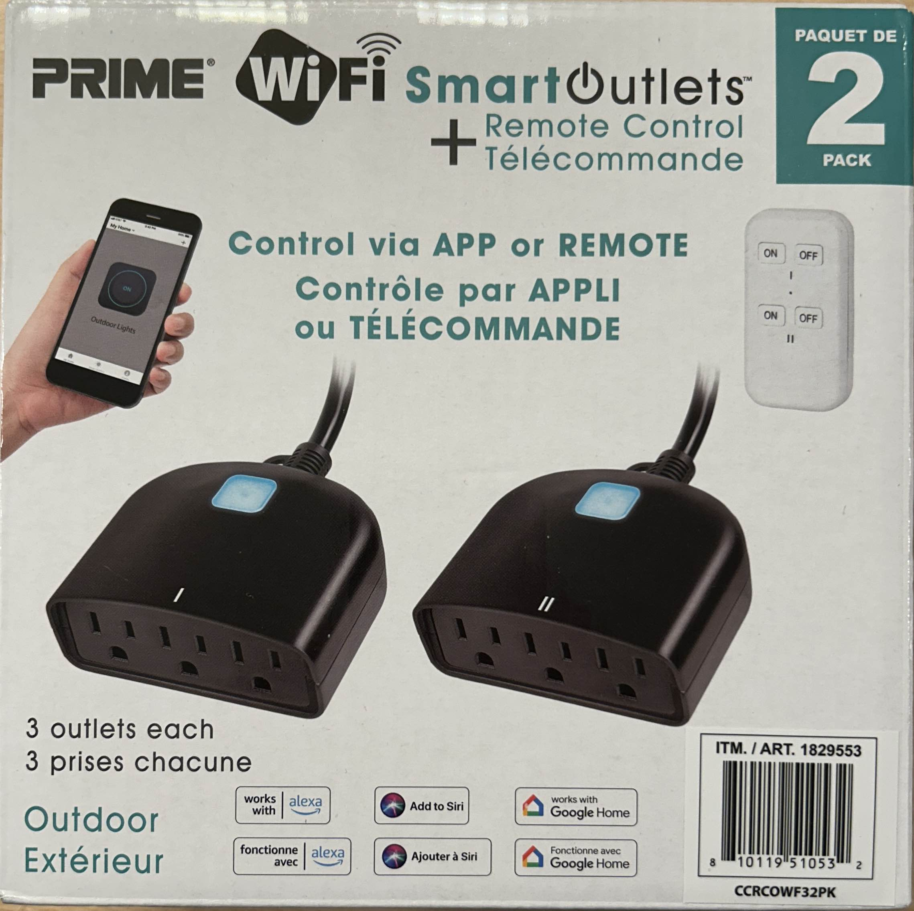

I purchased this at Costco in Canada in November of 2024. The Costco item number was 1829553.

It is hold together with screws, making it very easy to open and flash.

Inside I found a CB2S module and a board that looks exactly like the one here.
[Feit Electric PLUG3/WIFI/WP/2](/devices/Feit-PLUG3-WIFI-WP-2).

## GPIO Pinout

| Pin | Function            |
| --- | --------------------|
| P6  | (PWM0) Pushbutton   |
| P7  | (PWM1) Status LED   |
| P8  | (PWM2) Relay        |
| P10 | (RXD1) UART 1 RX    |
| P11 | (TXD1) UART 1 TX    |

Disassembly is straightforward but DO NOT open the device while it is plugged into mains power as that presents a safety hazard. There are six phillips head screws on the bottom; they are all the same size. Remove those screws and set aside.

I refer you to [Feit Electric PLUG3/WIFI/WP/2](/devices/Feit-PLUG3-WIFI-WP-2) for further instructions on flashing.

## Basic Configuration

```yaml
esphome:
  name: globe-outdoor-plug-1
  friendly_name: "Globe Outdoor Plug 1"

bk72xx:
  board: generic-bk7231n-qfn32-tuya

logger:
  level: verbose

web_server:
  version: 3

captive_portal:

mdns:

api:

ota:
  - platform: esphome

captive_portal:

wifi:
  ssid: !secret wifi_ssid
  password: !secret wifi_password

binary_sensor:
  - platform: gpio
    id: binary_switch_1
    pin:
      number: P6
      inverted: true
      mode: INPUT_PULLUP
    on_press:
      then:
        - switch.toggle: switch_1

switch:
  - platform: gpio
    id: switch_1
    name: Relay 1
    pin: P8
    on_turn_on:
      - light.turn_on: light_status
    on_turn_off:
      - light.turn_off: light_status

light:
  - platform: status_led
    id: light_status
    pin:
      number: P7
      inverted: true

text_sensor:
  - platform: libretiny
    version:
      name: LibreTiny Version


```

## References

[Feit Electric PLUG3/WIFI/WP/2](/devices/Feit-PLUG3-WIFI-WP-2)
<https://docs.libretiny.eu/boards/cb2s/> - CB2S pinout
