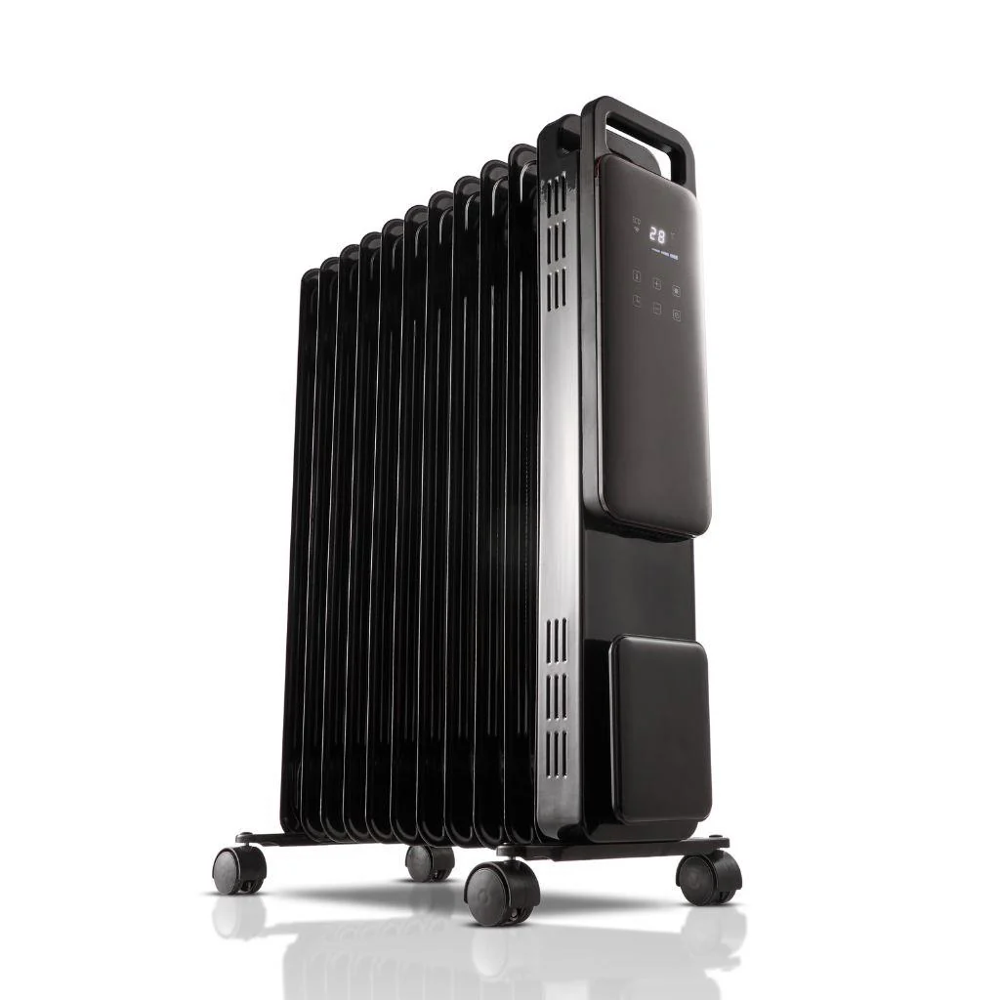
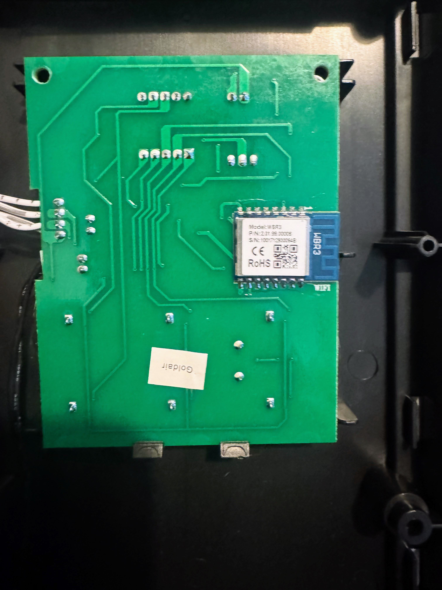

## General Notes

I actually broke my WBR3 Chip during dissassembly so the following config is going to be based on using an ESP8266 Chip.

To get at the chip you will need to pry the front faceplate off using a spudger or screwdriver. Then remove all of the screws and pull off the whole faceplate, the chip is located on the back of the mainboard. You will then need to desolder it to flash it.




## Flashing Instuctions

This device is based on the WBR3 Tuya Module, you can check for flashing setup
[on the Elektroda forum](https://www.elektroda.com/rtvforum/topic4097185.html). With the WBR3 removed and with the probe
pins soldered you can use ltchiptool to flash it via UART. We strongly recommend using an external power source for the
3v3 power supply. Make sure to connect the GND of the supply and the serial converter together, so they share the same
GND reference.

## Features

## GPIO Pinout

| Pin   | Function                         |
| ----- | -------------------------------- |
| GPIO1 | UART TX (Connects to TuyaMCU RX) |
| GPIO3 | UART RX (Connects to TuyaMCU TX) |

## TuyaMCU DP IDs

| DP ID | Function                  | Type    | Values / Notes                       |
| :---- | :------------------------ | :------ | :----------------------------------- |
| `1`   | Power                     | Boolean | `0`: Off, `1`: On                    |
| `2`   | Target Temperature        | Value   | Integer, 5-30°C                      |
| `3`   | Current Temperature       | Value   | Integer, °C                          |
| `5`   | Power/Mode                | Enum    | `0`: ECO, `1`: LOW, `2`: MED, `3`: HIGH |
| `7`   | Child Lock                | Boolean | `0`: Off, `1`: On                    |
| `11`  | Work State                | Enum    | `0`: Heating, `1`: Warm              |
| `20`  | AUTO-OFF Time Remaining   | Value   | Integer, minutes                     |
| `21`  | Unknown                   | Raw     | 8-byte hex value, function unknown   |
| `101` | Disable Beeping           | Boolean | `0`: Beeping enabled, `1`: Disabled  |
| `102` | AUTO-ON Timer             | Value   | Integer, 0-24 hours                  |
| `103` | AUTO-OFF Timer            | Value   | Integer, 0-24 hours                  |

## Features

### Climate Entity
Unified climate control interface exposing:
- Power control
- Target temperature (5-30°C, 1°C steps)
- Current temperature reading
- Fan modes mapped to heating power levels (ECO/LOW/MED/HIGH)
- Work state monitoring (Heating/Warm)

### Scheduling
- **AUTO-ON**: Automatically power on after specified hours (0-24h)
- **AUTO-OFF**: Automatically power off after specified hours (0-24h)
- Real-time countdown display for AUTO-OFF

### Safety Features
- Child lock to prevent accidental changes
- Optional beep disable for quiet operation
- Temperature limits enforced (5-30°C)

## Example ESPHome Configuration
**The below configuration is for an ESP8226, not the original WBR3 Board, sorry.** 
```yaml
esphome:
  name: smart-heater
  friendly_name: Smart-Heater

esp8266:
  board: esp12e

logger:
  baud_rate: 0

uart:
  tx_pin: GPIO1
  rx_pin: GPIO3
  baud_rate: 9600

# Enable Home Assistant API
api:
  encryption:
    key: !secret encryption_key

ota:
  - platform: esphome
    password: "ota_password"

wifi:
  ssid: !secret wifi_ssid
  password: !secret wifi_password

captive_portal:
web_server:

text_sensor:
  - platform: template
    id: tuya_work_state
    name: Work State
    filters:
      - map:
          - 0 -> Heating
          - 1 -> Warm

tuya:
  on_datapoint_update:
    - sensor_datapoint: 11
      datapoint_type: enum
      then:
        - text_sensor.template.publish:
            id: tuya_work_state
            state: !lambda "return std::to_string(x);"

switch:
  - platform: tuya
    switch_datapoint: 1
    name: Power
  - platform: tuya
    switch_datapoint: 7
    name: Child Lock
  - platform: tuya
    switch_datapoint: 101
    name: Disable Beeping

number:
  - platform: tuya
    number_datapoint: 2
    name: Temperature
    unit_of_measurement: "°C"
    min_value: 5
    max_value: 30
    step: 1

  - platform: tuya
    number_datapoint: 102
    name: AUTO-ON
    unit_of_measurement: Hours
    min_value: 0
    max_value: 24
    step: 1

  - platform: tuya
    number_datapoint: 103
    name: AUTO-OFF
    unit_of_measurement: Hours
    min_value: 0
    max_value: 24
    step: 1

sensor:
  - platform: tuya
    sensor_datapoint: 3
    name: Current Temperature
    unit_of_measurement: "°C"
  - platform: tuya
    sensor_datapoint: 20
    name: AUTO-OFF Time Remaining
    unit_of_measurement: min

select:
  - platform: tuya
    enum_datapoint: 5
    name: Power/Mode
    optimistic: true
    options:
      0: ECO
      1: LOW
      2: MED
      3: HIGH

climate:
  - platform: tuya
    name: "Smart Heater"
    switch_datapoint: 1                  # Power
    target_temperature_datapoint: 2      # Set temperature
    current_temperature_datapoint: 3     # Current temperature

    active_state: 
      datapoint: 11

    fan_mode:
      datapoint: 5
      auto_value: 0
      low_value: 1
      medium_value: 2
      high_value: 3

    visual:
      min_temperature: 5
      max_temperature: 30
      temperature_step: 1
```