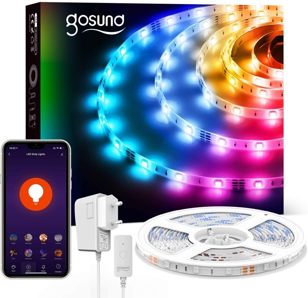

## Gosund SL2 LED light stripe

This is a cheap LED light stripe which can be bought at Amazon. Older versions of this LED controller allow to flash the device using tuya-convert whereas newer version needs to be flashed using a cable connection to the pins on the controller.

```yaml
# Define the name
substitutions:
  devicename: "markise_led"
  upper_devicename: "Markise LED"

esphome:
  name: ${devicename}

esp8266:
  board: esp01_1m

# OTA flashing
ota:
  - platform: esphome

wifi: # Your Wifi network details
  
# Enable fallback hotspot in case wifi connection fails  
  ap:

# Enabling the logging component
logger:

# Enable Home Assistant API
api:

# Enable the captive portal
captive_portal:

# Enable the Web Server component 
webserver:

time:
  - platform: homeassistant
    id: homeassistant_time

# Enable switch for remote restart
switch:
  - platform: restart
    name: "${upper_devicename} Restart"

# Example configuration entry
light:
  - platform: rgb
    name: "${upper_devicename}"
    red: output_red
    green: output_green
    blue: output_blue
    id: led_strip

# Example output entry
output:
  - platform: esp8266_pwm
    id: output_red
    pin: GPIO12
  - platform: esp8266_pwm
    id: output_green
    pin: GPIO5
  - platform: esp8266_pwm
    id: output_blue
    pin: GPIO13

binary_sensor:

  - platform: gpio
    pin:
      number: GPIO4
      mode: INPUT_PULLUP
      inverted: true
    name: "${upper_devicename} Pushbutton"
    internal: true
    on_press:
      then:
        - light.toggle: led_strip

```
