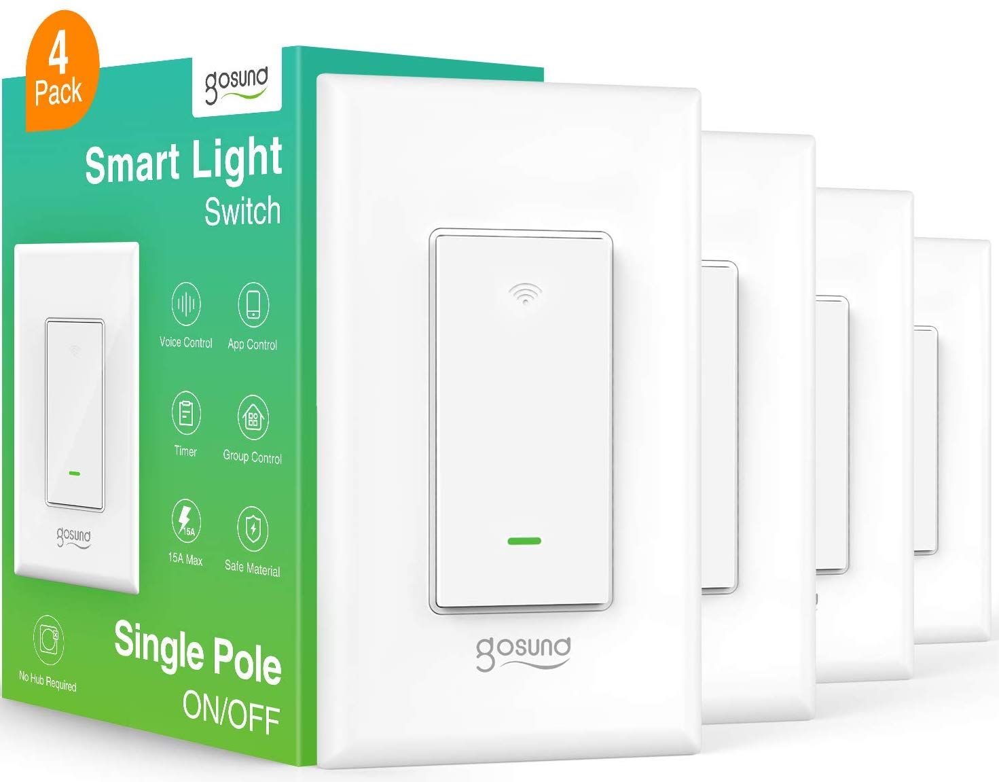

## Flashing

For older devices, it may be possible to use Tuya Convert to flash

For newer devices, use a USB to serial adapter, and solder wires onto the pads marked IO0, TX, RX, 3.3V and GND.

## GPIO Pinout

| Pin    | Function                   |
| ------ | -------------------------- |
| GPIO0  | Button                     |
| GPIO2  | State LED (Inverted: true) |
| GPIO14 | Relay                      |
| GPIO16 | Link LED (inverted: true)  |

## Basic Configuration

```yaml
esphome:
  name: gosundsw5
  platform: ESP8266
  board: esp01_1m

# Enable logging
logger:

# Enable Home Assistant API
api:

ota:

wifi:
  ssid: "ssid"
  password: "PASSWORD"

  # Enable fallback hotspot (captive portal) in case wifi connection fails
  ap:
    ssid: "Gosund Fallback Hotspot"
    password: "ul57sDUAqbcl"

captive_portal:

status_led:
  pin:
    number: GPIO16
    inverted: true

output:
  - platform: esp8266_pwm
    id: state_led
    pin:
      number: GPIO2
      inverted: true

light:
  - platform: monochromatic
    output: state_led
    id: led

binary_sensor:
  - platform: gpio
    pin:
      number: GPIO00
    id: button1
    on_press:
      then:
        - switch.toggle: relay1

switch:
  - platform: gpio
    pin: GPIO14
    id: relay1
    name: GosundSW5
    icon: "mdi:light-switch"
    on_turn_on:
      - light.turn_on: led
    on_turn_off:
      - light.turn_off: led
```
