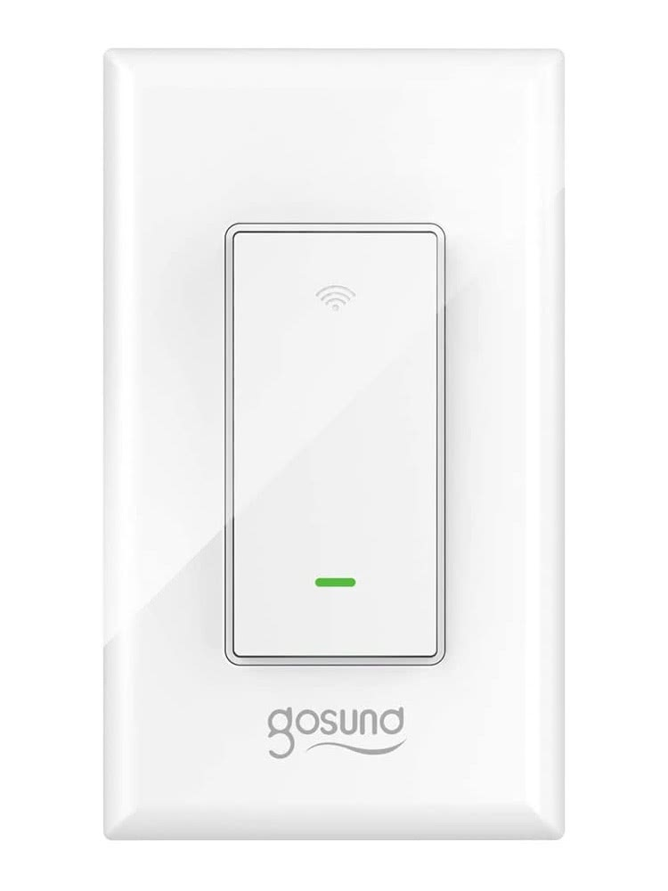

## Flashing
For older devices, it may be possible to use Tuya Convert to flash

For newer devices, use a USB to serial adapter, and solder wires onto the pads marked IO0, TX, RX, 3.3V and GND. 

## Notes
This configuration does not use the state LED at all, as it was never synchronized with the state of the light. This is an area for further work.

In order for the switch to work correctly, it should be placed as the first switch from the mains power, with the 'dumb' 3-way switch placed on the load side. For proper sensing, the load needs to be more than a few watts, so it should be put in place with an actual light for testing.

This configuration is based directly on information from this post: https://www.reddit.com/r/Esphome/comments/kn51r0/configuration_for_gosund_sw6/

## GPIO Pinout

| Pin    | Function                       |
| ------ | ------------------------------ |
| GPIO0  | Button                         |
| GPIO2  | State LED (Inverted: true)     |
| GPIO4  | Switch                         |
| GPIO14 | Relay 2                        |
| GPIO15 | Relay 1                        |
| GPIO16 | Link LED (inverted: true)      |

## Basic Configuration

```yaml
esphome:
  name: gosundsw5
  platform: ESP8266
  board: esp01_1m

substitutions:
  esphome_name: gosundsw5
  friendly_name: Gosund SW6

# Enable logging
logger:

# Enable Home Assistant API
api:

ota:

wifi:
  ssid: "ssid"
  password: "PASSWORD"

  # Enable fallback hotspot (captive portal) in case wifi connection fails
  ap:
    ssid: "Gosund Fallback Hotspot"
    password: "ul57sDUAqbcl"

captive_portal:

status_led:
  pin:
    number: GPIO16
    inverted: True

binary_sensor:
  - platform: gpio
    pin:
      number: GPIO00
    id: button
    on_press:
      - switch.toggle: relay

  - platform: gpio
    pin:
      number: GPIO4
      inverted: True
    id: power_button
    name: "Dumb Switch Output"
    internal: True
    on_press:
      - switch.toggle: ${esphome_name}

switch:
  - platform: gpio
    pin: GPIO14
    id: relay
    restore_mode: RESTORE_DEFAULT_OFF
    internal: True
  
  - platform: template
    name: ${friendly_name}
    id: ${esphome_name}
    icon: "mdi:light-switch"
    lambda: |-
      if (id(power_button).state) {
        return true;
      } else {
        return false;
      }
    turn_on_action:
      - if:
          condition:
            - binary_sensor.is_off: power_button
          then:
            - switch.toggle: relay
    turn_off_action:
      - if:
          condition:
            - binary_sensor.is_on: power_button
          then:
            - switch.toggle: relay

  - platform: gpio
    pin:
      number: GPIO15
      mode: INPUT_PULLDOWN_16
    id: dummy_relay
    internal: True

```
