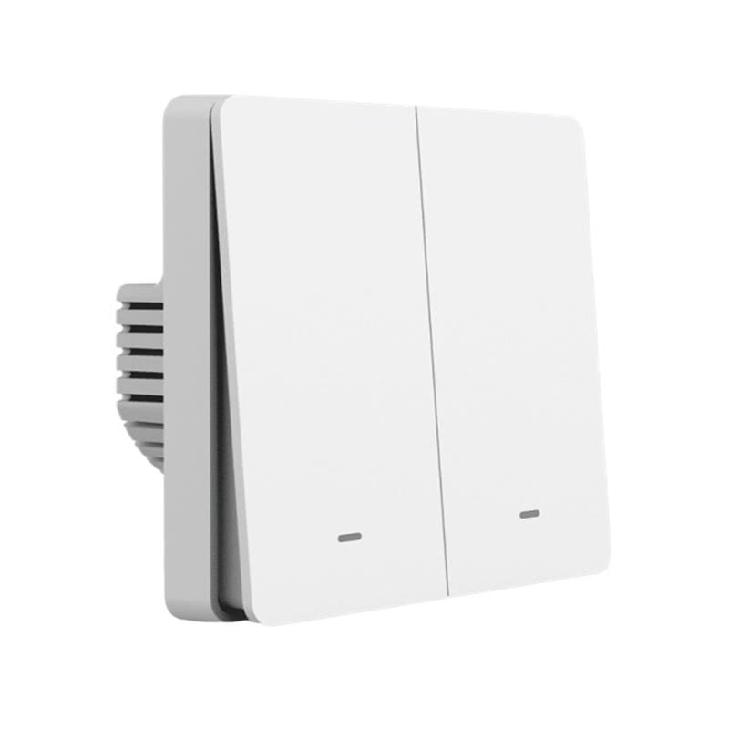
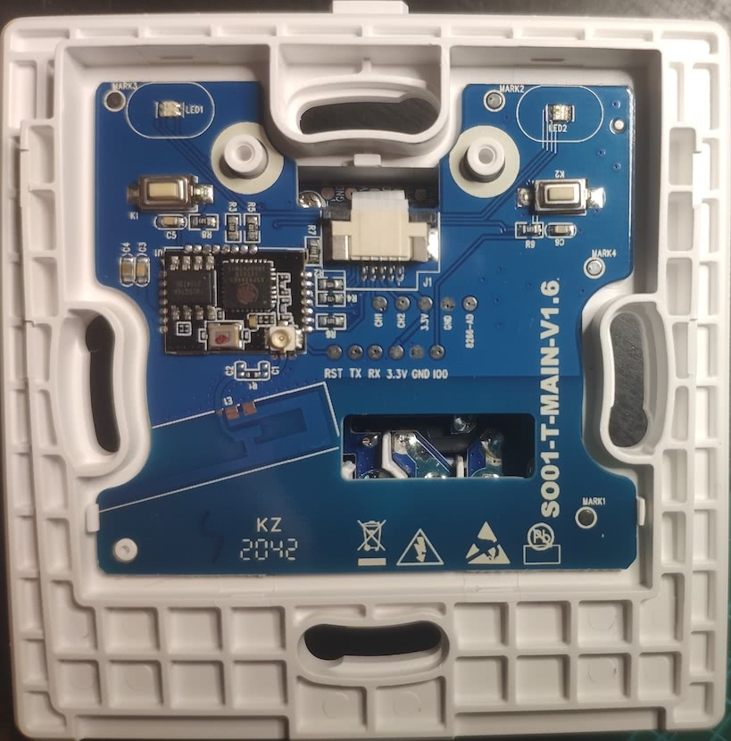

## Flashing

Use a USB to serial adapter, and solder wires onto the pads marked TX, RX, 3.3V and GND. Hold "K2" button when connecting 3.3V to enter flash mode. Tuya Convert may work as well.

## GPIO Pinout

| Pin    | Function                               |  
| ------ | -------------------------------------- |
| GPIO0  | Button 1                               |
| GPIO2  | State (red) LED 1 (Inverted: true)     |
| GPIO4  | State (red) LED 2 (Inverted: true)     |
| GPIO5  | Button 2                               |
| GPIO12 | Relay 2                                |
| GPIO13 | Status (green) LED                     |
| GPIO14 | Relay 1                                |

## Basic Configuration

```yaml
substitutions:
  name: "gosund-sw9"
  entity_name_1: "Light 1"
  entity_id_1: "light_1"
  entity_name_2: "Light 2"
  entity_id_2: "light_2"
  
esphome:
  name: $name
  platform: ESP8266
  board: esp01_1m
  on_boot:
    then:
      - light.turn_on: switch_1_led_state
      - light.turn_on: switch_2_led_state
      
# OTA flashing
ota:
  - platform: esphome

wifi: # Your Wifi network details
  
# Enable fallback hotspot in case wifi connection fails  
  ap:

# Enabling the logging component
logger:

# Enable Home Assistant API
api:

# Enable the captive portal
captive_portal:

status_led:
  pin:
    number: GPIO013
    inverted: true # remove this to keep switch illuminated with green LEDs

light:
  - platform: status_led
    name: "Switch 1 state LED"
    pin: GPIO2
    id: switch_1_led_state

  - platform: status_led
    name: "Switch 2 state LED"
    pin: GPIO4
    id: switch_2_led_state

  - platform: binary
    id: $entity_id_1
    name: $entity_name_1
    output: relay1
    on_turn_on:
      then:
        - light.turn_off:
            id: switch_1_led_state
    on_turn_off:
      then:
        - light.turn_on:
            id: switch_1_led_state

  - platform: binary
    id: $entity_id_2
    name: $entity_name_2
    output: relay2
    on_turn_on:
      then:
        - light.turn_off:
            id: switch_2_led_state
    on_turn_off:
      then:
        - light.turn_on:
            id: switch_2_led_state

binary_sensor:
  - platform: gpio
    id: button1
    name: "Button 1"
    pin:
      number: GPIO0
      mode: INPUT_PULLUP
      inverted: true
    filters:
      - delayed_on: 10ms
      - delayed_off: 10ms
    on_press:
      then:
        - light.toggle: $entity_id_1

  - platform: gpio
    name: "Button 2"
    id: button2
    pin:
      number: GPIO5
      mode: INPUT_PULLUP
      inverted: true
    filters:
      - delayed_on: 10ms
      - delayed_off: 10ms
    on_press:
      then:
        - light.toggle: $entity_id_2

  - platform: status
    name: "$name status"

output:
  - platform: gpio
    id: relay1
    pin: GPIO14
  - platform: gpio
    id: relay2
    pin: GPIO12


sensor:
  - platform: wifi_signal
    name: "$name WiFi signal"
    update_interval: 60s
  - platform: uptime
    name: "$name uptime"
```
