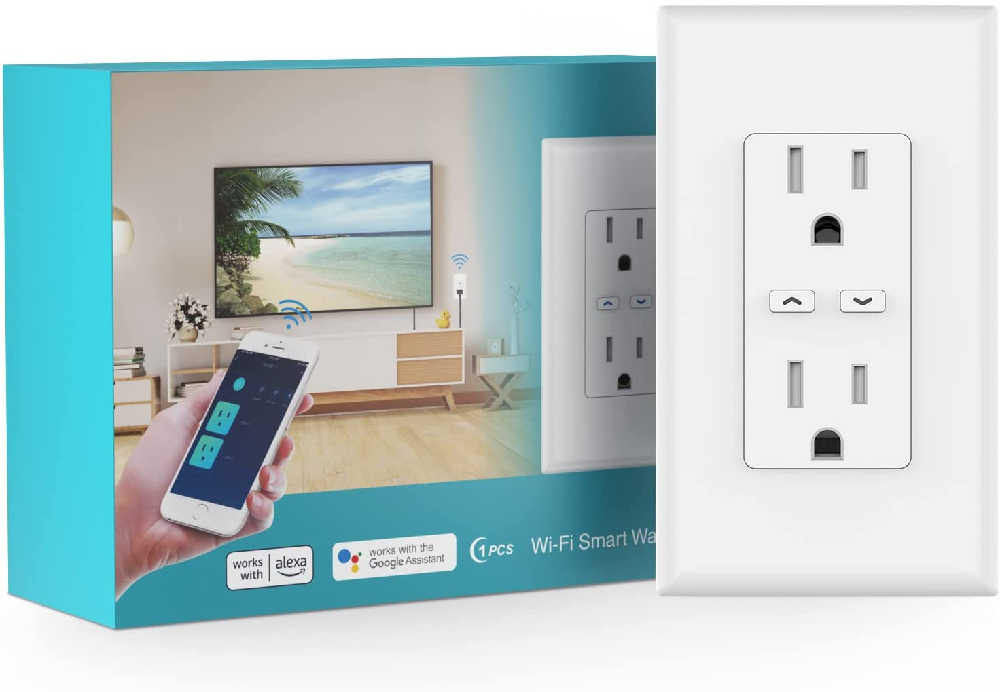

## Flashing

As of 2022-03-25, this device can be flashed with Tuya Convert OTA (over-the-air) out of the box with no adjustments needed.  Put the device in flash mode by long-holding either button until it starts fast-flashing.  Alternately, there are exposed pins on the ESP board for serial connection, but that method has not been tried or verified, as it wasn't necessary.

## GPIO Pinout

| Pin    | Function                               |
| ------ | -------------------------------------- |
| GPIO0  | Top outlet LED (Inverted: true)        |
| GPIO2  | Status LED (Inverted: true)            |
| GPIO4  | HLW8012 CF1 pin                        |
| GPIO5  | BL0937 CF pin                          |
| GPIO12 | HLW8012 SEL pin (Inverted: true)       |
| GPIO13 | Bottom outlet LED (Inverted: true)     |
| GPIO14 | Bottom outlet relay                    |
| GPIO15 | Top outlet relay                       |

## General Notes

These devices appear to be individually calibrated for voltage.  As a result, you will need to measure with a multimeter and adjust the voltage divider accordingly.  The observed range so far for voltage divider is 1646-1692, so the base configuration has been adjusted to be the average of range at 1670 for likely best default settings.  You can adjust the voltage divider in the substitutions section if needed.

## Basic Configuration

```yaml
# Basic Config
esphome:
  name: wall-outlet
  platform: ESP8266
  board: esp8285
  # Allow saving the last state of each outlet in case of power failure
  esp8266_restore_from_flash: true

# OTA flashing
ota:
  - platform: esphome

wifi: # Your Wifi network details
  
# Enable fallback hotspot in case wifi connection fails  
  ap:

# Enabling the logging component
logger:

# Enable Home Assistant API
api:

# Enable the captive portal
captive_portal:

web_server:
  port: 80
  
time:
  - platform: sntp
    id: the_time

# Device Specific Config

# Some things may need to be adjusted for hardware or preference differences.
# Adjust them here:
substitutions:
  # Note: Voltage divider on the BL0937 may vary from device to device.
  # If your voltage appears off, adjust that number as necessary.
  # The default voltage divider is about 25% too high.
  # In testing 4 separate devices, the range was 1646-1692, with a range
  # average of 1670.
  voltage_div: "1670"
  # Update interval (Time) for power sensors.  Because of a hardware limitation
  # (BL0937 swaps between current and voltage, and throws out the first value
  # after the swap), voltage and current will update at quadruple the interval.
  # In order to have everything update at least every 60 seconds, an update
  # interval of 15s is needed.
  # Power and energy will update each update_interval.
  update_interval: "15s"

status_led:
  pin:
    number: GPIO2
    inverted: true

output:
  - platform: gpio
    pin: GPIO0
    inverted: True
    id: top_outlet_led
  - platform: gpio
    pin: GPIO13
    inverted: True
    id: bottom_outlet_led

switch:
  - platform: gpio
    name: "Top Outlet"
    pin: GPIO15
    id: relay_top_outlet
    restore_mode: RESTORE_DEFAULT_OFF
    on_turn_on:
      - output.turn_on: top_outlet_led
    on_turn_off:
      - output.turn_off: top_outlet_led
  - platform: gpio
    name: "Bottom Outlet"
    pin: GPIO14
    id: relay_bottom_outlet
    restore_mode: RESTORE_DEFAULT_OFF
    on_turn_on:
      - output.turn_on: bottom_outlet_led
    on_turn_off:
      - output.turn_off: bottom_outlet_led

sensor:
  - platform: wifi_signal
    name: "wifi_signal"
  - platform: hlw8012
    model: BL0937
    sel_pin:
      number: GPIO12
      inverted: true
    cf_pin: GPIO5
    cf1_pin: GPIO4
    voltage_divider: ${voltage_div}
    current:
      name: "Current"
    voltage:
      name: "Voltage"
    power:
      name: "Power"
    energy:
      name: "Energy"
      unit_of_measurement: "kWh"
      accuracy_decimals: 3
      filters:
        - multiply: 0.001
    update_interval: ${update_interval}
    change_mode_every: 1
  # Buttons are not IO, but instead different measurements on the raw analog A0
  # value and must be handled with sensors instead.
  # Because they are analog, they are not exact values, but instead in ranges.
  # 1024 when no buttons are pressed
  # 730-735 when the top outlet button (left) is pressed
  # 305-310 when the bottom outlet button (right) is pressed
  # 225-230 when both buttons are pressed
  # Because the values are far enough a part, we set wide ranges, and a filter
  # with a safe delta of 50
  # There may be other ways to handle this, but this was the method I was
  # most comfortable with.
  - platform: adc
    pin: A0
    id: analog_buttons
    raw: true
    # This needs to be short enough for the buttons to appear responsive.
    # 100ms was chosen because it seems sufficient for momentary detection.
    update_interval: 100ms
    # There is no real unit of measurement for this, and default V is confusing.
    unit_of_measurement: ""
    # Only trigger when the change is larger than the delta of 50.
    filters:
      - delta: 50
    on_value:
      lambda: !lambda |-
        if (id(analog_buttons).state > 700 && id(analog_buttons).state < 800)
        {
          // Top outlet (left) button is being pushed.
          id(relay_top_outlet).toggle();
        }
        else if (id(analog_buttons).state > 300
                    && id(analog_buttons).state < 400)
        {
          // Bottom outlet (right) button is being pushed.
          id(relay_bottom_outlet).toggle();
        }
        else if (id(analog_buttons).state < 300)
        {
          // Both buttons are being pushed.
          // Add custom action for both buttons being pressed at the same time
          // here if needed.
        }
```
