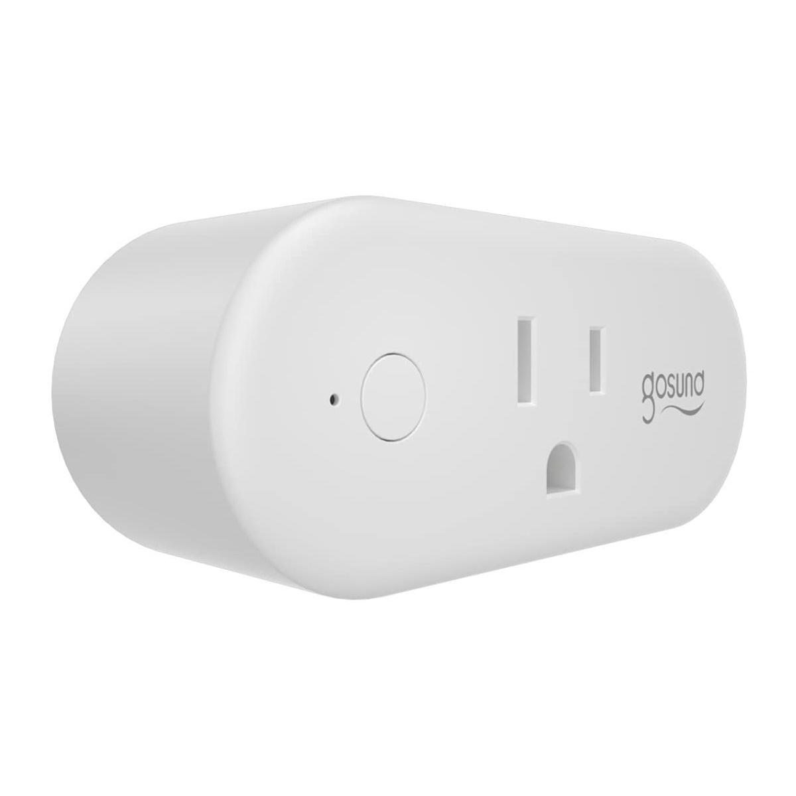

## GPIO Pinout

| Pin    | Function             |
| ------ | -------------------- |
| GPIO03 | Push Button inverted |
| GPIO13 | Red LED (Status LED) |
| GPIO01 | Blue LED (Led1i)     |
| GPIO14 | Relay 1              |

## Basic Configuration

```yaml
substitutions:
  device_name: gosund_wp6
  friendly_name: Gosund WP6

esphome:
  name: "${device_name}"

esp8266:
  board: esp01_1m

wifi:
  ssid: !secret wifi_ssid
  password: !secret wifi_password

  # Enable fallback hotspot (captive portal) in case wifi connection fails
  ap:
    ssid: "${device_name} Fallback Hotspot"
    password: !secret wifi_fallback_pw

# Enable logging
logger:

# Enable Home Assistant API
api:

ota:
  password: !secret gosund_1_ota

binary_sensor:
  - platform: gpio
    pin:
      number: GPIO03
      mode: INPUT_PULLUP
      inverted: True
    name: "${friendly_name} Button"
    id: "${device_name}_button"
    on_press:
      - switch.toggle: "${device_name}_relay"
  - platform: status
    name: "${friendly_name} Status"
    id: "${device_name}_status"

switch:
  - platform: gpio
    name: "${friendly_name} Relay"
    id: "${device_name}_relay"
    pin: GPIO14
    on_turn_on:
      - output.turn_on: led
    on_turn_off:
      - output.turn_off: led

status_led:
  pin:
    number: GPIO13

output:
  - platform: gpio
    pin: GPIO01
    inverted: true
    id: led

sensor:
  - platform: wifi_signal
    name: "${friendly_name} WiFi signal"
    id: "${device_name}_wifi_signal"
    update_interval: 60s
  - platform: uptime
    name: "${friendly_name} Uptime"
    id: "${device_name}_uptime"
    update_interval: 60s

text_sensor:
  - platform: version
    name: "${friendly_name} ESPHome Version"
    id: "${device_name}_esphome_version"
```
