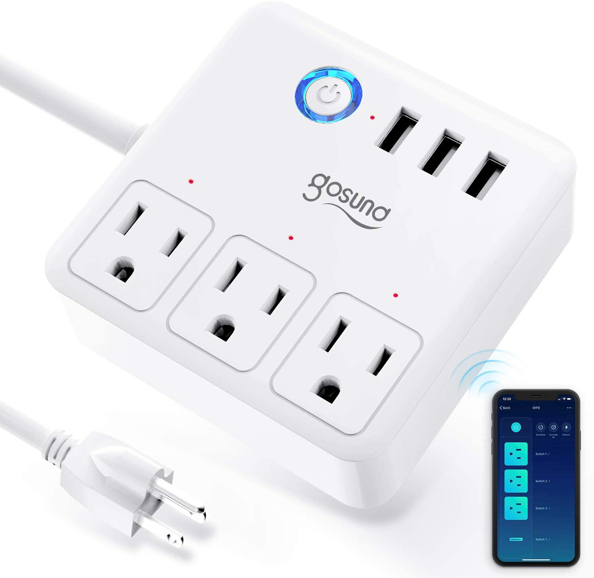

## Gosund WP9 Power Strip

Gosund Smart Power Strip Works with Alexa/Google Home, Smart Plugs WiFi Surge Protector Multi Outlet Extender, 10A 3 USB/Charging Ports for Home Office Desk Tablets, 4ft Extension Cord, White

## GPIO Pinout

| Pin    | Function |
| ------ | -------- |
| GPIO00 | Ledi     |
| GPIO01 | Led4     |
| GPIO02 | Led3     |
| GPIO03 | Led3     |
| GPIO05 | Relay1   |
| GPIO12 | Relay3   |
| GPIO13 | Relay4   |
| GPIO14 | Relay2   |
| GPIO16 | Button1  |

## Basic Configuration

```yaml
substitutions:
  name: power_strip
  upper_name: Power Strip
  platform: ESP8266
  board: esp01_1m

esphome:
  name: $name
  platform: $platform
  board: $board
  
# OTA flashing
ota:
  - platform: esphome

wifi: # Your Wifi network details
  
# Enable fallback hotspot in case wifi connection fails  
  ap:

# Enabling the logging component
logger:

# Enable Home Assistant API
api:

# Enable the captive portal
captive_portal:

binary_sensor:
  - platform: gpio
    pin:
      number: GPIO16
      mode: INPUT_PULLUP
      inverted: yes
    name: "${upper_name} Power Button"
    id: "${name}_power_button"
    on_press:
      then:
        - switch.toggle: "${name}_usb"
        - switch.toggle: "${name}_switch1"
        - switch.toggle: "${name}_switch2"
        - switch.toggle: "${name}_switch3"
switch:
  - platform: gpio
    name: "${upper_name} Switch1"
    id: "${name}_switch1"
    pin: GPIO14
    restore_mode: "RESTORE_DEFAULT_ON"
  - platform: gpio
    name: "${upper_name} Switch2"
    id: "${name}_switch2"
    pin: GPIO12
    restore_mode: "RESTORE_DEFAULT_ON"
  - platform: gpio
    name: "${upper_name} Switch3"
    id: "${name}_switch3"
    pin: GPIO13
    restore_mode: "RESTORE_DEFAULT_ON"
  - platform: gpio
    name: "${upper_name} usb"
    id: "${name}_usb"
    pin: GPIO05
    restore_mode: "RESTORE_DEFAULT_ON"
    on_turn_on:
      - switch.turn_on: led
    on_turn_off:
      - switch.turn_off: led
  - platform: gpio
    id: led
    pin: GPIO0
    inverted: no
```

## Newer WP9s that are based on Tuya with a non-ESP SOC

You can opt to swapout the chip and replace with an ESP, but this is difficult and tedious.  I have done this with success, however I have since found LocalTuya which may be a better option for you.  It is still a bit tedious and you need to jump through some initial hoops, but you don't have to crack open and modify the WP9.  
reference:  [https://github.com/rospogrigio/localtuya](https://github.com/rospogrigio/localtuya)
