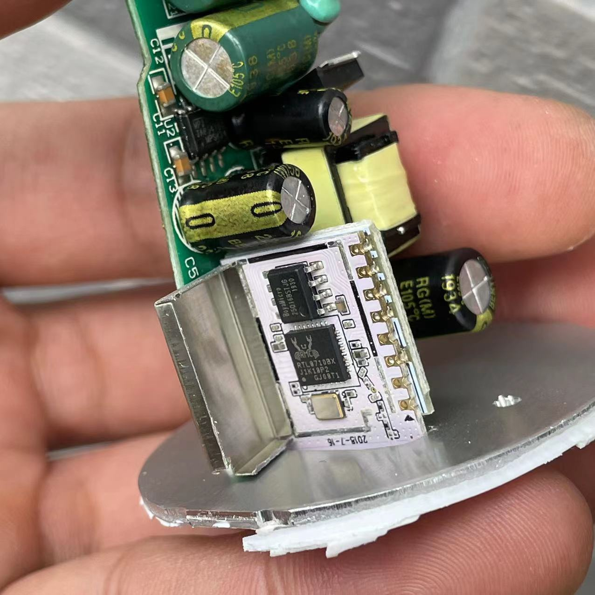
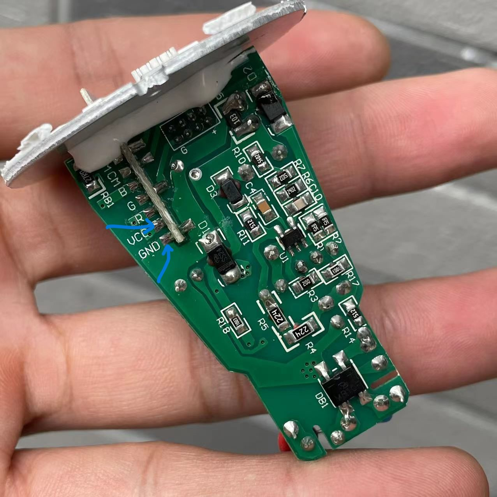

Uses T103 module. CPU is RTL8710BN.


First, desolder the vcc and gnd on the back of the pcb  before connecting all the wires to the respective pins otherwise it won't go into download mode.


## GPIO Pinout

| Pin    | Function                           |
| ------ | ---------------------------------- |
| GPIO10  | Red Output  |
| GPIO7  | Blue Output       |
| GPIO6  | Green Output  |
| GPIO12  | Cold White Output          |
| GPIO8  | Warm White Output  |

## Basic Configuration

```yaml
substitutions:
  devicename: govee-bulb

esphome:
  name: $devicename

rtl87xx:
  board: generic-rtl8710bn-2mb-468k
  framework:
    version: latest

# OTA flashing
ota:
  - platform: esphome

wifi: # Your Wifi network details
  
# Enable fallback hotspot in case wifi connection fails  
  ap:

# Enabling the logging component
logger:

# Enable Home Assistant API
api:

# Enable the captive portal
captive_portal:

web_server:
  port: 80

# Output pins
output:
- platform: ledc
  id: red_color
  pin: GPIO10
  inverted: False
- platform: ledc
  id: green_color
  pin: GPIO07
  inverted: False
- platform: ledc
  id: blue_color
  pin: GPIO06
  inverted: False
- platform: ledc
  id: cold_white
  pin: GPIO12
  inverted: False
  # max_power: 50%
- platform: ledc
  id: warm_white
  pin: GPIO08
  inverted: False
  # max_power: 50%

light:
  - platform: rgbww
    name: "$devicename 5W"
    id: "light_goveebulb_5W"
    red: red_color
    green: green_color
    blue: blue_color
    cold_white: cold_white
    warm_white: warm_white
    cold_white_color_temperature: 6536 K
    warm_white_color_temperature: 2000 K
    color_interlock: true
    restore_mode: ALWAYS_ON
    effects:
      - random:
      - pulse:
      - strobe:
      - flicker:
```
