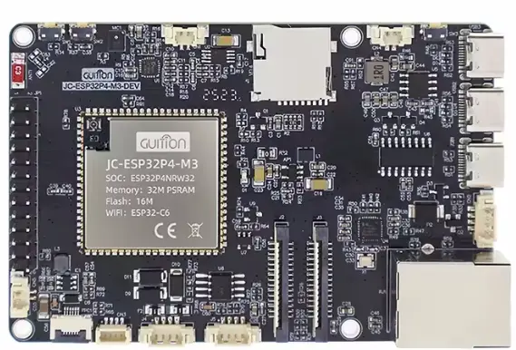

Model reference: ESP32-P4-M3-Dev

Available on [AliExpress](https://www.aliexpress.com/item/1005009511796128.html)

## Product Description

The Guition ESP32-P4-M3-Dev is a development board based on the ESP32-P4 chip featuring dual-core RISC-V
processors with advanced image and video processing capabilities. The board includes an onboard ESP32-C6-MINI
module for Wi-Fi 6 and Bluetooth 5/BLE connectivity, making it ideal for IoT applications requiring wireless
communication alongside high-performance computing.

### Key Features

- ESP32-P4 dual-core RISC-V processors
- 32MB PSRAM (in chip package)
- 16MB NOR Flash
- ESP32-C6-MINI coprocessor for Wi-Fi 6 and Bluetooth 5/BLE
- MIPI 2-lane DSI display interface
- MIPI 2-lane CSI camera interface with ISP
- 100M Ethernet (IP101 PHY)
- USB 2.0 OTG High-Speed Host Controller Port (Type-C)
- USB 1.1 OTG Full-Speed Host Controller Port (Type-C)
- SDIO 3.0 TF card slot
- 11 accessible unused programmable GPIOs
- Onboard microphone
- Speaker header (8Ω 2W)
- Li-Ion Battery connector
- USB Type-C connector
- 0.5 Pitch 6 pin FPC connector for touch
- UART/RS485 ports MX1.25 format
- HS 1.0 pitch i2c port

## GPIO Pinout

### ESP32 Hosted (ESP32-C6 Coprocessor)

The board uses the ESP32-C6-MINI module as a coprocessor for Wi-Fi and Bluetooth connectivity via SDIO:

| Function | GPIO |
|----------|------|
| Reset    | GPIO54 |
| CMD      | GPIO19 |
| CLK      | GPIO18 |
| D0       | GPIO14 |
| D1       | GPIO15 |
| D2       | GPIO16 |
| D3       | GPIO17 |

### Ethernet (IP101 PHY)

| Function | GPIO |
|----------|------|
| MDC      | GPIO31 |
| MDIO     | GPIO52 |
| Power    | GPIO51 |
| CLK      | GPIO50 |

## Basic Configuration

Minimum configuration required for the Guition JC-ESP32-P4-M3-Dev:

```yaml
esphome:
  name: "esp32-p4-m3-dev"

esp32:
  variant: esp32p4
  flash_size: 16MB
  framework:
    type: esp-idf

logger:
  hardware_uart: USB_SERIAL_JTAG

api:

ota:
  platform: esphome
```

## ESP32 Hosted Configuration

ESP32 Hosted ESP32-C6 coprocessor configuration:

```yaml
esp32_hosted:
  active_high: true
  variant: ESP32C6
  reset_pin: GPIO54
  cmd_pin: GPIO19
  clk_pin: GPIO18
  d0_pin: GPIO14
  d1_pin: GPIO15
  d2_pin: GPIO16
  d3_pin: GPIO17
```

## Wi-Fi Configuration

The ESP32-C6 coprocessor enables Wi-Fi functionality:

```yaml
wifi:
  ssid: !secret wifi_ssid
  password: !secret wifi_password
```

## Bluetooth Proxy Configuration

The ESP32-C6 coprocessor enables Bluetooth proxy functionality - could require a C6 firmware update to work:

```yaml
esp32_ble_tracker:
  scan_parameters:
    interval: 1100ms
    window: 1100ms
    active: true

bluetooth_proxy:
  active: true
  connection_slots: 3
```

## Ethernet Configuration

Configuration to use the onboard 100M Ethernet with IP101 PHY:

```yaml
ethernet:
  type: IP101
  mdc_pin: GPIO31
  mdio_pin: GPIO52
  power_pin: GPIO51
  clk:
    mode: CLK_EXT_IN
    pin: GPIO50
  phy_addr: 1
```

## Coprocessor Firmware Update

The ESP32-C6 coprocessor firmware can be updated over-the-air using the esp32_hosted update platform:  
(see [esp32_hosted component](https://esphome.io/components/esp32_hosted/))

```yaml
update:
  - platform: esp32_hosted
    name: "C6 Coprocessor Update"
    path: /path/to/network_adapter.bin
    sha256: your_sha256_hash_here
```

The firmware binary is embedded into the ESP32-P4's flash at compile time and can be deployed to the
coprocessor on demand. The component automatically detects the current firmware version and compares it to
the embedded version. If they differ, an update becomes available in Home Assistant.

## Links

- [Product Page](https://www.aliexpress.com/item/1005009511796128.html)
- [Unofficial repo for device](https://github.com/p1ngb4ck/unofficial_guition_esp32p4_repo/tree/main/JC-ESP32P4-M3-Dev)
- [Schematic](https://github.com/p1ngb4ck/unofficial_guition_esp32p4_repo/tree/main/JC-ESP32P4-M3-Dev/schematics)
