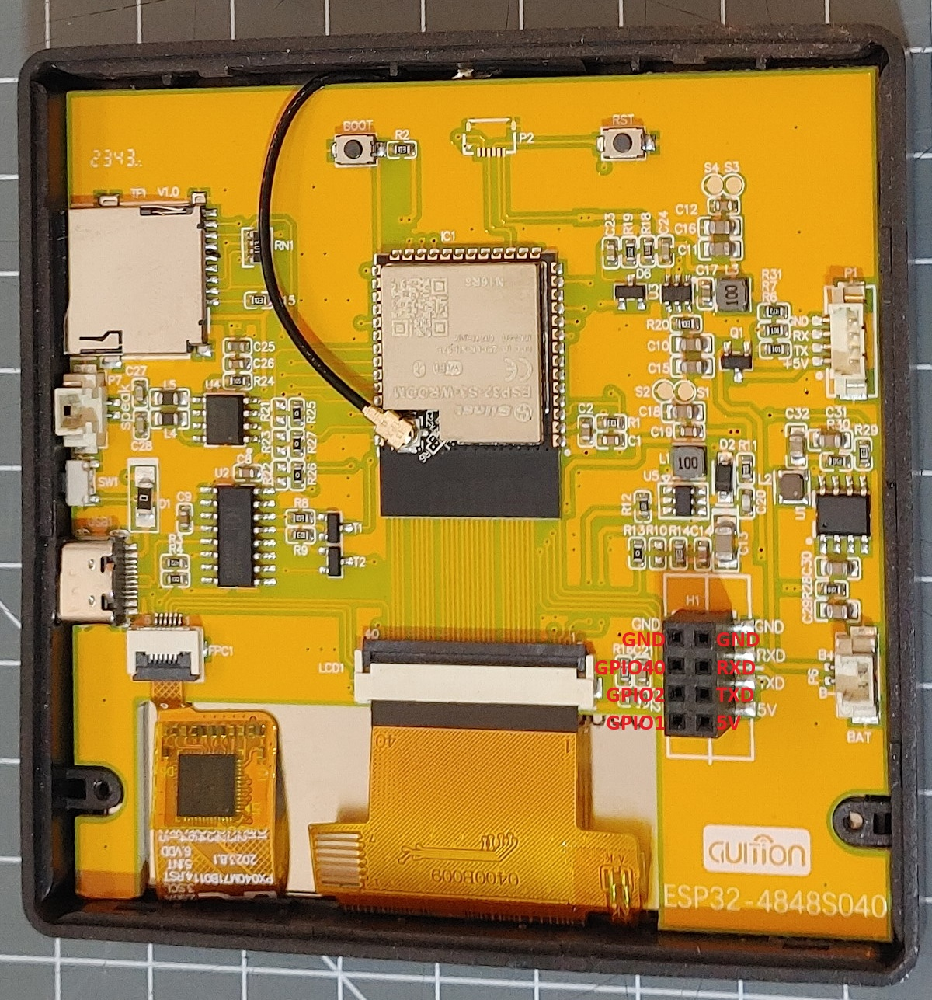

## Product specs

| Feature      | Spec                    |
| ------------ | ----------------------- |
| Screen       | st7701s driver 480\*480 |
| Touch screen | gt911                   |
| CPU          | ESP32-S3                |
| Flash        | 16MB                    |
| PSRAM        | 8MB                     |

## Product description

Avalible on [AliExpress](https://www.aliexpress.com/item/3256806115962222.html) at various vendors. Can be purchased with or without the relay module, which does not fit into a standard EU round 60mm box.
Wall mounting plates for the relayless version to be used easily in EU are available for 3D printing: [example1](https://www.printables.com/model/1440541-guition-esp32-s3-4848s040-eu-wall-mount) [example2](https://www.printables.com/model/1388933-guition-esp32s3-4-display-eu-wall-mount) [example3](https://www.printables.com/model/1257111-guition-4-esp32-s3-lvgl)



## Basic Config

```yaml
esphome:
  name: "guition-esp32-s3-4848s040"
  friendly_name: "4848s040"

esp32:
  board: esp32-s3-devkitc-1
  framework:
    type: esp-idf

psram:
  mode: octal
  speed: 80MHz

logger:

api:
  encryption:
    key: !secret encryption_key

ota:
  - platform: esphome
    password: !secret ota_password
    on_begin:  # prevent screen flickering during OTA
      - light.turn_off:
          id: display_backlight
          transition_length: 0s
      - lambda: "id(display_backlight).loop();"

wifi:
  ssid: !secret wifi_ssid
  password: !secret wifi_password

switch:
  - platform: gpio
    name: Relay 1
    pin:
      number: GPIO40
      inverted: true
  - platform: gpio
    name: Relay 2
    pin:
      number: GPIO2
      inverted: true
  - platform: gpio
    name: Relay 3
    pin:
      number: GPIO1
      inverted: true

output:
  - platform: ledc
    id: backlight_output
    pin: GPIO38
    frequency: 150Hz
    min_power: 0.01
    zero_means_zero: true

light:
  - platform: monochromatic
    name: Backlight
    id: display_backlight
    output: backlight_output
    restore_mode: ALWAYS_ON
    default_transition_length: 1s

spi:
  - id: lcd_spi
    clk_pin: GPIO48
    mosi_pin: GPIO47

i2c:
  id: touchscreen_bus
  sda: GPIO19
  scl:
    number: 45
    ignore_strapping_warning: true

display:
  - platform: st7701s
    id: tft_display
    dimensions:
      width: 480
      height: 480
#    rotation: 270    #uncomment for placement with down-facing USB socket
    spi_mode: MODE3
    data_rate: 2MHz
    color_order: RGB
    invert_colors: False
    cs_pin: 39
    de_pin: 18
    hsync_pin: 16
    vsync_pin: 17
    pclk_pin: 21
    pclk_frequency: 12MHz
    pclk_inverted: False
    hsync_pulse_width: 8
    hsync_front_porch: 10
    hsync_back_porch: 20
    vsync_pulse_width: 8
    vsync_front_porch: 10
    vsync_back_porch: 10
    update_interval: never
    auto_clear_enabled: False
    init_sequence:
      - 1
      - [0xFF, 0x77, 0x01, 0x00, 0x00, 0x10] # CMD2_BKSEL_BK0
      - [0xCD, 0x00] # disable MDT flag
    data_pins:
      red: [11, 12, 13, 14, 0]
      green: [8, 20, 3, 46, 9, 10]
      blue: [4, 5, 6, 7, 15]

touchscreen:
  - platform: gt911
    id: tft_touch
    display: tft_display
#    transform:     #uncomment for placement with down-facing USB socket
#      swap_xy: true
#      mirror_x: true

lvgl:
```
