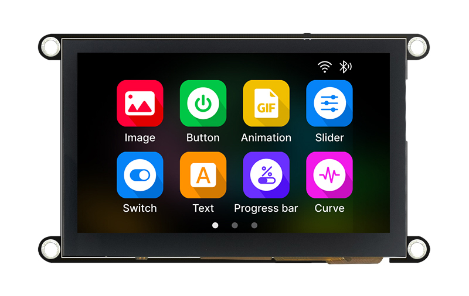
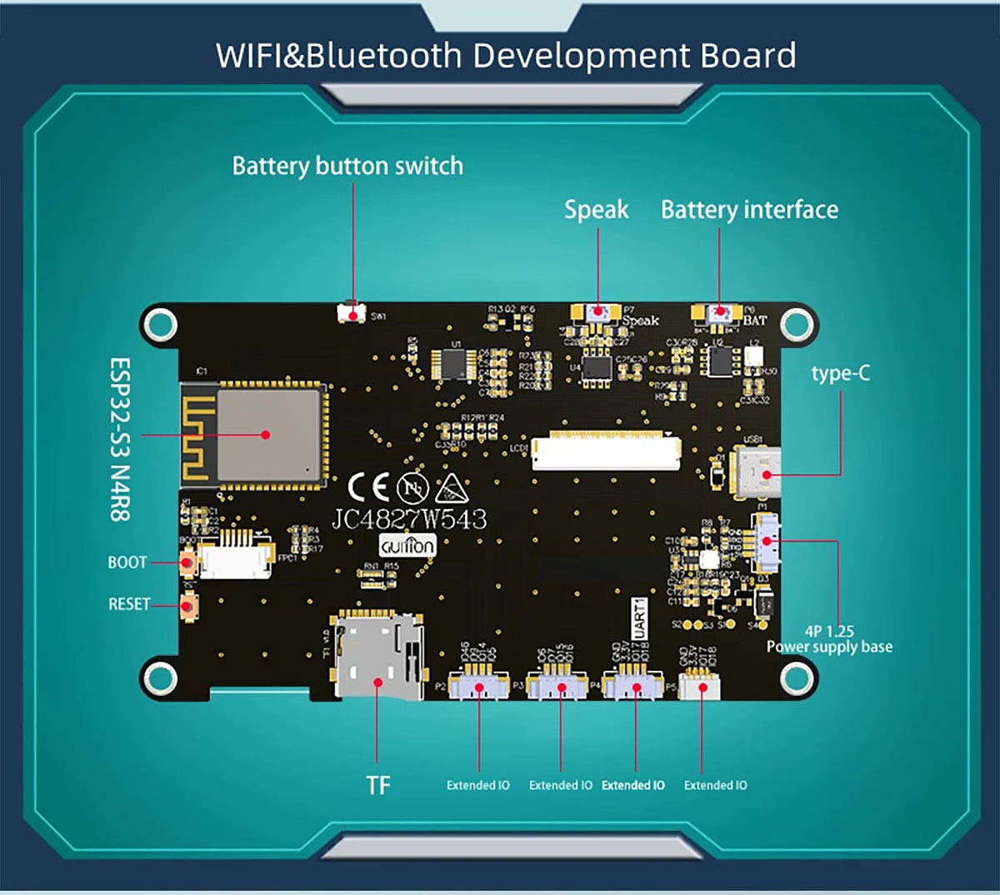

## Product specs

| Feature      | Spec                    |
| ------------ | ----------------------- |
| Screen       | NV3041A driver 480\*272 |
| Touch screen | gt911                   |
| CPU          | ESP32-S3                |
| Flash        | 4MB                    |
| PSRAM        | 8MB                     |

## Product description



## Basic Config

```yaml
esphome:
  name: "guition-jc4827w543c"
  friendly_name: "Guition 4827w543c 4.3"
  platformio_options:
    board_build.flash_mode: dio
  on_boot:
    priority: -100
    then:
      - script.execute: inactivity_timer
      - component.update: my_display

esp32:
  board: esp32-s3-devkitc-1
  variant: esp32s3
  flash_size: 4MB
  framework:
    type: esp-idf

psram:
  mode: octal
  speed: 80MHz

logger:

api:
  encryption:
    key: !secret encryption_key

ota:
  - platform: esphome
    password: !secret ota_password
    
wifi:
  ssid: !secret wifi_ssid
  password: !secret wifi_password


output:
  # Backlight LED
  - platform: ledc
    pin:
      number: 1
    id: gpio_backlight_pwm
    frequency: 1000Hz

light:
  - platform: monochromatic
    output: gpio_backlight_pwm
    name: Display Backlight
    icon: mdi:lightbulb-on
    id: display_backlight
    restore_mode: ALWAYS_ON

i2c:
  - id: bus_a
    sda: GPIO8
    scl: GPIO4
    scan: true

touchscreen:
  - platform: gt911
    id: my_touchscreen
    i2c_id: bus_a
    interrupt_pin:
      number: 3
      ignore_strapping_warning: true
    reset_pin: GPIO38
    transform:
      mirror_x: true
      mirror_y: true
    on_touch:
      then:
        - script.execute: inactivity_timer

spi:
  id: quad_spi
  type: quad
  clk_pin: GPIO47
  data_pins: [21,48,40,39]

display:
  - platform: qspi_dbi
    id: my_display
    update_interval: never
    auto_clear_enabled: False
    model: CUSTOM
    data_rate: 20MHz
    dimensions:
      width: 480
      height: 272
    cs_pin:
      number: 45
      ignore_strapping_warning: true
    invert_colors: true
    rotation: 180
    init_sequence:
      - [0xff,0xa5]
      - [0x36,0xc0]
      - [0x3A,0x01]
      - [0x41,0x03]
      - [0x44,0x15]
      - [0x45,0x15]
      - [0x7d,0x03]
      - [0xc1,0xbb]
      - [0xc2,0x05]
      - [0xc3,0x10]
      - [0xc6,0x3e]
      - [0xc7,0x25]
      - [0xc8,0x11]
      - [0x7a,0x5f]
      - [0x6f,0x44]
      - [0x78,0x70]
      - [0xc9,0x00]
      - [0x67,0x21]
      - [0x51,0x0a]
      - [0x52,0x76]
      - [0x53,0x0a]
      - [0x54,0x76]
      - [0x46,0x0a]
      - [0x47,0x2a]
      - [0x48,0x0a]
      - [0x49,0x1a]
      - [0x56,0x43]
      - [0x57,0x42]
      - [0x58,0x3c]
      - [0x59,0x64]
      - [0x5a,0x41]
      - [0x5b,0x3c]
      - [0x5c,0x02]
      - [0x5d,0x3c]
      - [0x5e,0x1f]
      - [0x60,0x80]
      - [0x61,0x3f]
      - [0x62,0x21]
      - [0x63,0x07]
      - [0x64,0xe0]
      - [0x65,0x02]
      - [0xca,0x20]
      - [0xcb,0x52]
      - [0xcc,0x10]
      - [0xcd,0x42]
      - [0xd0,0x20]
      - [0xd1,0x52]
      - [0xd2,0x10]
      - [0xd3,0x42]
      - [0xd4,0x0a]
      - [0xd5,0x32]
      - [0x80,0x00]
      - [0xa0,0x00]
      - [0x81,0x07]
      - [0xa1,0x06]
      - [0x82,0x02]
      - [0xa2,0x01]
      - [0x86,0x11]
      - [0xa6,0x10]
      - [0x87,0x27]
      - [0xa7,0x27]
      - [0x83,0x37]
      - [0xa3,0x37]
      - [0x84,0x35]
      - [0xa4,0x35]
      - [0x85,0x3f]
      - [0xa5,0x3f]
      - [0x88,0x0b]
      - [0xa8,0x0b]
      - [0x89,0x14]
      - [0xa9,0x14]
      - [0x8a,0x1a]
      - [0xaa,0x1a]
      - [0x8b,0x0a]
      - [0xab,0x0a]
      - [0x8c,0x14]
      - [0xac,0x08]
      - [0x8d,0x17]
      - [0xad,0x07]
      - [0x8e,0x16]
      - [0xae,0x06]
      - [0x8f,0x1B]
      - [0xaf,0x07]
      - [0x90,0x04]
      - [0xb0,0x04]
      - [0x91,0x0a]
      - [0xb1,0x0a]
      - [0x92,0x16]
      - [0xb2,0x15]
      - [0xff,0x00]
      - [0x11,0x00]
      - [0x29,0x00]

    lambda: |-
      it.print(240, 136,id(roboto_20),TextAlign::CENTER, "Hello Viet Nam");


font:
  - file: "gfonts://Roboto" 
    id: roboto_20 
    size: 24

script:
  - id: inactivity_timer
    mode: restart
    then:
      - if:
          condition:
            light.is_off: display_backlight
          then:
            - light.turn_on:
                id: display_backlight
      - delay: !lambda 'return id(sleep_time).state * 1000;'
      - light.turn_off:
          id: display_backlight
      

number:
  - platform: template
    name: "Sleep time"
    id: sleep_time
    optimistic: true
    initial_value: 15
    restore_value: yes
    unit_of_measurement: "s"
    device_class: duration
    mode: box
    min_value: 5
    max_value: 600
    step: 1
```
