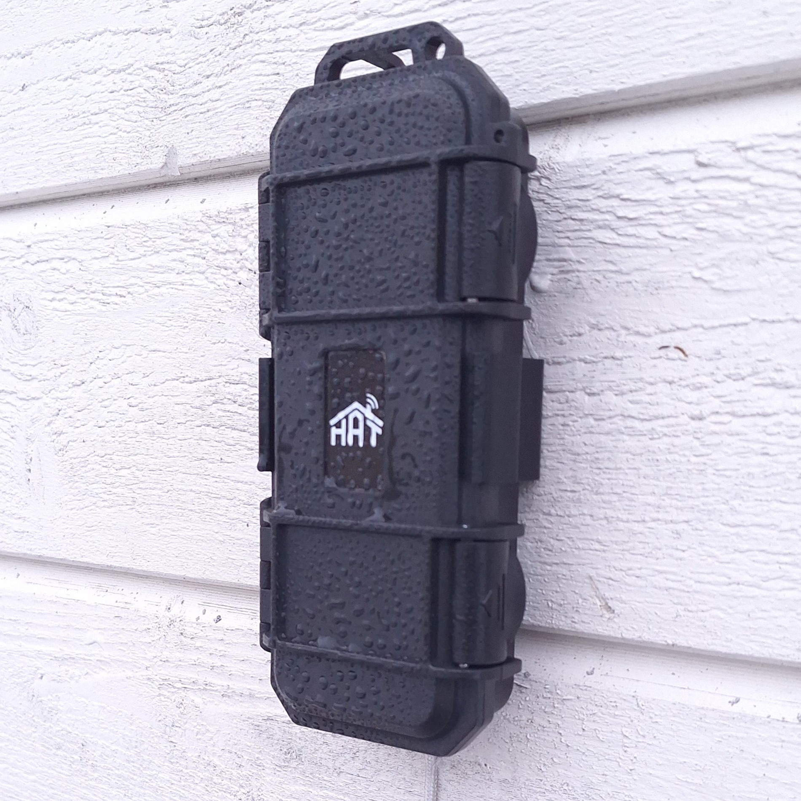
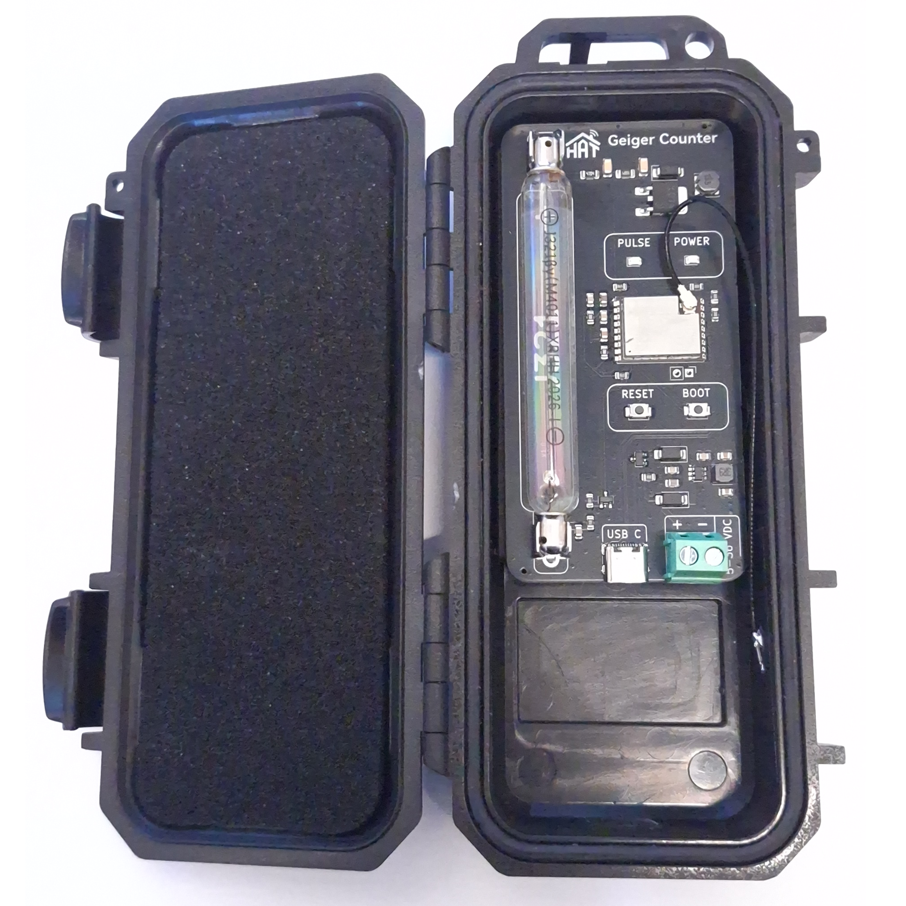

## Product Images

## Overview

The HAT Geiger Counter is an outdoor-rated ionizing radiation monitor built on the ESP32-C3.
It measures radiation in CPM and µSv/hr using a J321 Geiger tube, integrates natively with
Home Assistant via ESPHome, and optionally uploads readings to [radmon.org](https://radmon.org)
for public radiation monitoring.

The device ships pre-flashed with ESPHome firmware and can be adopted directly from the
ESPHome dashboard or provisioned via BLE (ESPHome app) or USB-C (improv_serial).

## Features

- Measures ionizing radiation in **CPM** and **µSv/hr** using a J321 Geiger tube
- Native **Home Assistant** integration via ESPHome native API
- **Outdoor rated** — designed for permanent external installation
- Optional radiation upload to **radmon.org** every 65 seconds
- Wi-Fi provisioning via **BLE** (ESPHome app) and **USB-C** (improv_serial)
- ESPHome **dashboard adoption** support
- Fallback Wi-Fi hotspot and captive portal
- Safe mode recovery via boot button
- Power via **USB-C** or **6–36V DC** screw terminal

## Hardware

| Component    | Details                        |
|--------------|--------------------------------|
| MCU          | ESP32-C3 (ESP32-C3-WROOM-02U) |
| Geiger tube  | J321                           |
| Power input  | USB-C or 6–36V DC screw terminal |

## Getting Started

1. Power the device via USB-C or the screw terminal (6–36V DC)
2. Provision Wi-Fi using the ESPHome app (BLE) or a USB-C cable (improv_serial)
3. Adopt the device in Home Assistant via the ESPHome integration
4. Optionally configure your radmon.org username and password from Home Assistant
