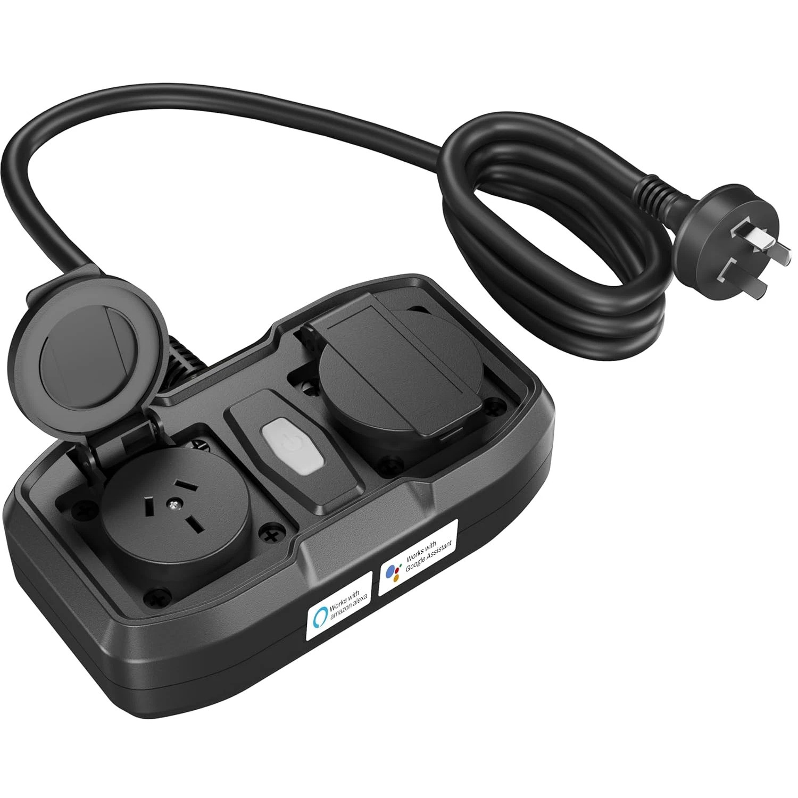

The HBN-CP-A86WT is an outdoor (IP54) dual outlet plug. It switches both active (line) and neutral
of both outlets (four relays).

It uses a CB2S module (Beken BK7231N). Disassembly is required to flash ESPHome, seven tri-wing
screws, and the Tuya module's readily accessible to tack on wires to the UART connection. The
device's front panel cable should be unplugged to temporarily free up RX1 which is normally used to
drive the state LED (GPIO P10).

Both `ltchiptool` and `esphome` can program the device without needing to ground CEN
([auto-download-reboot](https://docs.libretiny.eu/docs/flashing/tools/adr/)).

## GPIO Pinout

| GPIO | Function |
| ---- | -------- |
| P6   | Relay 1  |
| P7   | Relay 2  |
| P8   | Button   |
| P10  | LED      |

## Basic Configuration

```yaml
esphome:
  name: hbn-cp-a86wt
  friendly_name: HBN-CP-A86WT Dual Outlet Plug

bk72xx:
  board: cb2s

# generated by https://upk.libretiny.eu/ from storage.json as extracted by
# bk7231tools from the OEM Tuya firmware
switch:
  - platform: gpio
    id: switch_1
    name: Relay 1
    pin: P6
    on_turn_on:
      - light.turn_on: light_status
    on_turn_off:
      - light.turn_off: light_status
  - platform: gpio
    id: switch_2
    name: Relay 2
    pin: P7
    on_turn_on:
      - light.turn_on: light_status
    on_turn_off:
      - light.turn_off: light_status

binary_sensor:
  - platform: gpio
    id: binary_switch_all
    pin:
      number: P8
      inverted: true
      mode: INPUT_PULLUP
    on_press:
      then:
        - switch.toggle: switch_1
        - switch.toggle: switch_2

light:
  - platform: status_led
    id: light_status
    pin: P10
```
