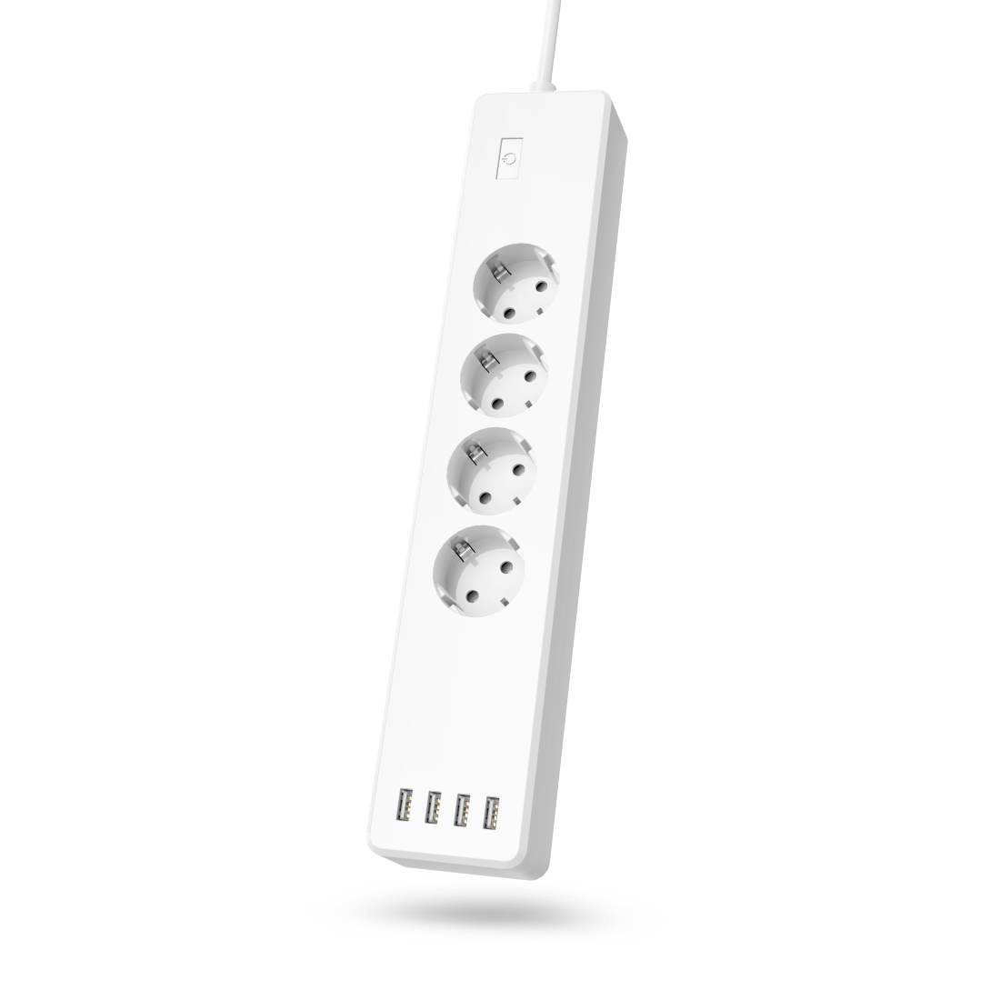

## Product Images



## GPIO Pinout

| Function   | GPIO-Pin |
| ---------- | -------- |
| Plug 1     | 5        |
| Plug 2     | 12       |
| Plug 3     | 13       |
| Plug 4     | 4        |
| Plug USB   | 14       |
| LED        | 1        |
| Button     | 3        |

## Basic Configuration

```yaml
# Basic Config
esphome:
  name: hama-wlan-power-strip-00176574
esp8266:
  board: esp01_1m
  restore_from_flash: True
logger:
api:
ota:
wifi:
  ssid: !secret wifi_ssid
  password: !secret wifi_password
  ap:
    password: !secret wifi_password
captive_portal:

switch:
# Relays (GPIO)
  - platform: gpio
    pin: 5
    id: powerstrip_switch_1_gpio
  - platform: gpio
    pin: 12
    id: powerstrip_switch_3_gpio
  - platform: gpio
    pin: 13
    id: powerstrip_switch_4_gpio
  - platform: gpio
    pin: 4
    id: powerstrip_switch_2_gpio
  - platform: gpio
    pin: 14
    id: powerstrip_switch_5_gpio
  - platform: gpio
    pin:
      number: 1
      inverted: true
    id: powerstrip_switch_main
    name: "POWERSTRIP: Switch Main"
    on_turn_on: # Turns on all relays (GPIO) if the coresponding switch is on
      if:
        condition:
          not:
            - switch.is_on: powerstrip_switch_1_gpio
            - switch.is_on: powerstrip_switch_2_gpio
            - switch.is_on: powerstrip_switch_3_gpio
            - switch.is_on: powerstrip_switch_4_gpio
            - switch.is_on: powerstrip_switch_5_gpio
        then:
          - if:
              condition:
                switch.is_on: powerstrip_switch_1
              then:
                switch.turn_on: powerstrip_switch_1_gpio
          - if:
              condition:
                switch.is_on: powerstrip_switch_2
              then:
                switch.turn_on: powerstrip_switch_2_gpio
          - if:
              condition:
                switch.is_on: powerstrip_switch_3
              then:
                switch.turn_on: powerstrip_switch_3_gpio
          - if:
              condition:
                switch.is_on: powerstrip_switch_4
              then:
                switch.turn_on: powerstrip_switch_4_gpio
          - if:
              condition:
                switch.is_on: powerstrip_switch_5
              then:
                switch.turn_on: powerstrip_switch_5_gpio
    on_turn_off: # Turns off all relays (GPIO)
      - switch.turn_off: powerstrip_switch_1_gpio
      - switch.turn_off: powerstrip_switch_2_gpio
      - switch.turn_off: powerstrip_switch_3_gpio
      - switch.turn_off: powerstrip_switch_4_gpio
      - switch.turn_off: powerstrip_switch_5_gpio

# Switches
  - platform: template
    id: powerstrip_switch_1
    name: "POWERSTRIP: Switch 1"
    optimistic: True
    restore_state: yes
    turn_on_action: # If mainswitch is on > turn off corresponding relay
      - if:
          condition:
            - switch.is_on: powerstrip_switch_main
          then:
            - switch.turn_on: powerstrip_switch_1_gpio
    turn_off_action: # If mainswitch is off > turn off corresponding relay
      - if:
          condition:
            - switch.is_on: powerstrip_switch_main
          then:
            - switch.turn_off: powerstrip_switch_1_gpio
  - platform: template
    name: "POWERSTRIP: Switch 2"
    id: powerstrip_switch_2
    optimistic: True
    restore_state: yes
    turn_on_action:
      - if:
          condition:
            - switch.is_on: powerstrip_switch_main
          then:
            - switch.turn_on: powerstrip_switch_2_gpio
    turn_off_action:
      - if:
          condition:
            - switch.is_on: powerstrip_switch_main
          then:
            - switch.turn_off: powerstrip_switch_2_gpio
  - platform: template
    name: "POWERSTRIP: Switch 3"
    id: powerstrip_switch_3
    optimistic: True
    restore_state: yes
    turn_on_action:
      - if:
          condition:
            - switch.is_on: powerstrip_switch_main
          then:
            - switch.turn_on: powerstrip_switch_3_gpio
    turn_off_action:
      - if:
          condition:
            - switch.is_on: powerstrip_switch_main
          then:
            - switch.turn_off: powerstrip_switch_3_gpio
  - platform: template
    name: "POWERSTRIP: Switch 4"
    id: powerstrip_switch_4
    optimistic: True
    restore_state: yes
    turn_on_action:
      - if:
          condition:
            - switch.is_on: powerstrip_switch_main
          then:
            - switch.turn_on: powerstrip_switch_4_gpio
    turn_off_action:
      - if:
          condition:
            - switch.is_on: powerstrip_switch_main
          then:
            - switch.turn_off: powerstrip_switch_4_gpio
  - platform: template
    name: "POWERSTRIP: Switch 5"
    id: powerstrip_switch_5
    optimistic: True
    restore_state: yes
    turn_on_action:
      - if:
          condition:
            - switch.is_on: powerstrip_switch_main
          then:
            - switch.turn_on: powerstrip_switch_5_gpio
    turn_off_action:
      - if:
          condition:
            - switch.is_on: powerstrip_switch_main
          then:
            - switch.turn_off: powerstrip_switch_5_gpio

binary_sensor:
# Button (GPIO)
  - platform: gpio
    pin:
      number: 3
      inverted: true
    id: powerstrip_button
    internal: true
    on_click:
    - max_length: 2000ms # Short press toggles mainswitch
      then:
        - switch.toggle: powerstrip_switch_main
    - min_length: 2001ms # Long press turns on all switches & relays (GPIO)
      max_length: 20000ms
      then:
        - switch.turn_on: powerstrip_switch_main
        - switch.turn_on: powerstrip_switch_1
        - switch.turn_on: powerstrip_switch_2
        - switch.turn_on: powerstrip_switch_3
        - switch.turn_on: powerstrip_switch_4
        - switch.turn_on: powerstrip_switch_5
```
