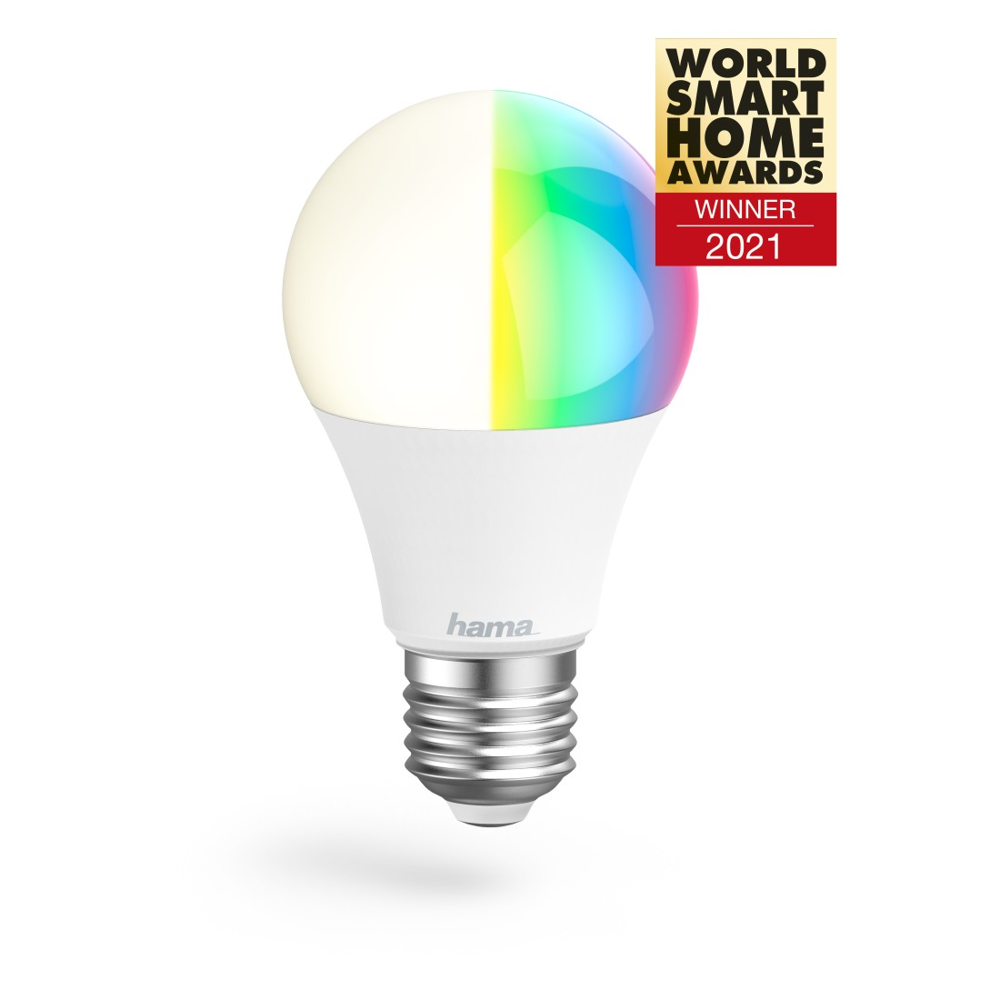

Can be flashed with esphome kickstart via tuya-cloudcutter!!
Profile name: 1.1.2 - BK7231T / oem_bk7231s_light_ty

## Product Images



## GPIO Pinout

| Function   | GPIO-Pin |
| ---------- | -------- |
| PWM_red    | 26       |
| PWM_green  | 6        |
| PWM_blue   | 24       |
| PWM_cold   | 8        |
| PWM_warn   | 6        |

## Basic Configuration

```yaml
#BASIC
Copy
substitutions:
  devicename: hama-bulb-10w

esphome:
  name: $devicename
  friendly_name: hama-bulb-10w

bk72xx:
  board: generic-bk7231t-qfn32-tuya

logger:

web_server:

captive_portal:

mdns:

api:
  password: ""

ota:
  password: ""

wifi:
  ssid: !secret wifi_ssid
  password: !secret wifi_password
  ap:

button:
  - platform: restart
    name: Restart

debug:
  update_interval: 30s

text_sensor:
  - platform: debug
    reset_reason:
      name: Reset Reason

sensor:
  - platform: uptime
    name: Uptime

output:
  - platform: libretiny_pwm
    id: output_red
    pin: P26
  - platform: libretiny_pwm
    id: output_green
    pin: P6
  - platform: libretiny_pwm
    id: output_blue
    pin: P24
  - platform: libretiny_pwm
    id: output_cold
    pin: P8
  - platform: libretiny_pwm
    id: output_warm
    pin: P7

light:
  - platform: rgbww
    id: light_rgbww
    name: $devicename
    color_interlock: true
    cold_white_color_temperature: 6500 K
    warm_white_color_temperature: 2700 K
    red: output_red
    green: output_green
    blue: output_blue
    cold_white: output_cold
    warm_white: output_warm
```
