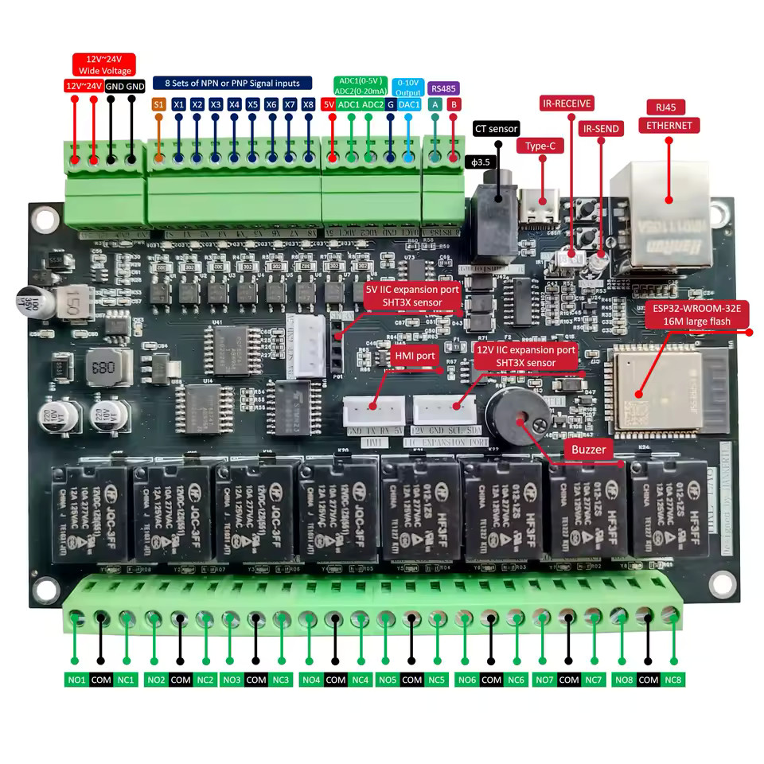

## GPIO Pinout

| FUNCTION                 | PIN     | CHIP    | NOTES                                                         |
| ------------------------ | ------- | ------- | ------------------------------------------------------------- |
| Infrared emission        | GPIO32  |         |                                                               |
| Infrared reception       | GPIO33  |         |                                                               |
| RS485 485_RX             | GPIO14  |         |                                                               |
| RS485 485_TX             | GPIO13  |         |                                                               |
| Buzzer                   | GPIO12  |         |                                                               |
| HMI_RX (Wire01)          | GPIO15  |         | HMI or One_Wire (jumper select)                               |
| HMI_TX (Wire02)          | GPIO16  |         | HMI or One_Wire (jumper select)                               |
| IIC_SDA                  | GPIO4   |         | IIC interface                                                 |
| IIC_SCL                  | GPIO5   |         | IIC interface                                                 |
| NPN or PNP INPUT(01–08)  | ADDRESS | PCF8574 | 0x26 (100110); NPN(S1→DC+, X1–X8→GND); PNP(S1→GND, X1–X8→DC+) |
| OUTPUT(01–08)            | ADDRESS | PCF8574 | 0x24 (100100); NO / COM / NC                                  |
| Current transformer      | ADDRESS | ADS1115 | 0x48; AIN0_AIN1 differential detection                        |
| ADC_0–10V (AIN2)         | ADDRESS | ADS1115 | 0x48; AIN2 input 0–10V signal detection                       |
| ADC_0–20mA (AIN3)        | ADDRESS | ADS1115 | 0x48; AIN3 input 0–20mA signal detection                      |
| DAC_0–10V                | ADDRESS | MCP4725 | 0x60                                                          |
| PHY_LAN8720 ETH_MDC_PIN  | GPIO23  | LAN8720 |                                                               |
| PHY_LAN8720 ETH_MDIO_PIN | GPIO18  | LAN8720 |                                                               |
| PHY_LAN8720 ETH_CLK PIN  | GPIO17  | LAN8720 |                                                               |

## Basic Configuration

```yaml
# Basic Config
esphome:
  name: hankerila-ea8

esp32:
  variant: esp32
  framework:
    type: esp-idf

# Enable logging
logger:

# Enable Home Assistant API
api:

# Allow Over-The-Air updates
ota:
- platform: esphome

#you can not use wifi and ethernet togerther. If you want to use wifi, comment ethernet settings and uncomment wifi settings
#wifi:
#  ssid: !secret wifi_ssid
#  password: !secret wifi_password

#i2c definition
i2c:
  sda: 4
  scl: 5
  scan: true
  id: bus_a

#ethernet definition
ethernet:
  type: LAN8720
  mdc_pin: GPIO23
  mdio_pin: GPIO18
  clk:
    pin: GPIO17
    mode: CLK_OUT
  phy_addr: 0

# Configure the MCP4725 DAC (Digital-to-Analog-Converter) output
output:
  - platform: mcp4725
    # I2C address of the MCP4725
    address: 0x60
    # Minimum output power
    min_power: 0
    # Maximum output power
    max_power: 1
    # ID for the output
    id: dac_output
    # I2C bus ID
    i2c_id: bus_a

# Configure the ADS1115 ADC (Analog-to-Digital Converter) - Analog input)
ads1115:
  - address: 0x48
    # I2C bus ID
    i2c_id: bus_a

#Configure 1-Wire transmission
one_wire:
  - platform: gpio
    pin: GPIO14

#IR reciever
remote_receiver:
  pin: GPIO33
  # Uncomment if you want to debug IR codes
  # dump: raw

#IR transmitter
remote_transmitter:
  pin: GPIO32
  carrier_duty_percent: 50%

#Configure I2C transmission
pcf8574:
  - id: "pcf8574_hub_out_1" # for output channel 1-8
    address: 0x24

  - id: "pcf8574_hub_in_1" # for input channel 1-8
    address: 0x26

# Individual outputs
switch:
  - platform: gpio
    name: "a8-relay1"
    id: relay1
    pin:
      pcf8574: pcf8574_hub_out_1
      number: 0
      mode: OUTPUT
      inverted: true

  - platform: gpio
    name: "a8-relay2"
    id: relay2
    pin:
      pcf8574: pcf8574_hub_out_1
      number: 1
      mode: OUTPUT
      inverted: true

  - platform: gpio
    name: "a8-relay3"
    id: relay3
    pin:
      pcf8574: pcf8574_hub_out_1
      number: 2
      mode: OUTPUT
      inverted: true

  - platform: gpio
    name: "a8-relay4"
    id: relay4
    pin:
      pcf8574: pcf8574_hub_out_1
      number: 3
      mode: OUTPUT
      inverted: true

  - platform: gpio
    name: "a8-relay5"
    id: relay5
    pin:
      pcf8574: pcf8574_hub_out_1
      number: 4
      mode: OUTPUT
      inverted: true

  - platform: gpio
    name: "a8-relay6"
    id: relay6
    pin:
      pcf8574: pcf8574_hub_out_1
      number: 5
      mode: OUTPUT
      inverted: true

  - platform: gpio
    name: "a8-relay7"
    id: relay7
    pin:
      pcf8574: pcf8574_hub_out_1
      number: 6
      mode: OUTPUT
      inverted: true

  - platform: gpio
    name: "a8-relay8"
    id: relay8
    pin:
      pcf8574: pcf8574_hub_out_1
      number: 7
      mode: OUTPUT
      inverted: true

#input X1-8 
binary_sensor:
  - platform: gpio
    name: "a8-input1"
    id: input1 
    on_press:
      then:
        - switch.toggle: relay1
    pin:
      pcf8574: pcf8574_hub_in_1
      number: 0
      mode: INPUT
      inverted: true

  - platform: gpio
    name: "a8-input2"
    id: input2
    on_press:
      then:
        - switch.toggle: relay2
    pin:
      pcf8574: pcf8574_hub_in_1
      number: 1
      mode: INPUT
      inverted: true

  - platform: gpio
    name: "a8-input3"
    id: input3
    on_press:
      then:
        - switch.toggle: relay3
    pin:
      pcf8574: pcf8574_hub_in_1
      number: 2
      mode: INPUT
      inverted: true

  - platform: gpio
    name: "a8-input4"
    id: input4
    on_press:
      then:
        - switch.toggle: relay4
    pin:
      pcf8574: pcf8574_hub_in_1
      number: 3
      mode: INPUT
      inverted: true

  - platform: gpio
    name: "a8-input5"
    id: input5
    on_press:
      then:
        - switch.toggle: relay5
    pin:
      pcf8574: pcf8574_hub_in_1
      number: 4
      mode: INPUT
      inverted: true

  - platform: gpio
    name: "a8-input6"
    id: input6
    on_press:
      then:
        - switch.toggle: relay6
    pin:
      pcf8574: pcf8574_hub_in_1
      number: 5
      mode: INPUT
      inverted: true

  - platform: gpio
    name: "a8-input7"
    id: input7
    on_press:
      then:
        - switch.toggle: relay7
    pin:
      pcf8574: pcf8574_hub_in_1
      number: 6
      mode: INPUT
      inverted: true

  - platform: gpio
    name: "a8-input8"
    id: input8
    on_press:
      then:
        - switch.toggle: relay8
    pin:
      pcf8574: pcf8574_hub_in_1
      number: 7
      mode: INPUT
      inverted: true

# Configure sensors connected to the ADS1115
sensor:
  - platform: ads1115
    # Measure the voltage between A0 and A1
    multiplexer: 'A0_A1'
    # Gain setting for the ADC
    gain: 6.144
    # Name of the sensor in Home Assistant
    name: "SCT013-30A-1V"
    # Update interval for the sensor
    update_interval: 5s

  - platform: ads1115
    # ID for the sensor
    id: ads1115_02
    # Measure the voltage between A2 and GND
    multiplexer: 'A2_GND'
    # Gain setting for the ADC
    gain: 6.144
    # Name of the sensor in Home Assistant
    name: "0-5V"
    # Update interval for the sensor
    update_interval: 2s

  - platform: ads1115
    # ID for the raw voltage sensor
    id: ads1115_03_raw
    # Measure the voltage between A3 and GND
    multiplexer: 'A3_GND'
    # Gain setting for the ADC
    gain: 6.144
    # Update interval for the sensor
    update_interval: 2s
    # Set the sensor as internal, not visible in Home Assistant
    internal: true
    on_value:
      then:
        - lambda: |-
            // Sampling resistor value in ohms
            const float sampling_resistor = 200.0;
            // Convert voltage to current in milliamperes
            float current = (id(ads1115_03_raw).state / sampling_resistor) * 1000;
            // Publish the converted current value to the custom sensor
            id(ads1115_03_current).publish_state(current);

  - platform: template
    # ID for the custom current sensor
    id: ads1115_03_current
    # Name of the sensor in Home Assistant
    name: "0-20mA"
    # Unit of measurement for the sensor
    unit_of_measurement: "mA"
    # Number of decimal places for the sensor value
    accuracy_decimals: 2
    # State class for the sensor
    state_class: measurement

   #Temperature sensor
  - platform: dallas_temp
    address: 0x1c00000123456789 #replace with your sensor's ID
    name: "ds18b20-1"
