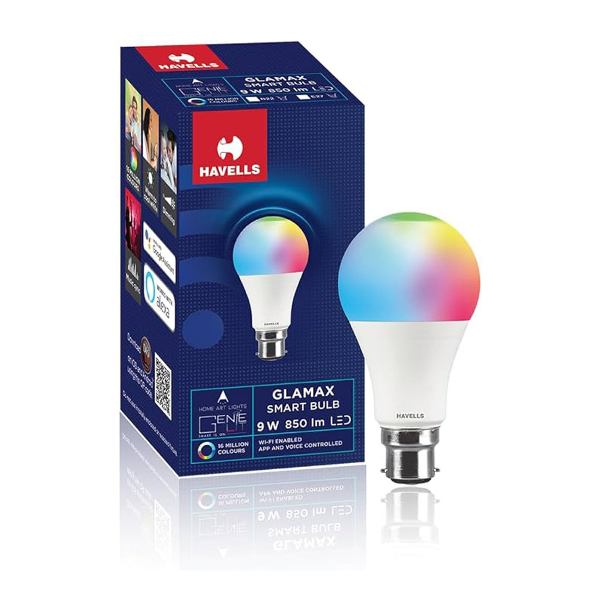
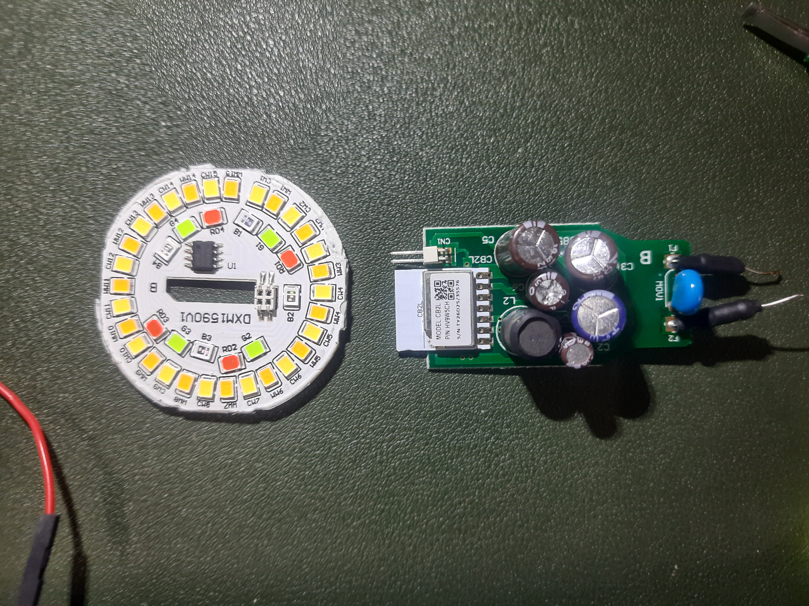

## Device Info

- **Name:** Havells Glamax 9W B22 WiFi LED RGB CCT Bulb
- **Chip:** CB2L
- **MCU:** BK7231N





Shorting of CEN was not required to enter flashing mode in this case as it was already in flashing mode.

For how to flash with ltchiptool refer to [guide of homemate 4 node touch switch](../HomeMate-4-Gang-Touch-Switch/index.md)
as the procedure is same.

## ESPHome Configuration

```yaml
bk72xx:
  board: cb2l

substitutions:
  name: havells-rgb-cct-bulb
  friendly_name: Havells Bulb 

esphome:
  name: ${name}
  friendly_name: ${friendly_name}


wifi:
  ssid: !secret wifi_ssid
  password: !secret wifi_password

captive_portal:

# The BP5758D Driver Configuration
bp5758d:
  data_pin: P7
  clock_pin: P6

output:
  - platform: bp5758d
    id: output_red
    channel: 3
    current: 40

  - platform: bp5758d
    id: output_green
    channel: 2
    current: 40

  - platform: bp5758d
    id: output_blue
    channel: 1
    current: 40

  - platform: bp5758d
    id: output_cold_white
    channel: 5
    current: 30

  - platform: bp5758d
    id: output_warm_white
    channel: 4
    current: 30

light:
  - platform: rgbww
    name: "Light"
    restore_mode: RESTORE_DEFAULT_ON
    
    red: output_red
    green: output_green
    blue: output_blue
    cold_white: output_cold_white
    warm_white: output_warm_white
    
    # Color Temperature configuration
    # Tuya bulbs usually default to 2700K-6500K range
    cold_white_color_temperature: 6500 K
    warm_white_color_temperature: 2700 K
    
    # "color_interlock" prevents RGB and White from being on at the same time.
    # Set to 'false' if you want to mix RGB + White (if the bulb hardware handles the heat).
    color_interlock: true
```

The esphome config was generated using ai so if there can be any improvements please contribute.
The json obtanined from the device's binary firmware is as below:

```json
{
 "Jsonver": "1.0.0",
 "bleonoff": 1,
 "brightmax": 80,
 "brightmin": 10,
 "cagt": 20,
 "category": "0505",
 "cmod": "rgbcw",
 "colormax": 40,
 "colormin": 10,
 "colorpfun": 0,
 "crc": 95,
 "cwmaxp": 100,
 "cwtype": 0,
 "dccur": 30,
 "defbright": 100,
 "defcolor": "c",
 "deftemp": 100,
 "dmod": 6,
 "drgbcur": 40,
 "dwcur": 30,
 "gmkb": 60,
 "gmkg": 60,
 "gmkr": 65,
 "gmwb": 75,
 "gmwg": 70,
 "gmwr": 100,
 "iicb": 0,
 "iicc": 4,
 "iicg": 1,
 "iicr": 2,
 "iicscl": 6,
 "iicsda": 7,
 "iicw": 3,
 "mixway": 0,
 "module": "CB2L",
 "notdisturb": 1,
 "onoffmode": 0,
 "pairt": 18,
 "pmemory": 1,
 "prodagain": 0,
 "remdmode": 1,
 "rgbt": 10,
 "rstbr": 50,
 "rstcor": "c",
 "rstnum": 5,
 "rsttemp": 100,
 "title20": 0,
 "wfcfg": "spcl_auto",
 "wfct": 3,
 "wt": 20
}
```
