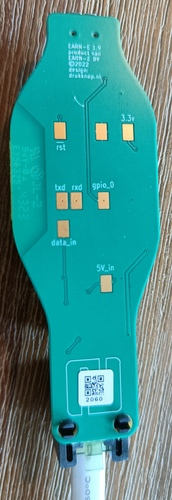

## Introduction

This is a dongle that plugs into the P1 port on DSMR meters.
Hegg customers get the [Hegg Dongle](https://hegg.energy/slimme-app/) for free.
PCB inspection reveals it is made by EARN-E, who presumably sell the same hardware branded as the [EARN-E Energiemonitor](https://earn-e.com/).

## Product Images

### Wrapped


### Unwrapped




The P1 connector on the right of this photo has pin 1 (+5V) at the bottom and pin 6 (Power GND) at the top.

## GPIO Pinout

All "pads" mentioned in this table are on the back of the board, except those that mention SW1 which is on top.

red/green/blue are for the RGB LED right next to the ESP.

| Pin    | Pad                                               | Function                                                           |
| ------ | ------------------------------------------------- | ------------------------------------------------------------------ |
| GND    | Unlabeled (next to 3.3v), one side of `SW1`       | many; connected to one side of the (unpopulated) SW1 header        |
| GPIO0  | `gpio_0`, other side of SW1                       | FLASH, connected to the other side of the (unpopulated) SW1 header |
| GPIO1  | `txd`                                             | TXD0                                                               |
| GPIO3  | `rxd` or `data_in` via inverter                   | RXD0                                                               |
| GPIO12 |                                                   | green                                                              |
| GPIO13 |                                                   | red                                                                |
| GPIO14 |                                                   | blue                                                               |
| VCC    | `3.3v`                                            | power, converted from 5V                                           |
|        |                                                   | P1 data request does not appear to be exposed                      |
|        | `5V_in`                                           | tied to USB power and the P1 power pin (pin 1)                     |
| RST    | `rst`                                             | reboots the ESP when briefly tied to ground                        |

## Flashing procedure

The text below assumes you removed the plastic wrap around the device.
A (so far) untested alternative is to poke a few pins through the plastic at the bottom to reach the pads.
If you try this, please update this document with your experiences!

Using the pads, or just the pins on the ESP12F, flashing this device is a pretty "normal" procedure, except that GPIO3/RXD0 is also used to receive data from the smart meter.
The DSMR/P1 smart meter protocol uses inverted logic levels for serial, and the dongle contains an inverter circuit to turn these back around to something the ESP can work with.
It turns out that this inverter circuit makes RXD0 unusable if the physical Data pin on the P1 port is left floating.

To flash:

* Make GPIO3/RXD0 idle by connecting `data_in` to GND, or tie the corresponding pins (5 and 6, the topmost two) on the P1 connector end together.
* Connect either the `txd` pad or the GPIO1/TXD0 pin to RX on your serial converter
* Connect either the `rxd`, or `data_in` pad, or pin 5 of the P1 socket, or the GPIO3/RXD0 pin to TX on your serial converter. If you use `data_in` or the P1 pin, you likely need to invert your signal.
* Power by connecting GND and VCC to your serial converter, or plugging in USB. Presumably you can also power the dongle via 5V+GND on the P1 connector. Have GND connected to GPIO0/FLASH during powerup, or briefly tie RST to GND with GPIO0/FLASH also tied to GND to reset into flashing mode.
* Flash as usual with something like `esptool`

## Flashing photos

### Tying P1 Data to GND on the P1 port


### Building a poor man's Spiderboard so you don't have to hold cables down


## Basic configuration

```yaml
esphome:
  name: "p1-reader"
  on_boot:
    then:
      - light.turn_on:
         id: status_led
         brightness: 50%
         blue: 0
         red: 0
         green: 100%
         effect: pulse

esp8266:
  board: esp12e
  
# OTA flashing
ota:
  - platform: esphome

wifi: # Your Wifi network details
  
# Enable fallback hotspot in case wifi connection fails  
  ap:

# Enabling the logging component
logger:
  baud_rate: 0

# Enable the captive portal
captive_portal:

api:
  encryption:
    key:
  on_client_connected:
      - light.turn_on:
         id: status_led
         brightness: 50%
         blue: 0.949
         red: 0.094
         green: 0.737
         effect:  none
  on_client_disconnected:
    - if:
        condition: wifi.connected
        then:
          - light.turn_on:
              id: status_led
              brightness: 50%
              blue: 0.949
              red: 0.094
              green: 0.737
              effect:  pulse

wifi:
  ssid:
  password:
  fast_connect: true
  power_save_mode: HIGH
  on_connect:
      - light.turn_on:
         id: status_led
         brightness: 50%
         blue: 0
         red: 0
         green: 100%
         effect:  none
  on_disconnect:
      - light.turn_on:
         id: status_led
         brightness: 50%
         blue: 0
         red: 100%
         green: 0
         effect: pulse

web_server:
  port: 80

uart:
  rx_pin: 3
  tx_pin: 1
  baud_rate: 115200
  rx_buffer_size: 1700

light:
  - platform: rgb
    internal: True
    id: status_led
    name: "Status Led"
    red: red
    green: green
    blue: blue
    effects:
      - pulse:

sensor:
  - platform: dsmr
    energy_delivered_tariff1:
      name: "Energy Consumed Tariff 1"
      state_class: total_increasing
    energy_delivered_tariff2:
      name: "Energy Consumed Tariff 2"
      state_class: total_increasing
    energy_returned_tariff1:
      name: "Energy Produced Tariff 1"
      state_class: total_increasing
    energy_returned_tariff2:
      name: "Energy Produced Tariff 2"
      state_class: total_increasing
    power_delivered:
      name: "Power Consumed"
      unit_of_measurement: "W"
      state_class: "measurement"
      accuracy_decimals: 0
      filters:
        - multiply: 1000
    power_returned:
      name: "Power Produced"
      unit_of_measurement: "W"
      state_class: "measurement"
      accuracy_decimals: 0
      filters:
        - multiply: 1000
    electricity_failures:
      name: "Electricity Failures"
      icon: mdi:alert
    electricity_long_failures:
      name: "Long Electricity Failures"
      icon: mdi:alert
    voltage_l1:
      name: "Voltage Phase 1"
    voltage_l2:
      name: "Voltage Phase 2"
    voltage_l3:
      name: "Voltage Phase 3"
    current_l1:
      name: "Current Phase 1"
    current_l2:
      name: "Current Phase 2"
    current_l3:
      name: "Current Phase 3"
    power_delivered_l1:
      name: "Power Consumed Phase 1"
      unit_of_measurement: "W"
      state_class: "measurement"
      accuracy_decimals: 0
      filters:
        - multiply: 1000
    power_delivered_l2:
      name: "Power Consumed Phase 2"
      unit_of_measurement: "W"
      state_class: "measurement"
      accuracy_decimals: 0
      filters:
        - multiply: 1000
    power_delivered_l3:
      name: "Power Consumed Phase 3"
      unit_of_measurement: "W"
      state_class: "measurement"
      accuracy_decimals: 0
      filters:
        - multiply: 1000
    power_returned_l1:
      name: "Power Produced Phase 1"
      unit_of_measurement: "W"
      state_class: "measurement"
      accuracy_decimals: 0
      filters:
        - multiply: 1000
    power_returned_l2:
      name: "Power Produced Phase 2"
      unit_of_measurement: "W"
      state_class: "measurement"
      accuracy_decimals: 0
      filters:
        - multiply: 1000
    power_returned_l3:
      name: "Power Produced Phase 3"
      unit_of_measurement: "W"
      state_class: "measurement"
      accuracy_decimals: 0
      filters:
        - multiply: 1000
    gas_delivered:
      name: "Gas Consumed"
      state_class: total_increasing

text_sensor:
  - platform: dsmr
    identification:
      name: "DSMR Identification"
    p1_version:
      name: "DSMR Version"

output:
  - platform: esp8266_pwm
    pin: 14
    frequency: 600 Hz
    id: blue
  - platform: esp8266_pwm
    pin: 13
    frequency: 600 Hz
    id: red
  - platform: esp8266_pwm
    pin: 12
    frequency: 600 Hz
    id: green
```

## Credits

Documented by [Peter van Dijk](https://github.com/Habbie) with lots of input and help from [Joris Vandalon](https://github.com/vandalon), [Robert van der Meulen](https://github.com/rvdm), and [Bart Smit](https://github.com/bitkat).
