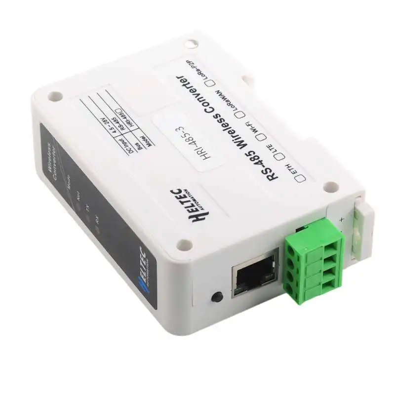

Model reference: HRI-485X

Manufacturer: [Heltec](https://vi.aliexpress.com/item/1005005792072535.html?spm=a2g0o.productlist.main.3.7cae4ff8eSDdJB&algo_pvid=fecf356a-9467-48dc-9b02-721346b7f6ad&algo_exp_id=fecf356a-9467-48dc-9b02-721346b7f6ad-1&pdp_npi=4%40dis%21EUR%2127.64%2126.26%21%21%2129.57%21%21%402103245417043199788201496e1ef7%2112000034369167466%21sea%21SK%21168837343%21&curPageLogUid=jVcZde3gM0fm)

## Basic Config

Configuration contains modbus sensors as example. First of leds on fron panel is always on (directly connected to power source), second is configured as indication of HA client connected, third led is ESPhome Status led)

GPIO16 is pin for powering MAX3485 chip. (Manufacturers magic ...)

```yaml
esphome:
  name: heltec-modbus
  friendly_name: Heltec-Modbus

esp32:
  board: esp32dev
  framework:
    type: arduino
  
# OTA flashing
ota:
  - platform: esphome

wifi: # Your Wifi network details
  
# Enable fallback hotspot in case wifi connection fails  
  ap:

# Enabling the logging component
logger:
  level: DEBUG
  baud_rate: 0

# Enable the captive portal
captive_portal:

# Enable Home Assistant API
api:  
  on_client_connected:
    switch.turn_on: HAOnlineLed
  on_client_disconnected:
    switch.turn_off: HAOnlineLed

status_led:
  pin: GPIO3

ethernet:
  type: RTL8201
  mdc_pin: GPIO23
  mdio_pin: GPIO18
  clk_mode: GPIO17_OUT
  phy_addr: 0

uart:
  - id: mod_bus
    tx_pin: GPIO33
    rx_pin: GPIO37
    baud_rate: 9600
    data_bits: 8
    parity: NONE
    stop_bits: 1

modbus:
  - uart_id: mod_bus
    id: modbus1

modbus_controller:
  - id: epever
    address: 0x1
    modbus_id: modbus1
    setup_priority: -10
    update_interval: 5s

sensor:
  - platform: modbus_controller
    modbus_controller_id: epever
    name: "Temperature"
    id: temp
    register_type: read
    address: 0x0001
    unit_of_measurement: "C"
    value_type: U_WORD
    accuracy_decimals: 1
    filters:
      - multiply: 0.1

  - platform: modbus_controller
    modbus_controller_id: epever
    name: "Humidity"
    id: hum
    register_type: read
    address: 0x0002
    unit_of_measurement: "%"
    value_type: U_WORD
    accuracy_decimals: 1
    filters:
      - multiply: 0.1

switch:
  - platform: gpio
    pin: GPIO16
    id: ModbusOnOff

  - platform: gpio
    pin: GPIO2
    id: HAOnlineLed
    inverted: true
